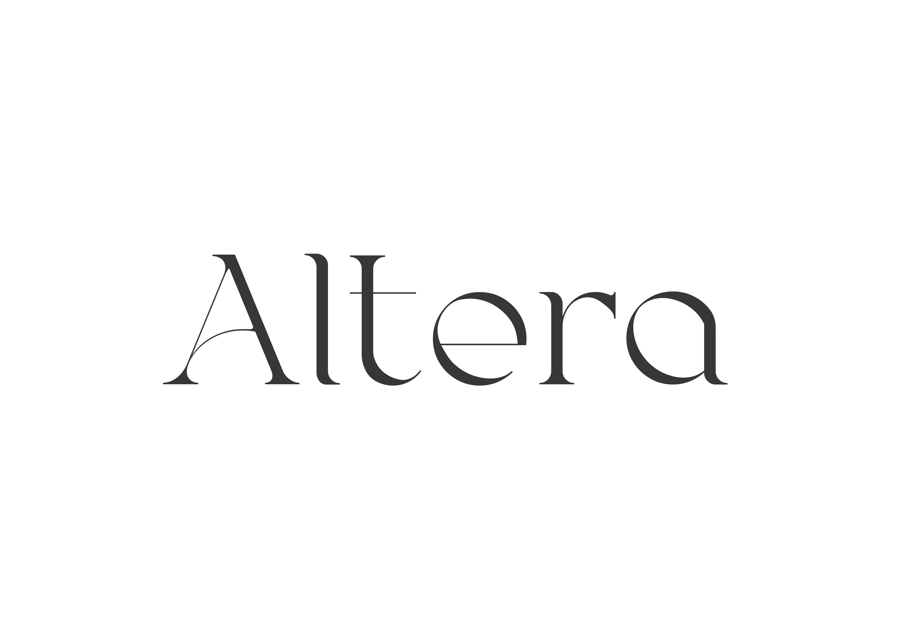

# where culture speaks differently

**Altera** is an open publishing platform for thoughtful writing on culture, art, photography, music, sports, and travel — created with elegance and freedom.

> Publish differently. Think deeply. Write beautifully.

---

## ✨ What is Altera?

**Altera** is a cultural web journal and collaborative editor where anyone can register and publish public articles. It combines the timeless depth of human expression with modern tools for writing, design, and distribution.

Built on **MDC** (Markdown + Components), the editor allows you to write using familiar markdown syntax, while composing rich, structured, and expressive layouts from ready-made content blocks.

Whether you’re writing an essay on Baroque architecture, sharing a photo travelogue, or reflecting on the philosophy of sport — Altera is a space to create **with clarity, dignity, and style**.

---

## 🧩 Features

- 📝 Elegant editor based on MDC (Markdown + Components)
- 🌍 Open access: anyone can register and publish articles
- 🖋 Designed for deep, cultural, and artistic topics
- 🎼 Supports mixed media: text, image, audio, and more
- 🔍 Semantic structure & clean design-first approach
- 🫂 Built for community authorship, not algorithms

---

## 📦 Tech Stack (planned or in-progress)

- Vue / Nuxt (frontend)
- MDC rendering engine (custom blocks)
- Markdown + slots / typed components
- PostgreSQL or SQLite (content storage)
- Supabase / Auth.js for authentication
- Vite / Vitest / ESLint strict typing

---

## 🚧 Roadmap

- [ ] Public editor with live preview
- [ ] User accounts and publishing flow
- [ ] Full MDC block system (quotes, galleries, etc.)
- [ ] Article feed with categories and tags
- [ ] Themeable typography and layout
- [ ] Moderation and featured articles

---

## 🤝 Contributing

We welcome contributions! Altera is still in early development. If you’re a developer, writer, designer, or just someone who cares about deep cultural publishing — feel free to open issues, pull requests, or ideas.

- Clone the repo
- Run `npm install`
- Dev server: `npm run dev`
- Feedback? → Open an issue or email us at `team@altera.art`

---

## 📜 License

This project is licensed under the **MIT** — keeping the platform open, even if deployed as a hosted service.  
See [`LICENSE`](./LICENSE) for full details.

---

## 🌌 About the name

> *Altera* (лат.) — "другая".  
> We believe in offering another voice. A space for thoughtful words. A culture beyond noise.

---

