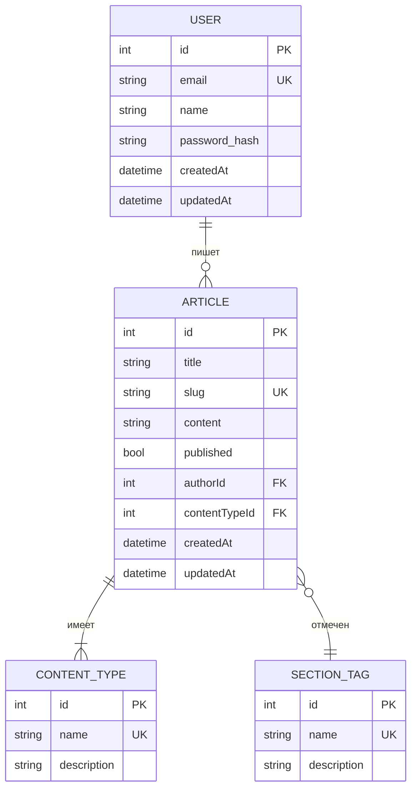

# Архитектура базы данных

Этот документ описывает структуру базы данных проекта Altera.

## Диаграмма E-R (Entity-Relationship)



## Таблицы

### `User`

- **Описание**: Хранит информацию о пользователях системы.
- **Поля**:
    - `id`: Уникальный идентификатор (Primary Key).
    - `email`: Электронная почта (Unique).
    - `name`: Имя пользователя.
    - `password_hash`: Хеш пароля.
    - `createdAt`, `updatedAt`: Временные метки.

### `Article`

- **Описание**: Основная сущность, представляющая статью.
- **Поля**:
    - `id`: Уникальный идентификатор (PK).
    - `title`: Заголовок статьи.
    - `slug`: Уникальная строка для URL.
    - `content`: Содержимое статьи (в формате Markdown или HTML).
    - `published`: Флаг, указывающий, опубликована ли статья.
    - `authorId`: Внешний ключ на `User`.
    - `contentTypeId`: Внешний ключ на `ContentType`.

### `ContentType`

- **Описание**: Тип контента (например, "Новость", "Блог-пост", "Туториал").
- **Поля**:
    - `id`: Уникальный идентификатор (PK).
    - `name`: Название типа (Unique).
    - `description`: Краткое описание.

### `SectionTag`

- **Описание**: Теги или разделы для группировки статей.
- **Поля**:
    - `id`: Уникальный идентификатор (PK).
    - `name`: Название тега (Unique).
    - `description`: Краткое описание.

## Примеры SQL-запросов

### Получить все опубликованные статьи пользователя

```sql
SELECT
  a.title,
  a.slug,
  u.name as authorName
FROM "Article" a
JOIN "User" u ON a."authorId" = u.id
WHERE
  a.published = true AND u.email = 'user@example.com';
``` 