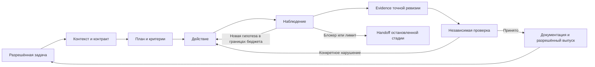

# Архитектура управляемой агентной разработки Altera

- **Дата**: 2026-09-13
- **Статус**: предложение для поэтапного внедрения; текущие правила остаются действующими.
- **Спецификация переезда**: этот документ и [реестр требований](requirements-and-preservation.md).
- **Источники**: [сохранённое вложение](sources/2026-09-13-agent-loop-original.txt),
  [операционная модель](../multica/operating-model.md), [правила бэклога](../backlog/README.md).

## A1. Решение и варианты

Предлагается развивать существующий слой исполнения: репозиторий хранит версионируемые
контракты и доказательства, среда исполнения ограничивает действия, Multica координирует
стадии и показывает их состояние. Агент адаптивно выбирает следующий полезный эксперимент
внутри заранее определённых границ задачи. Готовность определяет проверка результата.

| Вариант                                                           | Что даёт                                                                          | Цена и ограничения                                                              |
| ----------------------------------------------------------------- | --------------------------------------------------------------------------------- | ------------------------------------------------------------------------------- |
| Только расширить промпты                                          | Быстро описывает ожидания                                                         | Копии расходятся; права, блокировки и свежесть evidence остаются непроверенными |
| Развить текущий harness и синхронизировать Multica — предлагается | Сохраняет роли, историю, команды и привычную доску; позволяет мигрировать частями | Требует проверок исполнения и дисциплины версионирования копий                  |
| Написать собственный оркестратор                                  | Полный контроль расписаний и блокировок                                           | Новый продукт для сопровождения; его необходимость пока не доказана             |

Собственный scheduler, новая база знаний и замена Multica для этого переезда не требуются.
Если платформа не обеспечивает нужное ограничение, соответствующий шаг остаётся ручным
до появления проверенного механизма.

## A2. Слои и границы ответственности

| Слой                  | Источник / место                                                | Ответственность                                                          |
| --------------------- | --------------------------------------------------------------- | ------------------------------------------------------------------------ |
| Контракт продукта     | журнал владельца → `docs/spec/` → ADR → vision                  | Как должно работать; код не отменяет решения владельца                   |
| Фактическое состояние | код, конфигурация, Git, выполненные проверки                    | Как работает сейчас, с датой и ревизией                                  |
| Правила процесса      | `docs/multica/operating-model.md`, будущий короткий `AGENTS.md` | Стадии, источники, границы, права; ссылки на подробности                 |
| Повторяемые процедуры | локальные навыки/команды и `altera-project-rules`               | Получение контекста, воспроизведение, проверка, передача работы          |
| Исполнение            | используемый coding runner, MCP, shell, browser, hooks          | Проверка аргументов, права, таймауты, результаты инструментов, остановка |
| Координация           | Multica project/issues/agents/squad/autopilots                  | Выбор разрешённой задачи, назначения, история run, отображение evidence  |
| Приёмка               | тестировщик + независимый ревьюер; условия выпуска §7           | Проверка исходного контракта и итогового состояния на точной ревизии     |

Модель предлагает вызов инструмента; runner исполняет его в пределах прав. Текст «тесты
запущены» не заменяет результат процесса. Hook — обработчик события, а его наличие не
доказывает ни полноты проверки, ни запрета обхода. Skill — процедура; subagent — отдельный
контекст исполнения. MCP — доступ к инструментам и данным, а не автоматическая гарантия доверия.

Локальные `.claude/` и агенты Multica — разные конфигурационные поверхности. Их совпадение
и загрузка нужного файла в каждом runner должны подтверждаться отдельно. Trace MCP для
навигации по коду также не равен журналу исполнения агента.

## A3. Три цикла и три завершения

Внутренний цикл решает текущую стадию; цикл приёмки возвращает конкретные нарушения;
внешний процесс выбирает следующую разрешённую задачу. В последней стрелке действуют
гейты очереди; завершение одной задачи само по себе не разрешает любую следующую.

1. **Модель завершила ответ** — закончился ответ, готовность неизвестна.
2. **Run завершён** — процесс остановился: успешно, из-за ошибки, квоты, отмены или блокера.
3. **Задача принята** — все согласованные критерии подтверждены актуальными артефактами,
   независимое ревью выполнено, обязательные стадии завершены.

Значения статусов run различаются между платформами; сохраняются и native-статус, и причина.
Число `turn` нельзя сравнивать между продуктами без определения единицы. Цикл не означает
дообучение весов модели: обновляются контекст, наблюдения и состояние среды.

## A4. Контракт задачи и полезная итерация

Перед реализацией фиксируются текущее/ожидаемое поведение, сохраняемый публичный API,
scope, зависимости, неизвестные, риски и критерии приёмки. Используется существующая задача
`T-NNN`, а в Multica хранится её соответствие `ALTE-N` и ссылка на файл. Прямое поручение
владельца оформляется планом с источником полномочий; ему не требуется выдуманный статус `готова`.

Согласование относится к конкретному контракту и объёму: уже данное разрешение не спрашивается
повторно. Новое продуктовое решение и открытый `Q-NN` остаются решениями владельца.
Согласованные критерии нельзя менять ради зелёного результата. Изменение тестового ожидания
требует причины, связанной с контрактом, и явного diff для проверяющего.

Для бага: воспроизвести → увидеть падение по нужной причине → минимально исправить → проверить
исходный случай, границы и связанные сценарии. Ошибка импорта или незапущенная БД не является
воспроизведением продуктового бага. Для документации проверяются сохранность, ссылки и смысл;
искусственные продуктовые тесты для такой правки не нужны.

У каждой неудачной попытки есть гипотеза, проверка, наблюдение и решение о следующем шаге.
Полезная итерация уменьшает неизвестное, создаёт необходимую часть решения или проверяет
предположение. Повтор без изменений допустим при явной диагностической цели, например
проверке нестабильности. Соседние улучшения сохраняются отдельно, scope не расширяется молча.

## A5. Контекст, память и сохранение знаний

Рабочий контекст модели, состояние файлов/процессов и сохранённая память — разные вещи.
Доступ к репозиторию не означает чтение всего репозитория. На старте применяется trace-mcp
`get_project_map(summary_only=true)`, затем task/feature context, outline, нужные символы,
impact и tests. Нет необходимости читать код целиком или создавать субагента только для поиска.

Предлагаемый `AGENTS.md` — компактный указатель на правила, команды и архитектуру работы.
Существующий trace-routing сохраняется дословно; перед созданием файла надо установить,
откуда он сейчас внедряется в сессию. `CLAUDE.md` становится адаптером для соответствующего
runner после переноса уникальных сведений с картой старое → новое. Правила разных клиентов
не считаются автоматически синхронизированными.

Память задачи хранится в паре план/отчёт по действующим путям. Добавление `active/` и
`completed/` сейчас не требуется: существующие ссылки и ритуал не ломаются. Для продолжения
нужны цель, подтверждённые факты, сделанное, остаток, причины решений, отвергнутые гипотезы,
ветка, проверенная ревизия, файлы, команды и блокер. Новый run сначала проверяет, что эти
данные ещё соответствуют среде. Сжатие чата не удаляет первичные документы.

Ни один ADR, журнал, план, отчёт или задача не удаляется при миграции. Устаревшее утверждение
получает дату, источник замены и ссылку на сохранённую версию. Исторический контекст ADR
не превращается в утверждение о текущем коде. Дубликаты сначала сопоставляются по смыслу.

## A6. Проверки, evidence и независимость

Подробный формат — [контракты артефактов](artifact-contracts.md). Evidence содержит критерий,
исполнителя, команду, каталог, версии окружения, время, exit code, значимый вывод, число
исполненных проверок и ревизию. Для незакоммиченного дерева дополнительно фиксируются
diff и хэши затронутых файлов; одного `HEAD` недостаточно. Изменение проверяемого файла
делает связанные результаты устаревшими; перезапускаются затронутые проверки.

Проверка расширяется от минимального воспроизведения к компоненту/контракту и интеграции.
Браузер нужен там, где критерий касается поведения интерфейса, фокуса, SSR или сквозного
потока; unit-тест этого не доказывает. Моки разрешены на границе внешних зависимостей,
но не вместо самой проверяемой логики. `skip`, `todo`, ноль тестов и замаскированный exit
не дают основания принять обязательный критерий.

Ревьюер получает исходное задание, источники, diff и evidence. Он не реализовывал этот
результат. Название отдельной роли не гарантирует независимости: фиксируются actor/run
исполнителя и проверяющего. Результат subagent также проверяется. Вердикт указывает
точную ревизию, нарушения, границы проверки и `принято / вернуть / не проверено`.

## A7. Полномочия, параллелизм и остановка

Сохраняется один writer продуктового кода во всём проекте; worktree изолирует файловые
правки, но не разрешает вторую активную кодовую цепочку. Исследование, документация и
подготовка проверок могут идти параллельно при раздельном владении файлами. Проверяющий
не получает возможности менять проверяемый код через `Write`, shell или другой путь.

Политика должна исполняться средой: ограниченные каталоги записи, права токенов и runner,
проверенный механизм исключения одновременных запусков. Prompt-only запрет учитывается
как инструкция, а не техническая блокировка. Git-ветка и checkpoint не заменяют sandbox
и не отменяют уже выполненные внешние изменения. Внешнее содержимое не выдаёт разрешений;
секреты исключаются из контекста, snapshot и логов.

Действующий бюджет Altera: **две подряд неуспешные попытки одной и той же проверки внутри
стадии**, успех обнуляет счёт этой проверки. Счёт сохраняется между run одной стадии.
Учебное «например три» из вложения не заменяет подтверждённые две. Таймауты, общий лимит
итераций и расходов инвентаризируются в runner; новые значения требуют отдельного решения,
а отсутствие сведений не трактуется как бесконечный бюджет.

Причина остановки классифицируется: код, тест, среда, неоднозначный контракт, конфликт,
разрешения, квота/бюджет, отмена. Две ошибки останавливают стадию; их нельзя обойти
переименованием проверки или новым run. Возобновление допускается после устранения
названной причины и проверки отсутствия активной дублирующей стадии. Открытый вопрос
владельца не разрешается догадкой или таймером.

Разрешённая автономия push/PR/слияния/выкладки из operating-model §7 сохраняется вместе
с условиями выпуска. Новые платные услуги, реальные провайдеры, необратимые операции,
включение автопилотов и изменение их настроек не следуют автоматически из неё.

## A8. Multica как координационный слой

Проект хранит краткое описание и ссылки с датой/ревизией; общий skill — переносимые правила;
агент — только роль и нужные инструменты; squad — порядок стадий; autopilot — узкое
действие по событию/расписанию. Исторический инцидент не становится вечной инструкцией.

Срез UI от 2026-09-13 и расхождения находятся в [аудите](../multica/2026-09-13-configuration-audit.md).
Синхронизация выполняется после принятия репозиторных правил: snapshot → точный diff →
применение разрешённых полей → перечитывание → контролируемый пробный запуск.
Версия источника и digest сохраняются в копии или в сопроводительном реестре, если UI
не поддерживает соответствующие поля. Неподдерживаемые возможности отмечаются явно.

Доска `Todo` сама по себе не заменяет `готова` в файле, закрытые зависимости и разрешение.
`In Review` не равно `Done`; завершённый run не равно принятой задаче. `run_only` не требует
создавать issue ради расписания. При неизменившемся состоянии — тихий no-op без уведомлений.

## A9. Оценка и переход на новый процесс

На одинаковой исходной ревизии и фиксированных критериях сравниваются типовые задачи:
документная сверка, небольшой воспроизводимый дефект, контракт/права и браузерный сценарий.
Один удачный запуск не доказывает устойчивость. Число повторов и пороги принятия серии
согласуются перед экспериментом; результаты не выбираются только из удачных попыток.

Сохраняются доля принятых задач, регрессии, возвраты, вмешательства владельца, время ревью,
время до приёмки, стоимость всех попыток и инфраструктуры. Стоимость принятой задачи
учитывает человеческую проверку; неизвестная стоимость модели не подменяется нулём.
Количество инструментальных шагов служит диагностике, но не является метрикой успеха.

Prompt caching при наличии поддержки учитывается как оптимизация повторного префикса,
а не готовых ответов и не гарантированная детерминированность. Смена модели сравнивается
вместе с инструментами, правами и процедурами. Масштабирование очереди допускается после
проверки отрицательных сценариев: ложная готовность, устаревшее evidence, двойной запуск,
открытый блокер, повторный сбой и попытка записать проверяемый файл проверяющим.
