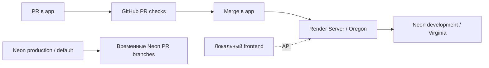

# Окружения Altera: Render и Neon

Обновлено 2026-09-15: MCP/CLI и исходный `origin/app`
`563e909819348127f71a54bd2c0fbaae35d6f7d9`. Исторические инциденты 2026-09-14 сохранены ниже. Это карта инфраструктуры,
инструкция диагностики и план её развития. Статус конкретного сервиса всегда читается заново.

## Текущее окружение

| Компонент                 | Подтверждённая настройка                                                               |
| ------------------------- | -------------------------------------------------------------------------------------- |
| GitHub                    | `Egoka/Altera`, интеграционная ветка `app`                                             |
| Render project            | `prj-d1uimbmmcj7s73eimc7g`, Altera                                                     |
| Render environment        | `evm-d1uimbmmcj7s73eimc80`, название `Production`                                      |
| Backend                   | Web Service `Server`, `srv-d1uk6b6mcj7s73ek25h0`, Node, Free                           |
| API URL                   | `https://altera-m4po.onrender.com/`, GraphQL endpoint `/`                              |
| Render region             | Oregon (US West)                                                                       |
| Git source                | `app`, Root Directory `server`                                                         |
| Build                     | `pnpm install && pnpm run build`                                                       |
| Start                     | `pnpm start`, то есть `node dist/server.js`                                            |
| Node / Prisma             | `24.12.0` / `6.12.0` в исследованном deploy                                            |
| Auto-deploy / PR previews | On Commit / Off                                                                        |
| Pre-deploy                | Не задан; настройка недоступна на текущем тарифе                                       |
| HTTP Health Check Path    | Не задан в Render                                                                      |
| Neon project              | `purple-salad-06550104`, Altera, PostgreSQL 17                                         |
| Neon region / plan        | AWS US East 1 (N. Virginia), Free                                                      |
| Рабочая БД Server         | `development`, сохранена по явному решению владельца в этой задаче                     |
| Development branch        | `br-ancient-mode-adgmr3w1`, child от production                                        |
| Production branch         | `br-plain-grass-adrif7r3`, default branch проекта; не текущая БД Server                |
| Database / role           | `neondb` / `neondb_owner`; значения паролей здесь не хранятся                          |
| Development compute       | `ep-dry-boat-ad0thetj`, 0.25–2 CU, scale-to-zero после 5 минут                         |
| Neon network              | IP restrictions: None set; VPC: Not configured                                         |
| History retention         | 6 hours в наблюдаемой конфигурации                                                     |
| Frontend                  | По сообщению владельца локальный; опубликованный frontend в этой задаче не подтверждён |

Название Render `Production` не определяет ветку Neon. **Сейчас app → Render Server → Neon development**.
Не переключать на production и не копировать данные между ветками по одному совпадению названий.
Регионы Render и Neon различаются: это потенциальная задержка, но не доказанная причина P1001.



## Подключения и миграции

Для текущего Server обе строки берутся из **одной development branch**, для одной роли и базы:

| Переменная              | Назначение             | Host                                                      |
| ----------------------- | ---------------------- | --------------------------------------------------------- |
| `DATABASE_URL`          | Prisma Client, pooled  | `ep-dry-boat-ad0thetj-pooler.c-2.us-east-1.aws.neon.tech` |
| `DATABASE_URL_UNPOOLED` | Prisma Migrate, direct | `ep-dry-boat-ad0thetj.c-2.us-east-1.aws.neon.tech`        |

Production endpoint `ep-dry-sun-ad4uy1u8` зарезервирован для будущего отдельного решения.
Нельзя комбинировать пароль одной ветки с host другой. Нельзя менять только одну из пары строк.
Сохранять TLS (`sslmode=require` и предоставленный Neon `channel_binding=require`);
для ограниченного ожидания пробуждения рекомендуется `connect_timeout=15` в обеих строках.
Не использовать бесконечный timeout как способ скрыть неисправность.

`server/prisma/schema.prisma` использует `url = env("DATABASE_URL")` и
`directUrl = env("DATABASE_URL_UNPOOLED")`. Поэтому отсутствие `-pooler` в логе миграции правильно.
Не переносить инструкции Prisma 7 на установленную Prisma 6 без отдельной миграции.

На проверенном `563e909…` `server/build` и `build:ci` выполняют:

```text
prisma generate → tsc → copy-graphql → copy generated client
```

Миграции выделены в `prisma:migrate:deploy`; текущая сборка их не запускает. Старые deploy ниже
использовали build с миграциями, поэтому их результат не доказывает применение новых миграций.
Перед диагностикой читать scripts конкретного SHA; не применять миграции ради проверки подключения.
Не выполнять `migrate reset`, `db push`, seed или ручной destructive SQL для лечения P1001.

Render также содержит `REDIS_URL`, `CACHE_TTL`, `PORT`, `FRONTEND_URL`, JWT и magic-link
переменные из [project-rules](project-rules.md). Наличие ключа не доказывает правильность значения.
Redis — runtime dependency; после исправления БД его состояние тоже требует проверки.

## Инцидент 2026-09-14

[Неуспешный deploy](https://dashboard.render.com/web/srv-d1uk6b6mcj7s73ek25h0/deploys/dep-dak5cs49v7es73ft3ktg)
относится к `467bde721ff853d7e9057d393ba2e3abbf6ae46f` (PR #29), auto-deploy в 23:17:52 MSK.
Build завершился с exit 1 на `prisma migrate deploy`, P1001 к direct development host.
Новая версия не была запущена; это не доказывает остановку ранее работающей версии.
Render показывал предыдущий successful commit `308206d5d14d44a95f5231f584af1b02a0bab959`.

Подтверждено при сравнении актуальных значений в консолях без сохранения секретов:

- pooled и direct Render указывают на development;
- **пароли обеих строк не совпадают с текущим development password в Neon**;
- обе строки не содержали `connect_timeout`;
- Neon development compute был suspended; на Free нормален сон после 5 минут;
- TCP 5432 обоих development endpoints доступен с Mac. Это не проверка из Render и не SQL authentication.

Несовпадение credentials — конкретный дефект конфигурации. Сам код P1001 не доказывает,
что причина только в пароле: также проверяются пробуждение, DNS, TLS и путь сети из Render.
Исправление принимается только по новому deploy и проверкам ниже.

Порядок восстановления:

1. Сверить Neon project/branch/role/database; получить свежую pooled/direct пару development.
2. В Render заменить обе строки согласованно, добавить ограниченный timeout, сохранить с rebuild/deploy.
   Ввод изменяемых credentials в браузере выполняет владелец; в логах только host и результат сравнения.
3. Зафиксировать ID нового deploy и полный commit. Не создавать второй запуск, пока первый активен.
4. Проверить прохождение миграций, сборки, старта и переход deploy в live. Сохранить очищенный error при неуспехе.
5. Выполнить HTTP/GraphQL smoke; отдельно проверить DB и Redis из разрешённой среды без изменения данных.
6. Зафиксировать `release_status`, доказательства и остаток. При новом дефекте продолжить тот же incident,
   не повторять rebuild без изменившейся причины.

Пароли, уже попавшие в переписку, следует заменить согласованно во всех потребителях.
Ротация отличается от исправления перепутанных строк; она не выполнена этим документом.

### История: восстановление Neon и Redis blocker 2026-09-14

Владелец исправил обе переменные и запустил
[deploy dep-dak5rnad0e5s73b458a0](https://dashboard.render.com/web/srv-d1uk6b6mcj7s73ek25h0/deploys/dep-dak5rnad0e5s73b458a0)
для `1a6ebdb99600bfd1c65f2d76a55563129cbfe43e` в 23:49:34 MSK.
В 23:50:04 Prisma подключилась к direct development, нашла четыре миграции и сообщила
`No pending migrations to apply`; build successful, сервер запущен на порту 4000.
В 23:51:40 Render подтвердил `Deploy succeeded | Live`.
После Live проверка `/` вернула HTTP200 за 0.413 секунды: JSON `data.__typename=Query`, errors отсутствуют.
Это подтверждает восстановление миграционного подключения и запуск API, а не всех зависимостей.

В runtime log этого же deploy повторяется `ioredis ENOTFOUND` для
`redis-16002.c44.us-east-1-2.ec2.redns.redis-cloud.com`. **В этом историческом deploy Redis был неисправен**; актуальное состояние приведено ниже.
Не считать live статус полной release acceptance. Уточнить действующий Redis сервис,
сверить host/port/TLS в `REDIS_URL`, затем выполнить ограниченный Redis PING из runtime
и smoke зависящего от Redis сценария. Не создавать новый платный сервис и не менять данные
по одному DNS-сбою. Исправление credentials Neon выполнено владельцем; ротация и наличие
timeout после изменения отдельно не проверялись.

## CI, preview и deploy: разные проверки

`.github/workflows/pull_request.yml` запускается на PR в `app`, а не на push в `app`.
PR checks проверяют исходный код и smoke в тестовой среде. Это не проверка работающего Render.
`.github/workflows/neon_workflow.yml` создаёт `preview/pr-<number>-<branch>` и удаляет ветку при закрытии PR.
Родитель не указан явно, поэтому сейчас это default production. Миграции на preview в workflow
закомментированы, URL не переданы в основные smoke jobs. Зелёный job создания Neon branch
не доказывает, что миграции и тесты на ней запускались.

Render Root Directory `server` ограничивает автодеплой изменениями этой директории.
Изменения root lockfile, workspace config и `.nvmrc` тоже могут влиять на backend: план контроля
должен явно учитывать их, даже если Render сам не инициировал deploy.
Для чистой документации/web-only допустимо `deploy_status=not_applicable` с обоснованием diff.
Отсутствие deploy для изменения backend/shared build inputs — `not_triggered`, а не успех.

Рекомендуемый постоянный порядок:

1. Сохранить обязательные PR checks и review до merge.
2. Добавить проверки на push в `app` (лучше через reusable workflow, не копировать команды).
3. Только после успешной canary проверки commit checks включить Render **After CI Checks Pass**.
   Этот режим не запускает deploy при нуле checks; GitHub `skipped/neutral` Render тоже считает прошедшими,
   поэтому проектный aggregate обязан явно требовать нужные успешные jobs.
4. Добавить post-deploy job с API secret `RENDER_API_KEY` и service ID из обычной configuration variable.
   Сопоставлять deploy с полным ожидаемым merge SHA, а не первым/latest deploy в списке.
5. Дождаться terminal status с deadline, проверить live SHA и smoke, опубликовать отдельный deploy result.
   При опережающем merge записать `superseded`, проверить новый SHA и ancestry/эквивалентность;
   чужой успешный deploy не подтверждает исходный автоматически.
6. Сохранить миграционную проверку на изолированной Neon preview до выпуска;
   у будущих реальных production данных предусмотреть безопасный preview parent/schema-only режим.

Это **план следующей реализации**, а не описание уже включённого GitHub deployment workflow.
MCP не нужен внутри Actions: REST API/CLI проще воспроизводить и ограничивать по времени.
Не передавать Render/Neon API secrets в недоверенный PR код; production credentials не нужны PR tests.
Связанные задачи: [T-104](../backlog/tasks/T-104-deploy-pipeline-migrations.md),
[T-103](../backlog/tasks/T-103-prod-environment-ru.md). Этот аудит не объявляет их выполненными. T-103 требует продуктивное окружение в РФ без Neon и зависит от Q-01; текущий development и намерение двух frontend не отменяют это решение молча. Итоговую production topology необходимо согласовать отдельно.

## Доступ инструментов и свежий срез 2026-09-15

Render MCP подтвердил workspace `tea-d0q29c7diees738n0250`, Server и историю deploy.
Последний наблюдавшийся Live — [dep-dak7bomk1f9s73c6dsbg](https://dashboard.render.com/web/srv-d1uk6b6mcj7s73ek25h0/deploys/dep-dak7bomk1f9s73c6dsbg),
SHA `563e909819348127f71a54bd2c0fbaae35d6f7d9`, 2026-09-14 22:33:59 UTC (15 сентября 01:33:59 MSK).
Build successful и старт на порту 4000 подтверждены логами именно этого checkout SHA.
PR #36 merged; обязательный aggregate `test` и четыре prerequisite jobs — SUCCESS.
GraphQL POST `__typename` вернул HTTP 200, Query, без errors (0.509s).
Это датированный срез, а не бессрочное утверждение о текущем `app`.

[Render Key Value](https://dashboard.render.com/r/red-dak61sjl550s73a1tao0)
`red-dak61sjl550s73a1tao0`, имя Redis: `available`, Free/Oregon, Valkey 8.1.4,
allkeys-lru, persistence off, внешний allowlist пуст. Это замена старому Redis Cloud;
владелец сообщил об обновлении REDIS_URL. Метрики показывают CPU/память и одно подключение
после текущего deploy. Это не подтверждает PING/cache-сценарий из Server.
В ограниченном окне старта свежего deploy ENOTFOUND/ioredis ошибок не наблюдалось.

Neon CLI подтвердил development `br-ancient-mode-adgmr3w1` в состоянии `ready`, endpoint
`ep-dry-boat-ad0thetj` принадлежит этой ветке, state `idle`, host совпадает с ожидаемым direct.
SQL authentication из Server в этой проверке не выполнялась. Значения credentials не читались.
Render memory metrics доступны; CPU и HTTP metrics в первом выбранном окне были пустыми:
это `no_data`, а не нулевая нагрузка. HTTP Health Check Path по-прежнему не задан.

Инвентарь инструментов, конфигурация профилей и диагностика доступа:
[Multica infrastructure access](../multica/infrastructure-access.md).
OAuth MCP не авторизует Render CLI или GitHub Actions. Render CLI был unauthorized в старом аудите;
его авторизация здесь не утверждается. Новый deploy/restart, env update, миграции и изменения тарифов
ради этой проверки не запускались.

## Что доказывает smoke

Безопасный GraphQL запрос `query InfrastructureProbe { __typename }` к `/` с
`Content-Type: application/json` проверяет HTTP и GraphQL обработчик; он не читает бизнес-данные.
Ожидается 2xx, корректный JSON `data.__typename` без `errors`. HTML, timeout и 5xx не являются успехом.
Render Free может долго пробуждаться; smoke имеет конечный бюджет, например 90 секунд.

Такой запрос **не проверяет SQL, Redis и полный пользовательский сценарий**.
В текущем `server/src/server.ts` отдельный DB-aware readiness endpoint не объявлен.
Для будущей readiness предусмотреть ограниченные `SELECT 1` и Redis `PING` с безопасным ответом,
отдельно от liveness, и закрепить commit identity. До реализации явно писать `not_run`
для DB/Redis проверки, если доступа нет; не называть GraphQL introspection полной приёмкой.

## Будущие регионы и frontend

Намерение владельца: один backend и одна логическая production DB, два frontend для
`Altera.ru` и `Altera.art` с разным контентом, политиками, authentication и платежами.
Домены пока планируются; покупка, DNS и публикация не выполнены этим аудитом.

Региональный профиль должен определять допустимые способы входа, оплаты, правила контента
и consent на сервере, а не только скрывать кнопки в UI. Потребуются отдельные allowed origins,
OAuth redirect URLs, настройки cookies/CSRF, email/magic-link URLs и payment providers.
Сейчас сервер принимает один `FRONTEND_URL`; поддержку двух frontend нельзя объявлять готовой.
Правовые утверждения про конкретные провайдеры не принимаются как проверенный запрет:
до запуска требуется отдельная проверка актуальных требований выбранных юрисдикций.

## Официальные источники

- [Render deployments и CI integration](https://render.com/docs/deploys)
- [Render MCP](https://render.com/docs/mcp-server)
- [Render health checks](https://render.com/docs/health-checks)
- [Neon Prisma: direct/pooler и P1001](https://neon.com/docs/guides/prisma)
- [Neon connection pooling](https://neon.com/docs/connect/connection-pooling)
- [Render service settings](https://dashboard.render.com/web/srv-d1uk6b6mcj7s73ek25h0/settings)
- [Neon development](https://console.neon.tech/app/projects/purple-salad-06550104/branches/br-ancient-mode-adgmr3w1)
