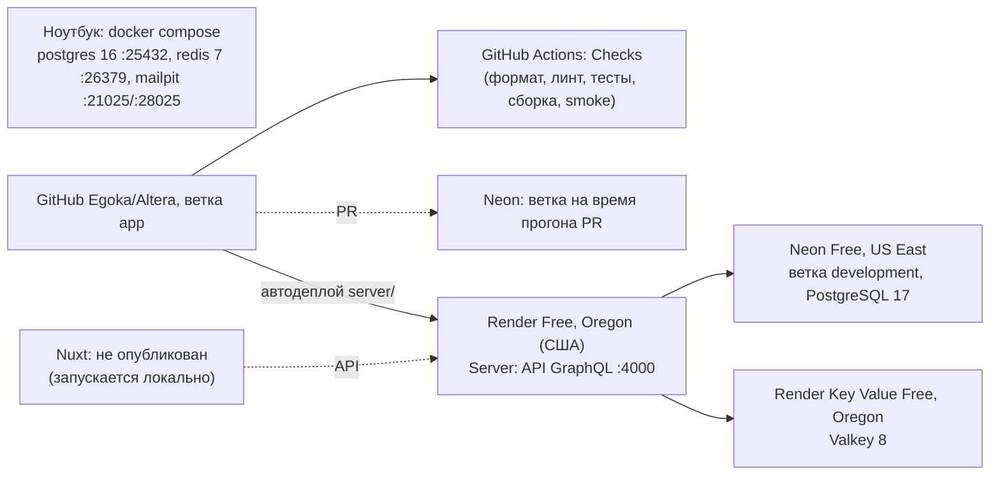
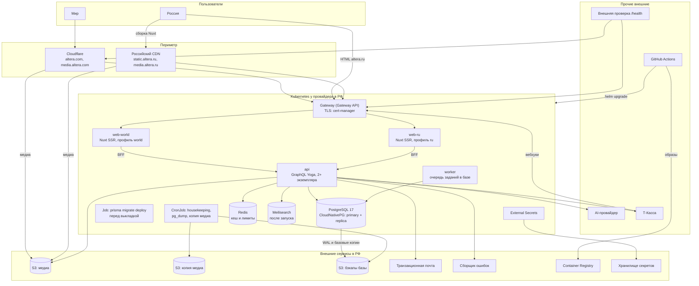
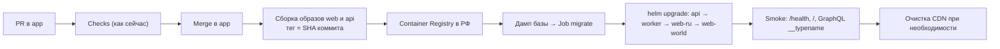

# Карта инфраструктуры Altera

- **Статус**: черновик от 2026-09-19 — предложение. В разделе 8 перечислены решения владельца,
  без которых карта не становится планом работ. Журнал решений и ADR этот документ не меняет:
  новые вводные записываются в журнал отдельно, по поручению владельца.
- **Срез**: `origin/app` `a5f6c64eef712dceef8f36b2aea69f07a331ffd1`, документы и конфигурация на
  эту ревизию; состояние Render и Neon — по `docs/development/render-neon.md` от 2026-09-15.
- **Рядом**: [Cloudflare перед altera.com](cloudflare-altera-com.md),
  [российский CDN перед altera.ru](ru-cdn.md), Terraform — `infra/cloudflare/`.

## 1. Вводные владельца от 2026-09-19

1. Развернуть backend, frontend и базу данных.
2. Frontend работает под двумя доменами: `altera.com` — мировой рынок, `altera.ru` — российский.
3. Всё, включая базу, работает в контейнерах под управлением Kubernetes.
4. Перед `altera.com` — кеширование Cloudflare. Для `altera.ru` нужен российский аналог CDN.

## 2. Как есть сейчас

| Что                        | Факт                                                                                                                                                                                                                                         | Источник                                               |
| -------------------------- | -------------------------------------------------------------------------------------------------------------------------------------------------------------------------------------------------------------------------------------------- | ------------------------------------------------------ |
| Репозиторий                | pnpm-workspace: `web` (Nuxt 4, SSR), `server` (GraphQL Yoga на `node:http`, Prisma 6.12)                                                                                                                                                     | `pnpm-workspace.yaml`, `server/src/server.ts`          |
| Node, pnpm                 | 24.12.0, 10.18.3                                                                                                                                                                                                                             | `.nvmrc`, `package.json`                               |
| API                        | GraphQL на `/`, `GET /health` проверяет PostgreSQL, миграции и Redis; порт 4000                                                                                                                                                              | `server/src/server.ts`, `server/src/health.ts`         |
| Web                        | BFF `POST /api/graphql` проксирует в API с подписанным `x-request-id`; адрес API — `runtimeConfig.graphqlApiUrl`                                                                                                                             | `web/server/api/graphql.post.ts`, `web/nuxt.config.ts` |
| Локали                     | RU без префикса, EN под `/en`, `prefix_except_default`, язык браузера не определяется                                                                                                                                                        | `web/nuxt.config.ts`, ADR-0002                         |
| Конфигурация API           | `PORT`, `NODE_ENV`, `LOG_HASH_SECRET`, `REQUEST_ID_FORWARD_SECRET`, `FRONTEND_URL` (один), `DATABASE_URL`, `DATABASE_URL_UNPOOLED`, `REDIS_URL`, `CACHE_TTL`, `JWT_*`, `MAGIC_LINK_*` (один базовый адрес); ревизия — из `RENDER_GIT_COMMIT` | `server/env.example`, `server/src/server.ts`           |
| Конфигурация Web           | `NUXT_GRAPHQL_API_URL`, `NUXT_REQUEST_ID_FORWARD_SECRET`; `web/.env.example` нет                                                                                                                                                             | `web/nuxt.config.ts`                                   |
| Миграции                   | `pnpm start` выполняет `prisma migrate deploy` перед стартом                                                                                                                                                                                 | `server/package.json`                                  |
| Локально                   | PostgreSQL **16**, Redis 7, Mailpit                                                                                                                                                                                                          | `docker-compose.yml`                                   |
| CI                         | PostgreSQL **17**, Redis 7; обязательный сводный джоб `test`                                                                                                                                                                                 | `.github/workflows/pull_request.yml`                   |
| Хостинг                    | API — Render Free, Oregon; Redis — Render Key Value Free; база — Neon Free, US East; фронтенд не опубликован                                                                                                                                 | `docs/development/render-neon.md`                      |
| В РФ                       | ничего                                                                                                                                                                                                                                       | —                                                      |
| Dockerfile, манифесты, IaC | нет (кроме `infra/cloudflare/` из этой работы)                                                                                                                                                                                               | репозиторий                                            |

Расхождения, которые стоит закрыть до прода: PostgreSQL 16 в compose против 17 в CI и Neon;
миграции внутри `start` против «отдельным шагом релиза» (`08-operations.md` §4, §7); ревизия из
переменной Render.

## 3. Что требуют принятые документы

| Требование                                                                                                                                                            | Источник                                                        |
| --------------------------------------------------------------------------------------------------------------------------------------------------------------------- | --------------------------------------------------------------- |
| Персональные данные, база, S3 и оба приложения в проде — в РФ; Neon только для разработки и превью                                                                    | ADR-0011                                                        |
| Медиа в S3 РФ: прод-бакет, второй бакет для копии, отдельный бакет для дампов базы                                                                                    | ADR-0008, `85-media-and-binary/storage-layout.md`, `backups.md` |
| Публичные варианты медиа — через CDN-домен с долгим кешем; после снятия материала CDN отдаёт 404                                                                      | `85-media-and-binary/access-and-signed-urls.md` п. 1, 3, 9      |
| Оригиналы и непубличное медиа — только по подписанным ссылкам                                                                                                         | там же, п. 2                                                    |
| Публичные страницы кешируются без сессии; персональные — `private, no-store`; ошибки — `no-store`                                                                     | ADR-0023 п. 6, `30-account/*`, `20-public/error.md`             |
| Redis необязателен; лимиты частоты в памяти процесса допустимы только при одном экземпляре                                                                            | ADR-0019 п. 1, 5                                                |
| Фоновые задания — очередь в базе внутри процесса API; housekeeping — один скрипт по расписанию                                                                        | `02-target-architecture.md` §2, `08-operations.md` §11          |
| Миграции — отдельный шаг релиза с дампом перед ним; деплой после зелёного CI                                                                                          | `08-operations.md` §4, §7                                       |
| `GET /health` на API и Nuxt; внешняя проверка раз в минуту                                                                                                            | `80-observability/health-and-alerts.md`                         |
| Внешний сборщик ошибок с инфраструктурой в РФ                                                                                                                         | журнал §28.6                                                    |
| Логи — JSON без ПДн, хранение 30 дней                                                                                                                                 | ADR-0032, `80-observability/logging-policy.md`                  |
| Бэкапы базы: ежедневно (30 дней) и `pg_dump` раз в неделю (12 недель); медиа — версионирование и еженедельная копия; восстановление проведено до открытой регистрации | `85-media-and-binary/backups.md`                                |
| Транзакционная почта — провайдер с РФ-контуром                                                                                                                        | ADR-0024, Q-01                                                  |
| Поиск — Meilisearch (после запуска)                                                                                                                                   | журнал §21.21                                                   |
| Бюджет этапа 1 — 4 000–12 000 ₽/мес плюс AI                                                                                                                           | `08-operations.md` §10                                          |

## 4. Где новые вводные расходятся с документами

Решения владельца главнее прежних документов. Ниже перечислено, что они меняют. Эти изменения
нужно записать в журнал решений, после чего документы получают пометки по правилу
`docs/decisions/README.md`.

| №   | Документ                                                    | Сейчас                                                                                                    | Новая вводная                                                                                           |
| --- | ----------------------------------------------------------- | --------------------------------------------------------------------------------------------------------- | ------------------------------------------------------------------------------------------------------- |
| 1   | `08-operations.md` §14                                      | «Kubernetes, микросервисы, очереди сообщений: один API, один Nuxt, один скрипт по расписанию» — не делаем | Kubernetes для всего                                                                                    |
| 2   | `08-operations.md` §14                                      | «CDN на старте» — не делаем                                                                               | Cloudflare и российский CDN с запуска                                                                   |
| 3   | ADR-0011 п. 1, `08-operations.md` §2, §5, `backups.md` п. 1 | Управляемый PostgreSQL с резервными копиями провайдера                                                    | PostgreSQL в кластере; копии делает оператор базы (раздел 5.4)                                          |
| 4   | `08-operations.md` §10                                      | Этап 1 — 4 000–12 000 ₽/мес                                                                               | Управляемый Kubernetes добавляет мастер и минимум два узла (раздел 7)                                   |
| 5   | ADR-0002 п. 5, ADR-0004                                     | Один сайт: RU в корне, EN под `/en`                                                                       | Два домена; как они делят локали — не решено (раздел 6)                                                 |
| 6   | `render-neon.md`, «Будущие регионы»                         | Прежнее намерение: `altera.ru` и `altera.art`                                                             | `altera.ru` и `altera.com`                                                                              |
| 7   | `02-target-architecture.md` §2                              | «Один процесс API и один Nuxt до этапа 5»                                                                 | Несколько экземпляров: Redis становится обязательным для лимитов, housekeeping — в CronJob (раздел 5.3) |

## 5. Целевая карта

### 5.1. Общая схема

### 5.2. Нагрузки в кластере

Один образ `web` и один образ `api` (`08-operations.md` §2). Ресурсы — стартовые
`[ДОПУЩЕНИЕ]`, уточняются по метрикам.

| Нагрузка            | Вид                   | Образ                  | Экземпляров           | Порт, проверки                                                             | Конфигурация                                                                      |
| ------------------- | --------------------- | ---------------------- | --------------------- | -------------------------------------------------------------------------- | --------------------------------------------------------------------------------- |
| `web-world`         | Deployment            | `web`                  | 2                     | 3000; readiness и liveness — `/health` Nuxt (сделать)                      | `SITE_PROFILE=world`, адрес сайта `https://altera.com`, адрес API внутри кластера |
| `web-ru`            | Deployment            | `web`                  | 2                     | то же                                                                      | `SITE_PROFILE=ru`, `https://altera.ru`                                            |
| `api`               | Deployment            | `api`                  | 2                     | 4000; readiness — `/health` с базой; liveness — без зависимостей (сделать) | секреты JWT, почты, S3, AI, платежей; список разрешённых сайтов                   |
| `worker`            | Deployment            | `api`, `ROLE=worker`   | 1                     | —                                                                          | очередь заданий (T-047) отдельно от HTTP                                          |
| `migrate`           | Job перед выкладкой   | `api`                  | 1                     | —                                                                          | `DATABASE_URL_UNPOOLED`; дамп перед миграцией                                     |
| `housekeeping`      | CronJob               | `api`                  | —                     | —                                                                          | `08-operations.md` §11                                                            |
| `pg-dump-weekly`    | CronJob               | `postgres:17`          | —                     | —                                                                          | `pg_dump -Fc` в бакет бэкапов, 12 недель                                          |
| `media-sync-weekly` | CronJob               | `rclone`               | —                     | —                                                                          | прод-бакет → бакет копии                                                          |
| `postgres`          | Cluster CloudNativePG | —                      | 2 (primary + replica) | 5432; сервисы `-rw`, `-ro`                                                 | PVC; WAL и копии в S3                                                             |
| `redis`             | StatefulSet           | `redis:7`              | 1                     | 6379                                                                       | без хранения на диске                                                             |
| `meilisearch`       | StatefulSet           | `getmeili/meilisearch` | 1                     | 7700                                                                       | этап поиска (F-03)                                                                |

Два Deployment из одного образа вместо одного на оба домена: у сайтов разные адрес, canonical,
вход по ссылке, платежи и правила (прежнее намерение в `render-neon.md`). Отказ или выкладка
одного сайта не задевает другой. Код при этом общий.

### 5.3. Что меняется в коде

| №   | Что                                                                                                                        | Почему                                                                                                                                                                                                       |
| --- | -------------------------------------------------------------------------------------------------------------------------- | ------------------------------------------------------------------------------------------------------------------------------------------------------------------------------------------------------------ |
| 1   | `Dockerfile` для `web` и `api` (Node 24.12.0, pnpm 10.18.3, multi-stage, непривилегированный пользователь)                 | образов нет                                                                                                                                                                                                  |
| 2   | Убрать `prisma migrate deploy` из `start`; миграции — Job перед выкладкой                                                  | `08-operations.md` §4, §7; несколько экземпляров API не должны мигрировать одновременно                                                                                                                      |
| 3   | `FRONTEND_URL` → список разрешённых сайтов; базовый адрес ссылки для входа — по сайту, с которого пришёл запрос, из списка | один `FRONTEND_URL` и один `MAGIC_LINK_BASE_URL` сейчас                                                                                                                                                      |
| 4   | Профиль сайта (`world`/`ru`) передаётся из BFF в API подписанным заголовком, как `x-request-id`                            | вход, платежи и правила по сайту (`render-neon.md`)                                                                                                                                                          |
| 5   | Проверка `Origin` для мутаций в BFF — по списку сайтов                                                                     | ADR-0023 п. 4                                                                                                                                                                                                |
| 6   | Canonical, hreflang, sitemap и robots — по домену                                                                          | два домена с общим контентом                                                                                                                                                                                 |
| 7   | `Cache-Control` по классам адресов в `routeRules`, `Cache-Tag` на публичных страницах                                      | [cloudflare-altera-com.md](cloudflare-altera-com.md), раздел 4                                                                                                                                               |
| 8   | Адаптер очистки CDN (`cloudflare`, российский CDN, `noop`) рядом с инвалидацией Redis по тегам                             | ADR-0019 п. 2, `access-and-signed-urls.md` п. 3                                                                                                                                                              |
| 9   | Настоящий IP клиента из заголовка CDN с доверием только к адресам CDN                                                      | лимиты по IP (ADR-0024)                                                                                                                                                                                      |
| 10  | `/health` у Nuxt; разделить liveness и readiness у API                                                                     | `health-and-alerts.md` п. 1 требует работы без Redis, а сейчас без `REDIS_URL` `/health` отвечает 503: `isReady()` у noop-кеша возвращает `false` (`server/src/cache/noop.ts:6`, `server/src/health.ts:114`) |
| 11  | Ревизия из `APP_REVISION`, а не из `RENDER_GIT_COMMIT`                                                                     | хостинг меняется                                                                                                                                                                                             |
| 12  | Лимиты частоты — в Redis при двух и более экземплярах API                                                                  | ADR-0019 п. 5                                                                                                                                                                                                |
| 13  | `web/.env.example`                                                                                                         | `08-operations.md` §2 требует                                                                                                                                                                                |
| 14  | Публичные маршруты рендерятся анонимно: SSR не обменивает cookie сессии, персональные части грузятся клиентом через `/api` | ADR-0023 п. 3 требует обмена при SSR; без этого HTML разный у разных пользователей, и ошибка правил CDN выдаст чужие данные ([ru-cdn.md](ru-cdn.md), раздел 4)                                               |
| 15  | У анонимного посетителя нет cookie, включая согласие на cookie — оно хранится в `localStorage`                             | у Yandex CDN запрос с любой cookie не кешируется ([ru-cdn.md](ru-cdn.md), раздел 4)                                                                                                                          |
| 16  | Сборка Nuxt для `altera.ru` — с `static.altera.ru` (`app.cdnURL` по профилю сайта)                                         | HTML `altera.ru` отдаётся без CDN ([ru-cdn.md](ru-cdn.md), раздел 1)                                                                                                                                         |

### 5.4. База в кластере

Вводная владельца — база в Kubernetes. Рекомендуемый способ — оператор
[CloudNativePG](https://cloudnative-pg.io/): он держит primary и реплику, переключает при сбое,
пишет WAL и базовые копии в S3 и восстанавливает базу на момент времени.

Что это меняет по сравнению с управляемым PostgreSQL:

- Резервные копии, восстановление, обновления PostgreSQL и мониторинг ведёт проект, а не
  провайдер. Для одного разработчика это заметная постоянная работа.
- Ежедневные копии провайдера заменяются непрерывным архивом WAL и базовыми копиями оператора
  (`backups.md` п. 1 нужно переписать). Еженедельный `pg_dump` остаётся как независимая копия.
- Нужен класс дисков провайдера с репликацией; реплика базы размещается на другом узле.
- Учебное восстановление до открытой регистрации (ADR-0011 п. 4) — восстановление из S3 в новый
  кластер CloudNativePG.

Альтернатива — управляемый PostgreSQL того же провайдера, подключённый к кластеру по внутренней
сети. Приложения при этом остаются в Kubernetes. Выбор — решение 3 в разделе 8.

### 5.5. Поставка

- Реестр образов — у провайдера кластера в РФ: образы не содержат ПДн, но так выкладка не
  зависит от внешних реестров.
- Секреты — в хранилище секретов провайдера, в кластер попадают через External Secrets Operator.
  В репозитории секретов нет (`08-operations.md` §1).
- Gateway — реализация Gateway API (Envoy Gateway, Traefik или балансировщик провайдера).
  ingress-nginx не использовать: проект прекратил поддержку в марте 2026 года
  ([Kubernetes](https://kubernetes.io/blog/2025/11/11/ingress-nginx-retirement/)).
- Наблюдаемость: логи — сервис логов провайдера или Loki с хранением 30 дней; метрики — Prometheus
  при потребности; ошибки — внешний сборщик в РФ (журнал §28.6).

## 6. Два домена

### 6.1. Как домены делят локали

ADR-0002 и ADR-0004 описывают один сайт: русский в корне, английский под `/en`. Для двух
доменов есть два варианта.

| Вариант                 | Как                                                                                                                     | Плюсы                                                                         | Минусы                                                                                                                       |
| ----------------------- | ----------------------------------------------------------------------------------------------------------------------- | ----------------------------------------------------------------------------- | ---------------------------------------------------------------------------------------------------------------------------- |
| А. Два одинаковых сайта | Оба домена отдают RU в корне и EN под `/en`; canonical русских версий — на `altera.ru`, английских — на `altera.com/en` | Адреса ADR-0004 не меняются; гео-редирект сохраняет путь                      | Половина страниц каждого домена — дубли с canonical на другой домен; главная `altera.com` русская                            |
| Б. Домен = язык         | `altera.com` — английский в корне, `altera.ru` — русский в корне; hreflang связывает версии между доменами              | Чистая схема для поиска: у каждой версии один адрес; каждый домен — один язык | Меняет ADR-0002 п. 5 и таблицу ADR-0004 (префикс `/en` уходит); гео-редирект ведёт на главную или на парную версию через API |

Рекомендация — Б: она прямо отвечает на «мировой рынок и российский», и до первых внешних ссылок
смена адресов бесплатна (ADR-0002, «Следствия»). Решение за владельцем (раздел 8, вопрос 2).

### 6.2. Что общее и что раздельное

- **Общее:** один API, одна база в РФ, одно хранилище медиа, один аккаунт пользователя.
- **Раздельное:** cookie сессии принадлежат своему домену. Вошедший на `altera.ru` на
  `altera.com` не залогинен и входит заново по ссылке. Общий вход между доменами — отдельная
  задача, если понадобится.
- **Письма:** ссылка для входа ведёт на тот домен, где пользователь её запросил (раздел 5.3, п. 3).
- **Платежи и правила** по сайту — прежнее намерение (`render-neon.md`); какие именно различия —
  решение владельца.

### 6.3. Россия и `altera.com`

- С 9 июня 2025 года российские провайдеры ограничивают доступ к сайтам за Cloudflare
  ([Хабр](https://habr.com/ru/news/922532/)). Российские читатели должны попадать на `altera.ru`.
- В `infra/cloudflare/redirects.tf` записан гео-редирект России на `altera.ru`; он выключен до
  решения по разделу 6.1.
- Гражданин РФ на `altera.com` передаёт ПДн через Cloudflare в США. Это вопрос трансграничной
  передачи (ст. 12 152-ФЗ) для юриста (раздел 8, вопрос 8).

## 7. Бюджет Kubernetes

Цены на 2026-09-19, с НДС; проверено только то, что помечено ссылкой.

| Статья                         | Selectel                                                                                        | Timeweb Cloud                                                                               | Yandex Cloud                                                                                                           |
| ------------------------------ | ----------------------------------------------------------------------------------------------- | ------------------------------------------------------------------------------------------- | ---------------------------------------------------------------------------------------------------------------------- |
| Мастер управляемого Kubernetes | 5 954,57 ₽/мес базовый, 17 085,59 ₽/мес отказоустойчивый ([прайс](https://selectel.ru/prices/)) | кластер «от 729 ₽/мес» ([страница](https://timeweb.cloud/services/k8s)), состав не проверен | мастер тарифицируется отдельно ([правила](https://yandex.cloud/ru/docs/managed-kubernetes/pricing)), цена не проверена |
| Узлы                           | по цене виртуальных машин                                                                       | то же                                                                                       | то же                                                                                                                  |

Минимальная рабочая конфигурация: мастер, два узла по 2 vCPU и 4–8 ГБ, диски под PostgreSQL и
реплику, балансировщик, S3, CDN. При базовом мастере Selectel один мастер съедает половину
нижней границы бюджета этапа 1 (4 000 ₽). Точная смета — после выбора провайдера (Q-01).

## 8. Решения владельца

1. **Домены.** `altera.com` зарегистрирован с 1992 года у MarkMonitor — регистратора крупных
   брендов; по всей видимости, он принадлежит Altera Corporation, производителю FPGA; срок до
   2027-03-17. `altera.ru` зарегистрирован с 1998 года у RU-CENTER, не делегирован, оплачен до
   2026-10-31 (whois 2026-09-19). Есть ли у проекта права на эти домены? Если нет — какие домены
   берём? От ответа зависит всё, что связано с Cloudflare и CDN.
2. **Схема локалей на двух доменах**: А или Б из раздела 6.1.
3. **База**: CloudNativePG в кластере (вводная) или управляемый PostgreSQL рядом с кластером.
4. **Провайдер Kubernetes, S3 и реестра в РФ** (Q-01) и бюджет с учётом раздела 7.
5. **Тариф Cloudflare**: Free (конфигурация рассчитана на него) или платный с оплатой
   иностранной картой.
6. **Гео-редирект** посетителей из России с `altera.com` на `altera.ru`.
7. **Российский CDN** для `altera.ru` — по сравнению в [ru-cdn.md](ru-cdn.md).
8. **Юрист**: трансграничная передача ПДн через Cloudflare и нужно ли уведомление Роскомнадзора.
9. **Запись в журнал** новых вводных (раздел 4) — после ответов на вопросы выше.

## 9. Задачи-кандидаты

Статусы не присваиваются: задачи становятся готовыми после решений раздела 8. Связь с эпиком
E-17 указана там, где он уже покрывает работу.

| №   | Задача                                                            | Зависит от             | Связь        |
| --- | ----------------------------------------------------------------- | ---------------------- | ------------ |
| 1   | Dockerfile `web` и `api`, сборка образов в CI                     | —                      | T-104        |
| 2   | Миграции отдельным Job, убрать из `start`                         | 1                      | T-104        |
| 3   | Helm-чарт: web ×2 профиля, api, worker, CronJob, Gateway, секреты | 1, решения 3–4         | T-103, T-104 |
| 4   | Кластер, CloudNativePG, Redis, реестр, секреты у провайдера       | решения 3–4            | T-103        |
| 5   | Бэкапы базы и медиа, учебное восстановление                       | 4                      | T-105        |
| 6   | Поддержка двух сайтов в коде (раздел 5.3, п. 3–6)                 | решения 1–2            | новая        |
| 7   | `Cache-Control` и `Cache-Tag` в Nuxt; адаптер очистки CDN         | —                      | новая        |
| 8   | Применить `infra/cloudflare/`                                     | решения 1, 5; задача 4 | новая        |
| 9   | Российский CDN как код                                            | решения 1, 7           | новая        |
| 10  | Проверка связи Cloudflare → источник в РФ                         | задача 4               | новая        |
| 11  | `/health` Nuxt, liveness и readiness API, внешняя проверка        | Q-11                   | T-088, T-106 |
| 12  | Выровнять PostgreSQL 16/17 в compose и CI                         | —                      | новая        |
