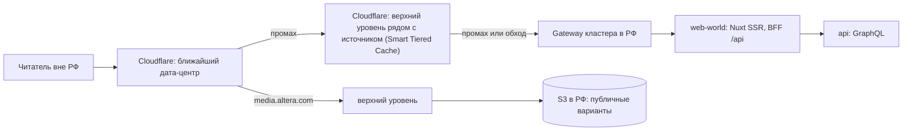

# Cloudflare перед altera.com: кеширование

- **Статус**: черновик от 2026-09-19. Конфигурация написана и проходит `terraform validate`, но не
  применена: зоны в Cloudflare нет, домен проекту не принадлежит (карта, раздел 8, вопрос 1).
- **Код**: `infra/cloudflare/` (Terraform, провайдер `cloudflare/cloudflare` 5.25.0).
- **Карта инфраструктуры**: [README.md](README.md).

## 1. Роль Cloudflare

Cloudflare стоит только перед мировым доменом. Он завершает TLS, кеширует публичные страницы,
статику и медиа, защищает от DDoS и делает редиректы. Источник — Gateway кластера Kubernetes в РФ:
приложения и база остаются в РФ (ADR-0011). altera.ru от Cloudflare не зависит: его HTML отдаётся с Gateway
напрямую, а статика и медиа — через российский CDN ([ru-cdn.md](ru-cdn.md)).



## 2. Что умеет бесплатный план (проверено 2026-09-19)

| Возможность                                                             | Free                                 | Источник                                                                                                              |
| ----------------------------------------------------------------------- | ------------------------------------ | --------------------------------------------------------------------------------------------------------------------- |
| Правил кеша                                                             | 10 (Pro 25, Business 50)             | [Cache Rules](https://developers.cloudflare.com/cache/how-to/cache-rules/)                                            |
| Обход кеша по наличию cookie в выражении правила                        | да                                   | [Bypass Cache on Cookie](https://developers.cloudflare.com/cache/how-to/cache-rules/examples/bypass-cache-on-cookie/) |
| Свой ключ кеша: cookie, заголовки, страна, язык, выбор query-параметров | нет, только Enterprise               | [Cache Rules settings](https://developers.cloudflare.com/cache/how-to/cache-rules/settings/)                          |
| Отключить уважение к `Cache-Control` источника                          | нет, только Enterprise               | там же                                                                                                                |
| Очистка по URL, тегу, префиксу, хосту, всего                            | да, все способы                      | [Purge cache](https://developers.cloudflare.com/cache/how-to/purge-cache/)                                            |
| Частота очистки по тегу, префиксу и хосту                               | 5 запросов в минуту, запас 25        | там же                                                                                                                |
| Очистка по URL                                                          | 800 URL в секунду                    | там же                                                                                                                |
| Подмена `Host`, SNI, DNS-записи к источнику (Origin Rules)              | нет, только Enterprise; порт — да    | [Origin Rules](https://developers.cloudflare.com/rules/origin-rules/)                                                 |
| Tiered Cache, Smart Topology                                            | да (Generic, Regional, Custom — нет) | [Tiered Cache](https://developers.cloudflare.com/cache/how-to/tiered-cache/)                                          |

Два следствия для кода:

- Язык страницы обязан быть в пути (`/en`, ADR-0002 п. 5), а не в `Accept-Language`: ключ кеша
  на бесплатном плане — только адрес.
- Платный план оплачивается иностранной картой. Конфигурация рассчитана на Free.

## 3. Правила кеша

Все подходящие правила применяются по порядку, и при конфликте побеждает более позднее. Поэтому
обходы кеша стоят последними. Код — `infra/cloudflare/cache.tf`.

| №   | Правило                | Условие                                                                               | Действие                                                                                                                            | Зачем                                      |
| --- | ---------------------- | ------------------------------------------------------------------------------------- | ----------------------------------------------------------------------------------------------------------------------------------- | ------------------------------------------ |
| 1   | `static_assets`        | `altera.com`, путь начинается с `/_nuxt/`                                             | в кеш на год, браузеру — как у источника                                                                                            | имена файлов сборки содержат хеш           |
| 2   | `public_pages`         | весь `altera.com`                                                                     | в кеш, **только если источник прислал `Cache-Control`**; устаревшая копия отдаётся, пока идёт обновление; защита от cache deception | политику TTL задаёт код                    |
| 3   | `media`                | `media.altera.com`                                                                    | в кеш на год; ответы 4xx — на 60 с, 5xx — не кешируются; браузеру — сутки                                                           | ключи неизменяемы, снятие — через очистку  |
| 4   | `bypass_private_paths` | `/api/`, `/auth/`, `/login`, `/me`, `/admin`, `/health`, те же под `/en`, `?preview=` | мимо кеша                                                                                                                           | персональные и служебные ответы            |
| 5   | `bypass_session`       | есть cookie сессии (`session_cookie_names`)                                           | мимо кеша                                                                                                                           | страница залогиненного может содержать ПДн |

Редиректы (`infra/cloudflare/redirects.tf`): `www.altera.com` → `altera.com` (301). Гео-редирект
посетителей из России на altera.ru записан, но выключен (`enable_ru_geo_redirect = false`) до
решения о схеме адресов двух доменов.

Настройки зоны (`infra/cloudflare/main.tf`): SSL `strict`, `always_use_https`, TLS не ниже 1.2,
HTTP/3, Tiered Cache со Smart Topology, Authenticated Origin Pulls.

## 4. Что должен делать источник

Cloudflare кеширует HTML только по явному разрешению источника. Пока Nuxt не отдаёт эти
заголовки, страницы просто идут мимо кеша: это безопасное состояние по умолчанию.

### 4.1. `Cache-Control` по классам адресов

Задаётся в `routeRules` Nuxt. Cloudflare подчиняется этим заголовкам. Российский CDN — нет: Yandex
кеширует ответ без `public, max-age` на время из настроек ресурса, поэтому там правила задаются
явно ([ru-cdn.md](ru-cdn.md), раздел 4).

| Класс                          | Адреса (ADR-0004)                                  | `Cache-Control`                                                | Основание                                     |
| ------------------------------ | -------------------------------------------------- | -------------------------------------------------------------- | --------------------------------------------- |
| Сборка                         | `/_nuxt/**`                                        | `public, max-age=31536000, immutable`                          | хеш в имени файла                             |
| Материал                       | `/{рубрика}/{слаг}`, `/en/...`                     | `public, max-age=0, s-maxage=3600, stale-while-revalidate=600` | ADR-0019 п. 3: до инвалидации, не больше часа |
| Главная, рубрики, теги, авторы | `/`, `/{рубрика}`, `/tags/*`, `/authors/*`         | `public, max-age=0, s-maxage=300, stale-while-revalidate=600`  | ADR-0019 п. 3: публичные списки — 5 минут     |
| Поиск                          | `/search`                                          | `public, max-age=0, s-maxage=60`                               | `20-public/search.md`: кеш 60 с               |
| RSS, sitemap                   | `/rss`, `/sitemap.xml`                             | `public, s-maxage=3600`                                        | `20-public/feeds-and-sitemap.md`              |
| Юридические тексты             | `/legal/*`                                         | `public, max-age=0, s-maxage=3600`                             | `20-public/legal-refunds.md`                  |
| Кабинет, админка, вход, BFF    | `/me/*`, `/admin/*`, `/login`, `/auth/*`, `/api/*` | `private, no-store`                                            | `30-account/*`, ADR-0023                      |
| Ошибка сервера                 | любой 5xx                                          | `no-store`                                                     | `20-public/error.md`                          |
| 404 и 410                      | —                                                  | `public, s-maxage=60` `[ДОПУЩЕНИЕ]`                            | 410 для архивных — журнал §28.2               |

`stale-while-revalidate` и `s-maxage` у 404 — `[ДОПУЩЕНИЕ]`, остальное взято из спецификаций.

### 4.2. Прочие условия

1. **Публичные страницы не выставляют cookie.** Ответ с `Set-Cookie` не должен попадать в общий
   кеш. Цветовая тема хранится в `localStorage` (`colorMode.storageKey`), определение языка
   браузера выключено (`i18n.detectBrowserLanguage: false`), поэтому сейчас условие выполняется.
   Закрепить тестом.
2. **Имя cookie сессии** в BFF (ADR-0023) совпадает с `session_cookie_names`. Сейчас в коде
   cookie нет, и значение по умолчанию `altera_session` — предложение.
3. **Персональные части публичных страниц** (шапка с ролью, закладки) грузятся отдельным
   запросом без кеша. `20-public/home.md` уже этого требует.
4. **Тег кеша** (`Cache-Tag`) на публичных страницах: `article:{id}`, `section:{slug}`,
   `author:{handle}`, `tag:{slug}`, `home:{locale}`. Те же теги ADR-0019 п. 2 использует для
   Redis. Публикация, снятие и правка вызывают очистку по тегам через адаптер CDN. Лимит Free —
   5 запросов в минуту, поэтому очистки собираются в пакет.
5. **Медиа:** при снятии, архиве материала и архиве аккаунта адаптер очищает URL всех вариантов
   (`access-and-signed-urls.md` п. 3).
6. **Настоящий IP клиента.** За Cloudflare источник видит IP Cloudflare. Лимиты частоты по IP
   (ADR-0024) обязаны брать `CF-Connecting-IP`, а Gateway — доверять этому заголовку только от
   диапазонов Cloudflare. Иначе все пользователи попадут под один лимит.
7. **Источник закрыт для всех, кроме Cloudflare.** Для хоста `altera.com` Gateway принимает
   соединения только с [адресов Cloudflare](https://www.cloudflare.com/ips/) или с клиентским
   сертификатом Authenticated Origin Pulls. Хост `altera.ru` тот же Gateway обслуживает напрямую,
   а `static.altera.ru` — через российский CDN со своим списком адресов.

## 5. Медиа: откуда Cloudflare берёт изображения

Бесплатный план не подменяет `Host` при запросе к источнику. Запрос к бакету придёт с
`Host: media.altera.com`, и источник должен его принять. Есть два варианта.

| Вариант                  | Как                                                                                         | Плюсы                                                    | Минусы                                                                                                                                                                           |
| ------------------------ | ------------------------------------------------------------------------------------------- | -------------------------------------------------------- | -------------------------------------------------------------------------------------------------------------------------------------------------------------------------------- |
| А. Бакет с именем домена | Бакет публичных вариантов называется `media.altera.com`; CNAME на адрес бакета у провайдера | Нет нагрузки на кластер                                  | Нужна поддержка у выбранного S3 (у Yandex Object Storage есть, у остальных проверить); имя бакета привязано к мировому домену; российский CDN берёт тот же бакет со своим `Host` |
| Б. Через Gateway         | `media.altera.com` → Gateway → прокси в бакет с заменой `Host`                              | Работает с любым S3; доступ к медиа описан в одном месте | Промахи кеша идут через кластер; ещё один маршрут в Gateway                                                                                                                      |

Рекомендация: А, если выбранный S3 умеет отдавать бакет по своему домену, иначе Б. Решается
вместе с Q-01 (выбор S3) и T-062.

## 6. Как применить

1. Домен куплен, зона создана в Cloudflare, NS у регистратора переключены на Cloudflare.
2. Gateway кластера отвечает по HTTPS для `altera.com` с действительным сертификатом
   (Let's Encrypt через cert-manager или Cloudflare Origin CA).
3. Создан токен Cloudflare с правами из `infra/cloudflare/versions.tf`. Для приложения — отдельный
   токен только на очистку кеша, хранится в секретах кластера.
4. Заполнить `terraform.tfvars` по `terraform.tfvars.example` и выполнить:

   ```bash
   cd infra/cloudflare
   export CLOUDFLARE_API_TOKEN=...   # не сохранять в файлы
   terraform init
   terraform plan
   terraform apply
   ```

5. Если правила кеша или редиректы уже созданы вручную в панели, их ruleset импортируется до
   `apply`: у фазы в зоне может быть только один ruleset.

## 7. Проверка после применения

| Проверка                      | Команда                                                      | Ожидается                                   |
| ----------------------------- | ------------------------------------------------------------ | ------------------------------------------- |
| Статика кешируется            | `curl -sI https://altera.com/_nuxt/<файл>.js` дважды         | `cf-cache-status: HIT` на втором запросе    |
| Публичная страница кешируется | `curl -sI https://altera.com/` дважды                        | `HIT`, растущий `age`                       |
| Сессия обходит кеш            | `curl -sI -H 'Cookie: altera_session=x' https://altera.com/` | `BYPASS` или `DYNAMIC`                      |
| Кабинет не кешируется         | `curl -sI https://altera.com/me`                             | `BYPASS` или `DYNAMIC`, `private, no-store` |
| Медиа                         | `curl -sI https://media.altera.com/<ключ варианта>` дважды   | `HIT`; после очистки — `MISS`               |
| www                           | `curl -sI https://www.altera.com/x?a=1`                      | `301` на `https://altera.com/x?a=1`         |
| Источник закрыт               | запрос к IP Gateway с `Host: altera.com` не из Cloudflare    | отказ                                       |

## 8. Риски

1. **Россия.** С 9 июня 2025 года российские провайдеры ограничивают соединения с сайтами за
   Cloudflare: загружаются только первые 16 КБ ([Хабр](https://habr.com/ru/news/922532/)), трафик
   Cloudflare из России за полгода упал на 30 % ([Хабр](https://habr.com/ru/news/981454/)). Поэтому
   российским читателям нужен altera.ru. Короткий ответ-редирект, вероятно, проходит, но это не
   проверено.
2. **Связь Cloudflare с источником в РФ.** Ограничения направлены на пользователей в РФ, но
   запросы Cloudflare к источнику в РФ тоже проходят через российские сети. До выбора схемы
   проверить на пробном источнике: ответы больше 16 КБ, серия запросов, сутки наблюдения.
3. **Трансграничная передача ПДн.** Гражданин РФ, который входит на altera.com, передаёт e-mail и
   cookie через Cloudflare (США). Нужно ли уведомление Роскомнадзора о трансграничной передаче
   (ст. 12 152-ФЗ), решает юрист. Гео-редирект снижает, но не снимает вопрос.
4. **Кеш дробится по query-параметрам.** На бесплатном плане нельзя исключить из ключа, например,
   `utm_*`: каждая метка — отдельная копия. На старте это не важно.
5. **Зависимость от иностранного провайдера.** Затрагивает только мировой домен; российский
   контур работает без Cloudflare.
