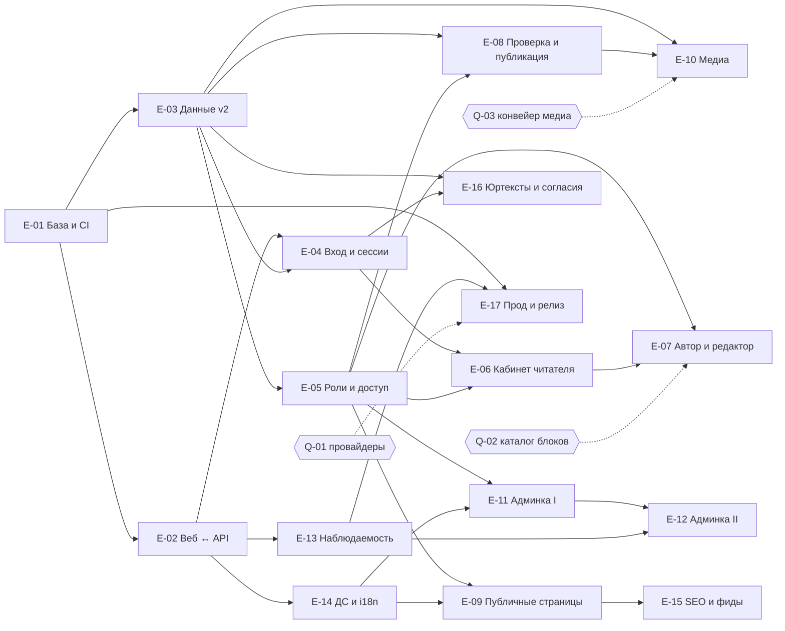

# Дорожная карта Altera — ревизия 3

- **Дата**: 2026-09-09
- **Статус**: ревизия 3 — бесплатный первый запуск; заменяет ревизию 2 (2026-09-06)
- **Основание**: рабочий журнал решений `docs/decisions/role-review-working-log-2026-09-08.md`
  (гейты Г1–Г9, §24.1 — первый запуск бесплатный), спецификации `docs/spec/` (фаза 2 завершена
  2026-09-09), `docs/spec/OPEN-QUESTIONS.md`, ADR-0034…0046 со строками статуса по журналу
- **Исполнимые задачи**: `docs/backlog/` (эпики `E-`, задачи `T-`, блокеры `Q-`, будущие этапы `F-`);
  операционная модель — `docs/multica/operating-model.md`
- **Оценок в человеко-днях нет** — по правилу `docs/spec/README.md`; порядок и объём — здесь и в
  бэклоге, содержание — в спецификациях

## 0. Что изменилось относительно ревизии 2

| Было (ревизия 2) | Стало (ревизия 3) | Основание |
|---|---|---|
| Этап 1 «Первый автор оплачивает и публикует»: биллинг, ЮKassa, цены, чеки в первом релизе | **Бесплатный запуск**: регистрация → читатель; базовое авторство открывается бессрочно при первом «Создать статью» без оплаты и одобрения; платность — отдельный будущий этап F-01 с Т-Кассой первой | журнал §24.1, §25.1, §8.14 |
| AI-оценка и балл как вход рейтинга; раздел «AI-оценки» с переопределением | AI даёт только бинарный результат «публиковать / не публиковать» с причинами; в рейтинге не участвует; раздел «AI-процессы» — наблюдение | журнал #41–42, §21; ADR-0039 частично заменён |
| Pro-буст на 24 часа, `ArticleBoost`, лимит бустов | Постоянный Pro-балл по снимку плана при публикации | журнал §21.15–16; ADR-0040 заменён |
| `RankExplainer` — словесное объяснение позиции читателю | Объяснения читателю нет; автору — общие показатели без внутренних коэффициентов | журнал §21, §25.5, §28.9; ADR-0034 п. 5 заменён |
| Секции главной по рубрикам | Три подборки одной ленты: главный топ, «Новое», «Популярное»; до движка — по дате | журнал §22, §20.4; ADR-0034 п. 6 заменён |
| История слагов и хэндлов, 301 при смене | Слаги и хэндлы уникальны навсегда и не меняются; 301 только при архиве рубрики в преемника и слиянии тегов | журнал §26.10, §26.2, §26.3; ADR-0004 дополнен |
| «Ровно один `owner`» (историческое) | Несколько равноправных владельцев, назначение в два шага, «не ноль владельцев» | журнал #10, §26.7 |
| Поиск на PostgreSQL FTS (этап 3) | Meilisearch по релевантности — будущий этап F-03 | журнал §21.21; ADR-0025 заменён |
| Прочтения с суточными солями (`ReadEvent`) | Сигналы вовлечённости с first-party `visitorId` — будущий этап F-02 | журнал §23; ADR-0027, ADR-0038 заменены |
| Этапные файлы `01–06` как источник задач | Источник задач — `docs/backlog/`; этапные файлы ревизии 2 сохранены как история с плашкой | этот документ |
| Жалобы и `/contact` в этапе 1 | Жалобы — отдельный разбор (F-06); обращения в редакцию остаются в запуске | журнал «Открытые вопросы» |

Отменённое ревизией 2 (витрина, два контура, правило-арбитр, донаты, уровни доверия) остаётся
отменённым.

## 1. Стадии

| Стадия | Содержание | Эпики / этапы | Гейт владельца |
|---|---|---|---|
| **A. Бесплатный запуск** | инженерная база, соединение веба и API, модель данных v2, вход и сессии, роли и доступ, кабинеты, проверка и публикация, публичные страницы, медиа по утверждённым принципам, админка, наблюдаемость, дизайн-система и i18n, SEO, юридические тексты, прод в РФ | E-01…E-17; E-18 сквозной | блокеры Q-01…Q-12 (`docs/backlog/owner-blockers.md`); открытие регистрации — после T-105 (восстановление из копии) и T-107 (152-ФЗ) |
| **B. Рейтинг и вовлечённость** | контур `visitorId`, движок по принципам Г4 с параметрами в коде, главный топ и «Популярное», статистика автора, раздел состояния движка, антинакрутка | F-02 | параметры рейтинга (§21.39, §23) — углублённый этап Г4 |
| **C. Поиск** | индексация Meilisearch, страница `/search` | F-03 | спецификация индексации; OPEN-QUESTIONS #5 |
| **D. Платность** | планы, checkout с офертой, Т-Касса, очередь периодов, возвраты, чеки и бухгалтерия, промокоды, письмо о смене цены | F-01 | цены (§8.12), включение платности (§24.1), §8.19, §25.14, промокоды |
| **E. Расширения** | расширенное медиа (F-04), почта (F-05), жалобы (F-06), каталог блоков (F-07 — нужен раньше: Q-02), зона провайдеров (F-08), расширения автора и совместная работа (F-09), подписка на автора (F-10) | F-04…F-10 | по каждому — отдельный проход спецификаций |

Порядок стадий B–E после запуска не зафиксирован журналом (только «платность — после проверки
ценности», §24.1) — вопрос Q-13. Каталог блоков (F-07) стоит особняком: без него не завершаем
редактор стадии A, поэтому проход `95-blocks/` нужен до конца стадии A (Q-02).

## 2. Стадия A: эпики и зависимости

Граф — зависимости результатов, а не очередь исполнения: одновременно меняет продуктовый код
только одна цепочка (`docs/multica/operating-model.md` §5). Порядок первых работ —
`docs/backlog/ready-candidates.md`.

| Эпик | Результат | Файл |
|---|---|---|
| E-01 | Инженерная база и честный CI | `docs/backlog/epics/E-01-engineering-base-ci.md` |
| E-02 | Соединение веба и API | `docs/backlog/epics/E-02-web-api-connection.md` |
| E-03 | Модель данных v2 | `docs/backlog/epics/E-03-data-model-v2.md` |
| E-04 | Вход, сессии и лимиты | `docs/backlog/epics/E-04-auth-sessions-limits.md` |
| E-05 | Роли и проверки доступа | `docs/backlog/epics/E-05-roles-and-access.md` |
| E-06 | Кабинет читателя | `docs/backlog/epics/E-06-reader-account.md` |
| E-07 | Кабинет автора и обвязка редактора | `docs/backlog/epics/E-07-author-account-editor.md` |
| E-08 | Проверка и публикация | `docs/backlog/epics/E-08-review-and-publish.md` |
| E-09 | Публичные страницы | `docs/backlog/epics/E-09-public-pages.md` |
| E-10 | Медиа | `docs/backlog/epics/E-10-media.md` |
| E-11 | Админка I | `docs/backlog/epics/E-11-admin-1.md` |
| E-12 | Админка II | `docs/backlog/epics/E-12-admin-2.md` |
| E-13 | Наблюдаемость | `docs/backlog/epics/E-13-observability.md` |
| E-14 | Дизайн-система и i18n | `docs/backlog/epics/E-14-design-system-i18n.md` |
| E-15 | SEO и фиды | `docs/backlog/epics/E-15-seo-and-feeds.md` |
| E-16 | Юридические тексты и согласия | `docs/backlog/epics/E-16-legal-and-consent.md` |
| E-17 | Прод в РФ, бэкапы и релиз | `docs/backlog/epics/E-17-prod-and-release.md` |
| E-18 | Документация и ADR (сквозной) | `docs/backlog/epics/E-18-docs-and-adr.md` |

## 3. Минимальный бесплатный запуск: что считается достаточным

Открытая регистрация допустима, когда одновременно: (1) сквозной сценарий «регистрация →
«Создать статью» → подача → AI-проверка → публикация → страница материала» проходит e2e
(T-112) на реальных провайдерах (Q-01); (2) ручная ветка ревьюера работает (T-050); (3) медиа
загружается по утверждённым принципам (Q-03 закрыт); (4) юридические тексты опубликованы с
согласием (Q-07); (5) проведено восстановление из резервной копии (T-105) и выполнен чек-лист
152-ФЗ (T-107); (6) health и оповещения работают (Q-11). Всё остальное стадии A может
догоняться после открытия регистрации по решению владельца.

## 4. Точки решений владельца

Все точки собраны в `docs/backlog/owner-blockers.md` (Q-01…Q-13) с последствиями вариантов.
Критический путь стадии A: **Q-02** (каталог блоков — без него нет редактора и страницы
материала), **Q-01** (провайдеры — без них нет входа, медиа и прода), **Q-03** (конвейер медиа —
без лимитов загрузка не открывается), **Q-07** (юридические тексты).

## 5. Историческая часть

Этапные файлы ревизии 2 (`01-stop-the-bleeding.md`, `02-first-author-pays-and-publishes.md`,
`03-ranked-delivery.md`, `04-reader-finds-and-returns.md`, `05-editorial-team.md`,
`06-collaboration-and-pro-tools.md`) сохранены с плашкой «заменено бэклогом ревизии 3»; их
технические пункты перенесены в задачи бэклога, продуктовые расхождения с журналом перечислены в
отчёте `docs/reports/2026-09-09-roadmap-revision-and-backlog-report.md`. Файлы ревизии 1
остаются историческими. Роадмап ревизии 2 — коммит до `9066ba2` в истории этого файла.
