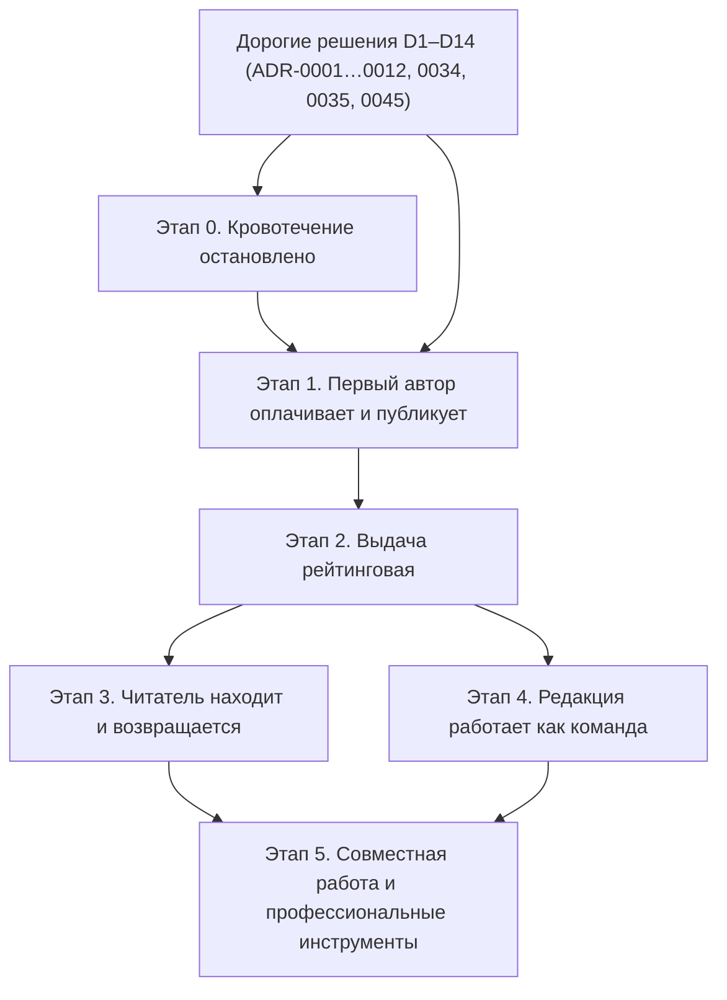

# Дорожная карта Altera

- **Ревизия**: 2 (2026-09-06), заменяет ревизию 1 (коммит `7c0ce79`). Ревизия 2 не содержит
  оценок в человеко-днях и сценария деградации: оценки делаются при разбивке этапов на
  задачи, после приёмки второй фазы проектирования (`docs/prompts/phase-2-program.md`).
- **Статус**: состав и порядок этапов утверждены владельцем 2026-09-06 (гейт Г0).
- **Основание**: `docs/vision/02-target-architecture.md` ревизии 2, срез реальности
  `docs/vision/00-reality-check.md` (коммит `8cb987c`), ADR-0043 и ADR-0034…0046.
- Этапы — **состояния продукта**, а не списки задач. Разбивка на задачи начинается только
  после отдельного подтверждения владельцем.

## 0. Что изменилось относительно ревизии 1

| Было | Стало | Почему |
|---|---|---|
| Этап 2 «Редакция ведёт витрину» | Отменён; замечания, ревизии, SEO, вторая языковая версия и аудит переехали в этапы 3–4 | ADR-0036 |
| Этап 4 «Первые деньги за редакционную работу» (после 20 авторов) | Биллинг — в этапе 1; донатов и витрины нет | ADR-0035 |
| Прочтения и «популярное» — этап 3 | Прочтения, рейтинг, AI-оценка, буст — этап 2 | ADR-0034, ADR-0038 |
| Уровни доверия и очередь — этап 1 | AI-проверка и вторая ступень человеком — этап 1 | ADR-0045 |
| Назначение ролей и отчёты — этап 5 | Администраторы и статистика — этап 1 | ADR-0042 |
| Перевод автором — этап 2 | AI-перевод для pro — этап 3 | ADR-0046 |
| Семь этапов 0–6 с оценками | Шесть этапов 0–5 без оценок | решение владельца |

---

## 1. Этапы

| № | Состояние | Файл | Что становится возможно |
|---|---|---|---|
| 0 | **Кровотечение остановлено** | [01-stop-the-bleeding.md](01-stop-the-bleeding.md) | Веб рендерит страницы из API по единому контракту; черновики и e-mail закрыты; сессия обновляется и отзывается; письма уходят; CI красный при поломке; сервер живёт без Redis |
| 1 | **Первый автор оплачивает и публикует** | [02-first-author-pays-and-publishes.md](02-first-author-pays-and-publishes.md) | Модель данных v2 без контуров; семь ролей и администраторы из интерфейса; планы free / standard / pro, ЮKassa за адаптером, чеки, жизненный цикл подписки, цены и оплата; кабинет читателя и автора, закладки; редактор с базовыми блоками; AI-проверка и вторая ступень человеком; страницы из данных (по дате); админка запуска; прод в РФ, бэкапы, юридические тексты, README |
| 2 | **Выдача рейтинговая** | [03-ranked-delivery.md](03-ranked-delivery.md) | Прочтения без профилирования; AI-оценка как вход; `ArticleScore` / `AuthorScore` с детерминированным пересчётом; `RankingConfig` из админки; pro-буст на сутки; секции главной по рейтингу; объяснение автору и читателю; антинакрутка; разделы «AI-оценки» и «Конфигурация рейтинга» |
| 3 | **Читатель находит и возвращается** | [04-reader-finds-and-returns.md](04-reader-finds-and-returns.md) | Поиск; подписка на автора с письмами; экспорт материалов; SEO целиком (hreflang, sitemap, RSS, OG); интерфейс на двух языках; AI-перевод для pro; самостоятельное удаление аккаунта и выгрузка данных; доступность и бюджеты как гейты CI |
| 4 | **Редакция работает как команда** | [05-editorial-team.md](05-editorial-team.md) | Замечания к блокам; ревизии в интерфейсе; аудит-интерфейс; медиа-библиотека; библиотека блоков; расширенные отчёты для `analyst`; рассылка; шаблоны материалов |
| 5 | **Совместная работа и профессиональные инструменты** | [06-collaboration-and-pro-tools.md](06-collaboration-and-pro-tools.md) | Соавторство в реальном времени; сравнение версий; профессиональные инструменты pro; партнёрские материалы |

Файлы этапов нумеруются по порядку выполнения (`01-` … `06-`), номер этапа — в заголовке
файла; этап 0 живёт в файле `01-`. Файлы ревизии 1 (`02-first-author-first-article.md`,
`03-editorial-showcase.md`, `05-first-money-for-editorial-work.md`, `06-editorial-team.md`,
`07-collaboration-and-pro-tools.md`) помечены как исторические.

## 2. Почему этап 0 первый и обязателен

Сейчас любая новая функция веба пишется на фикстурах против несуществующего контракта:
25 из 35 операций фронта невалидны, `article(slug)` отдаёт черновики, `User.email` публичен,
refresh-токен не обновляется, письма печатаются в консоль, CI зелёный при сломанной сборке
[ФАКТ: `docs/vision/00-reality-check.md` §3–6]. Пока контракт не един, соединение не живое, а
сессия не полна, редактор, биллинг и рейтинг строятся на песке. Этап 0 не добавляет
продукта; он делает возможной проверку всего, что будет добавлено.

## 3. Граф зависимостей

| Раньше | Позже | Почему |
|---|---|---|
| Единый контракт и живое соединение (0) | Всё остальное | Иначе каждая страница — новое расхождение фронта и сервера |
| Полный цикл сессии и почта (0) | Кабинет, оплата, публикация (1) | Без обновления сессии автор не проработает дольше 15 минут; без писем нет входа и чеков |
| Дорогие решения D1–D14 (ADR) | Модель данных v2 (1) | Мигрировать данные один раз |
| Модель ролей и планов (1) | Кабинеты и админка (1) | Кабинет без плана и подписки переписывается |
| Биллинг и гранты (1) | Первая публикация (1) | Без подписки или гранта нет роли автора (ADR-0035) |
| Модель контента, AI-адаптер (1) | Редактор и очередь проверки (1) | Редактор — производная от схемы документа; очередь — от вердикта AI |
| Ядро дизайн-системы и реестры `docs/spec/` (1) | Массовая вёрстка (1–3) | Иначе страницы верстаются на `zinc-*`, как сейчас, и без реестра теряются |
| Опубликованные материалы и прочтения (1–2) | Рейтинг (2) | Рейтинг нечего считать на пустой базе |
| Рейтинг (2) | Секции главной, статистика автора, бусты (2) | Всё это — представления рейтинга |
| Проверенный процесс публикации (1) | AI-перевод (3) | Переведённая версия идёт тем же путём проверки |
| Модель локализации (1) | Вторая языковая версия и SEO целиком (3) | Адреса и hreflang нельзя добавить задним числом |
| Прод в РФ, бэкапы, юридические тексты, договор с провайдером (1) | Открытая регистрация (конец 1) | Персональные данные и деньги появляются с первым автором |
| Замечания, ревизии в интерфейсе (4), библиотека блоков (4) | Совместная работа (5) | Совместная работа нужна, когда есть кому работать вместе |

## 4. Точки решений владельца

| Когда | Решение | Что блокирует |
|---|---|---|
| Этап 0, до почты | Провайдер почты с РФ-контуром, домен отправки | Письма для входа |
| Этап 0, до сессий | Утвердить ADR-0023 (BFF, cookie) | Реализацию сессии |
| Этап 1, до миграции | Список рубрик и соответствие существующим строкам `content_types` | Миграцию таксономии |
| Этап 1, до биллинга | Юрлицо или ИП; договор с ЮKassa на рекуррентные списания; консультация по чекам; цены планов и годовая скидка; политика возвратов | Страницу оплаты и открытие регистрации |
| Этап 1, до AI-проверки | AI-провайдер, юрисдикция, договор, бюджет; пороги вердикта | Очередь проверки |
| Этап 1, до открытой регистрации | Провайдер РФ (база, S3, хостинг); юридические тексты; README; уведомление РКН по консультации | Открытие регистрации |
| Этап 2, гейт Г4 | Веса рейтинга, состав и принципы секций главной, лимит бустов | Ленты по рейтингу |
| Этап 3 | Лимиты AI-переводов; SLA проверки при росте очереди | AI-перевод; быстрый путь проверки |
| Этап 4 | Учётки редакции | Работу очереди с несколькими людьми |
| Этап 5 | Разрешить второй процесс для совместной работы; подтвердить спрос | Старт этапа 5 |

## 5. Открытые вопросы владельцу

- Список рубрик и их соответствие существующим `content_types` (гейт этапа 1).
- Провайдеры: почта (0), платежи, AI, хостинг и S3 (1).
- Быстрый путь проверки для проверенных авторов, если очередь ревьюера растёт (ADR-0045 —
  решение новым ADR по метрике этапа 1).

## 6. Как читать файлы этапов

Каждый файл описывает состояние продукта по одной структуре: цель и продуктовая гипотеза;
что входит; что сознательно не входит; от чего зависит и что разблокирует; Definition of Done
проверяемыми критериями; риски и способ их снять; метрики успеха. Оценок нет. Критерии DoD
сформулированы так, чтобы их можно было проверить командой, тестом или наблюдаемым
поведением.

## 7. Метрики верхнего уровня

| Этап | Главная метрика |
|---|---|
| 0 | Невалидных операций фронта: 0; страниц из API: все публичные; тестов в CI: > 0 и растёт |
| 1 | Авторов с оплаченным standard/pro и ≥ 1 публикацией; конверсия «профиль автора → оплата»; медиана «отправлено → решение человека» |
| 2 | Доля лент по рейтингу: 100 %; детерминизм пересчёта: 0 расхождений в тесте; доля дней с исключёнными прочтениями |
| 3 | Поисков в день и доля нулевых выдач < 20 %; подписчиков на автора; AI-переводов опубликовано; возвраты по агрегатам |
| 4 | Медиана «отправлено → решение» при ≥ 2 ревьюерах; покрытие аудита 100 %; подписчики рассылки |
| 5 | Сессий совместного редактирования; потерянных правок 0; конверсия pro в профессиональные инструменты |
