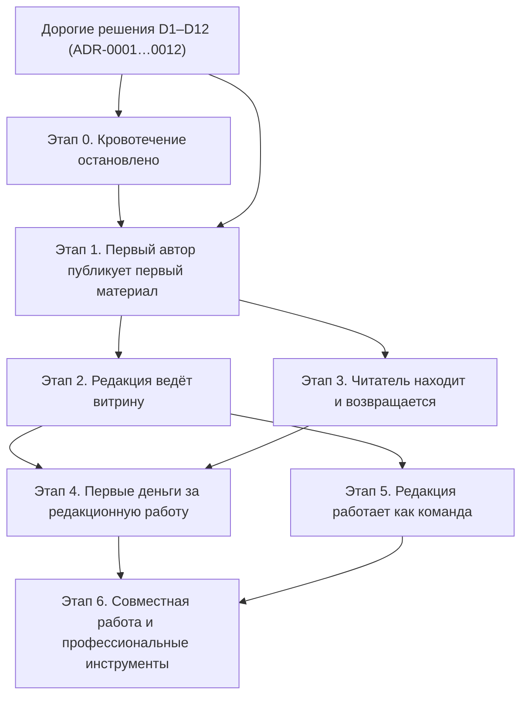

> **Ревизия 2 — черновик на утверждение (гейт Г0, 2026-09-06).** Таблица ниже заменяет
> раздел 1 после утверждения владельцем; остальной документ до этого момента описывает
> ревизию 1 и будет переписан целиком (без оценок в человеко-днях и сценария деградации).
>
> | № | Состояние | Что становится возможно |
> |---|---|---|
> | 0 | **Кровотечение остановлено** | Без изменений: единый контракт, живое соединение веба и API, закрытие утечек, полный цикл сессии, почта, честный CI, Redis необязателен |
> | 1 | **Первый автор оплачивает и публикует** | Модель данных v2 без контуров (ADR-0036); семь ролей и управление администраторами (ADR-0042); планы free/standard/pro, ЮKassa за адаптером, чеки, жизненный цикл подписки, страницы цен и оплаты (ADR-0035, ADR-0044); кабинет читателя и автора, закладки (ADR-0041); редактор с базовыми блоками; AI-проверка и вторая ступень человеком, очередь проверки (ADR-0039, ADR-0045); страницы из данных с временной сортировкой по дате; админка: сводка, категории, теги, статьи, очередь, пользователи, администраторы, подписки, статистика базовая, жалобы; прод в РФ, бэкапы, юридические тексты, README |
> | 2 | **Выдача рейтинговая** | Прочтения (ADR-0038); AI-оценка как вход; `ArticleScore`/`AuthorScore`, пересчёт, `RankingConfig` из админки; pro-буст (ADR-0040); секции главной по рейтингу (ADR-0034); объяснение читателю и автору; антинакрутка; разделы «Конфигурация рейтинга» и «AI-оценки» |
> | 3 | **Читатель находит и возвращается** | Поиск (ADR-0025); подписка на автора без денег; экспорт материалов; SEO целиком (meta, canonical, hreflang, sitemap, RSS); интерфейс на двух языках; AI-перевод для pro (ADR-0046); самостоятельное удаление аккаунта и выгрузка данных |
> | 4 | **Редакция работает как команда** | Замечания к блокам; ревизии в интерфейсе; аудит-интерфейс; медиа-библиотека; расширенные отчёты для `analyst`; рассылка; шаблоны материалов; библиотека блоков этапа 5 ревизии 1 |
> | 5 | **Совместная работа и профессиональные инструменты** | Соавторство в реальном времени; сравнение версий; платные инструменты pro; партнёрские материалы |
>
> Зависимости: 0 → 1 → 2 → 3; 4 после 2; 5 после 3 и 4. Биллинг перенесён в этап 1, потому что
> без него роль автора не существует (ADR-0035); рейтинг — этапом 2, потому что этап 1 даёт
> материалы, на которых его можно проверить; переводы и SEO — этапом 3, чтобы вторая языковая
> версия появлялась на уже проверенном процессе публикации.
>
> Точки решений владельца ревизии 2: провайдер почты (0); список рубрик; юрлицо и договор с
> ЮKassa, консультация по чекам, цены планов; AI-провайдер, юрисдикция и бюджет на проверку и
> оценку; провайдер РФ для базы, S3 и хостинга (все — до открытой регистрации в 1); веса
> рейтинга и состав секций главной (2, гейт Г4); лимиты AI-переводов (3).

# Дорожная карта Altera

- **Статус**: состав и порядок этапов подтверждены владельцем 2026-09-05.
- **Основание**: `docs/vision/02-target-architecture.md`, срез реальности
  `docs/vision/00-reality-check.md` (коммит `8cb987c`), решения `docs/decisions/`.
- **Допущение о скорости**: один разработчик с AI-агентами, около четырёх продуктивных дней
  в неделю. Все оценки — диапазоны в человеко-днях (чд); календарных дат нет, потому что
  скорость не измерена. После первого этапа оценки пересматриваются по фактической скорости.
- Этапы — **состояния продукта**, а не списки задач. Разбивка на задачи начинается только
  после отдельного подтверждения владельцем.

---

## 1. Этапы

| № | Состояние | Файл | Что становится возможно | Оценка, чд |
|---|---|---|---|---|
| 0 | **Кровотечение остановлено** | [01-stop-the-bleeding.md](01-stop-the-bleeding.md) | Веб рендерит страницы из API по единому контракту; черновики и e-mail закрыты; сессия обновляется и отзывается; письма уходят; CI красный при поломке; сервер живёт без Redis | 10–15 |
| 1 | **Первый автор публикует первый материал** | [02-first-author-first-article.md](02-first-author-first-article.md) | Модель данных v2 с переводами и ревизиями; вход по ссылке; кабинет; минимальный редактор; публикация с уровнями доверия; реальные страницы; прод в РФ с бэкапами; юридические тексты; README | 28–40 |
| 2 | **Редакция ведёт витрину** | [03-editorial-showcase.md](03-editorial-showcase.md) | Отборы на главную и витрину; замечания к блокам; ревизии; снятие с причиной; вторая языковая версия; интерфейс на двух языках; meta, canonical, hreflang, sitemap, RSS; аудит | 14–22 |
| 3 | **Читатель находит и возвращается** | [04-reader-finds-and-returns.md](04-reader-finds-and-returns.md) | Поиск; подборки; прочтения и честное «популярное»; подписка на автора; экспорт материалов; доступность и бюджеты как гейты; самостоятельное удаление аккаунта | 14–20 |
| 4 | **Первые деньги за редакционную работу** | [05-first-money-for-editorial-work.md](05-first-money-for-editorial-work.md) | Поддержка автора и подписка на витрину через адаптер провайдера; чеки; отмена, возврат, просрочка; выплаты v1; критерий отказа считается автоматически | 22–34 (+5–8 автоматические выплаты) |
| 5 | **Редакция работает как команда** | [06-editorial-team.md](06-editorial-team.md) | Библиотека блоков; медиа-библиотека; роли из интерфейса; аудит-интерфейс; отчёты; рассылка; шаблоны | 22–34 |
| 6 | **Совместная работа и профессиональные инструменты** | [07-collaboration-and-pro-tools.md](07-collaboration-and-pro-tools.md) | Соавторство в реальном времени; сравнение версий; платные инструменты; партнёрские материалы | 25–40 |

Сумма: 135–205 чд, около 34–51 недели при четырёх днях в неделю. Минимум для живого продукта
с первыми авторами (этапы 0, 1 и половина этапа 2): 45–65 чд.

Файлы этапов нумеруются по порядку выполнения (`01-` … `07-`), номер этапа — в заголовке
файла; этап 0 живёт в файле `01-`.

## 2. Почему этап 0 первый и обязателен

Сейчас любая новая функция веба пишется на фикстурах против несуществующего контракта:
25 из 35 операций фронта невалидны, `article(slug)` отдаёт черновики, `User.email` публичен,
refresh-токен не обновляется, письма печатаются в консоль, CI зелёный при сломанной сборке
[ФАКТ: `docs/vision/00-reality-check.md` §3–6]. Пока контракт не един, соединение не живое, а
сессия не полна, редактор, витрина и деньги строятся на песке — после первого подключения к
API их пришлось бы переписывать. Этап 0 не добавляет продукта; он делает возможной проверку
всего, что будет добавлено.

## 3. Граф зависимостей

| Раньше | Позже | Почему |
|---|---|---|
| Единый контракт и живое соединение (0) | Всё остальное | Иначе каждая страница — новое расхождение фронта и сервера |
| Полный цикл сессии и почта (0) | Кабинет и публикация (1) | Без обновления сессии автор не проработает дольше 15 минут; без писем нет входа |
| Дорогие решения D1–D12 (ADR) | Модель данных v2 (1) | Мигрировать данные один раз |
| Модель ролей и данных (1) | Кабинеты и админка (1–2) | Кабинет без переводов и контуров переписывается |
| Модель контента (ADR-0001, пакет `content`) | Редактор (1) | Редактор — производная от схемы документа |
| Ядро дизайн-системы: токены, карточка, `Prose*` (1) | Массовая вёрстка (1–3) | Иначе страницы верстаются на `zinc-*`, как сейчас |
| Модель локализации (1) | Вторая языковая версия и SEO (2) | Адреса и hreflang нельзя добавить задним числом |
| Прод в РФ, бэкапы, юридические тексты (1) | Открытая регистрация (конец 1) | Персональные данные появляются с первым автором |
| Отборы и замечания (2) | Витрина как продукт (4) | Платят за редакционную работу, которой должно быть видно |
| Подписка на автора и прочтения (3) | Поддержка автора (4) | Воронка и метрики для критерия отказа |
| Права и биллинг (1, 4) | Платные сценарии (4) | Paywall без прав — дыра; без модели платежей — переписывание |
| Замечания, ревизии (2), библиотека блоков (5) | Совместная работа (6) | Совместная работа нужна, когда есть кому работать вместе |

## 4. Точки решений владельца

| Когда | Решение | Что блокирует |
|---|---|---|
| Этап 0, до почты | Провайдер почты с РФ-контуром, домен отправки | Письма для входа |
| Этап 0, до сессий | Утвердить ADR-0023 (BFF, cookie) | Реализацию сессии |
| Этап 1, до миграции | Список рубрик и соответствие существующим строкам `content_types` (содержимое базы не проверено) | Миграцию M4 |
| Этап 1, до открытой регистрации | Провайдер РФ (база, S3, хостинг); юридические тексты; README; уведомление РКН по консультации | Открытие регистрации |
| Этап 2 | Учётки редакции; SLA проверки (48 часов в правилах) | Работу очереди с несколькими людьми |
| После этапа 3 | OAuth, комментарии, внешний поиск — только по измерениям | Ничего: по умолчанию не делаем |
| До этапа 4 | Юрлицо или ИП; договор с провайдером на рекуррент и выплаты; консультация по чекам при донатах и агентской схеме; утверждение ценовых гипотез; комиссия; хранение ИНН | Старт этапа 4 |
| До этапа 6 | Разрешить второй процесс для совместной работы; подтвердить спрос | Старт этапа 6 |

## 5. Сценарий деградации

Если времени вдвое меньше, режем в таком порядке:

1. Этап 6 целиком; этап 5 — до медиа-библиотеки и аудит-интерфейса.
2. Этап 4 откладывается до появления 20 активных авторов: деньги без аудитории не проверяют
   ничего.
3. Этап 3 — только поиск, навигация из данных и экспорт; подборки и подписка на автора уходят.
4. Этап 2 — только отбор на главную, очередь с замечаниями и базовое SEO; вторая языковая
   версия уходит в следующий цикл, **но модель данных для неё остаётся в этапе 1**.

Минимум, который всё ещё даёт живой продукт с первыми авторами: этап 0 + этап 1 + урезанный
этап 2 — 45–65 чд.

## 6. Открытые вопросы владельцу

- Список рубрик и их соответствие существующим `content_types` (гейт этапа 1).
- Адрес витрины (`/showcase` или иное) — до карты маршрутов этапа 1.
- Провайдеры: почта (0), хостинг и S3 (1), платежи (4).

## 7. Как читать файлы этапов

Каждый файл описывает состояние продукта по одной структуре: цель и продуктовая гипотеза;
что входит; что сознательно не входит; от чего зависит и что разблокирует; Definition of Done
проверяемыми критериями; риски и способ их снять; оценка в человеко-днях; метрики успеха.
Критерии DoD сформулированы так, чтобы их можно было проверить командой, тестом или
наблюдаемым поведением, а не мнением.

## 8. Метрики верхнего уровня

| Этап | Главная метрика |
|---|---|
| 0 | Невалидных операций фронта: 0; страниц из API: все публичные; тестов в CI: > 0 и растёт |
| 1 | Внешних авторов с хотя бы одной публикацией; медиана «первый вход → первый черновик» |
| 2 | Отборов в неделю; медиана «отправлено на проверку → решение» ≤ 48 часов |
| 3 | Поисков в день и доля нулевых выдач < 20 %; подписчиков на автора; возвраты по агрегатам |
| 4 | Конверсия подписчиков автора в платящих ≥ 3 % за 8 недель; удержание на первом продлении ≥ 50 % |
| 5 | Доля материалов с блоками этапа 5; покрытие аудита 100 %; подписчики рассылки |
| 6 | Сессий совместного редактирования; потерянных правок 0; конверсия в платные инструменты |
