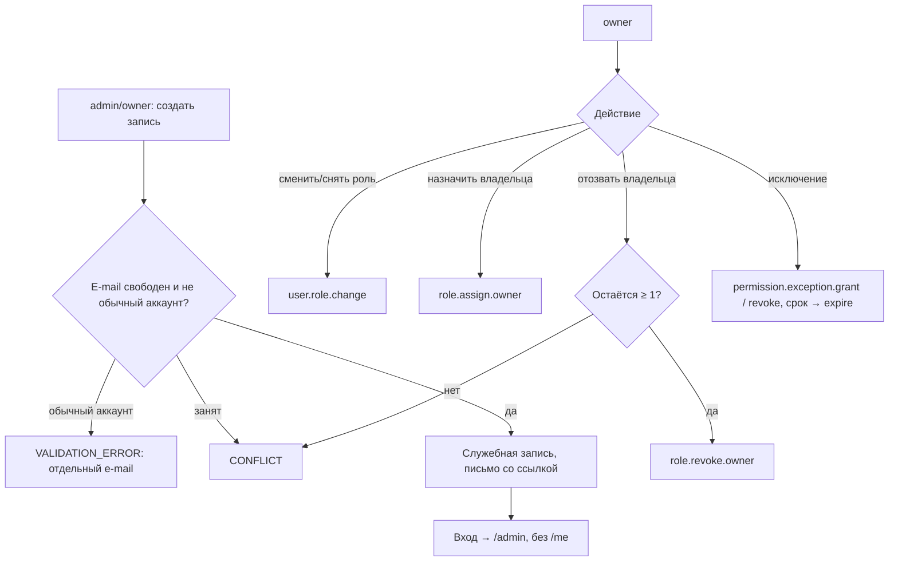

# Flow: Создание служебных учётных записей, смена ролей и владельцы

- **Реестр**: `00-registries/flows.md` #10
- **Статус**: на утверждении
- **ADR**: ADR-0003, ADR-0022, ADR-0042; журнал §1–2, #7, #10, #13, #46–47, #54, §25.2;
  `40-admin/admins.md` (#7); `50-access/escalation-and-demotion.md` п. 2–5,
  `permission-exceptions.md`; `10-flows/register-and-login.md` (#1)
- **Этап**: 1

## 1. Цель пользователя и роль на входе / выходе

`admin` или `owner` хочет завести сотрудника; `owner` — сменить или снять служебную роль,
назначить другого владельца, отозвать роль или деактивировать доступ другого владельца, выдать
или отозвать индивидуальное право. Вход: `admin` (только создание записей), `owner`. Выход:
новая служебная запись `editor` / `moderator` / `analyst` / `admin` с входом по ссылке; изменённая
роль; второй `owner`; действующее исключение. Существующий читатель или автор в служебную роль
не повышается ни при каких условиях (журнал #46–47); служебная запись изолирована от
читательского и авторского интерфейса, для личного — отдельный обычный аккаунт (§25.2);
система не остаётся без владельца (журнал #10).

## 2. Предусловия

Сессия `admin`/`owner`; e-mail новой записи не занят ни одним аккаунтом; для владельцев —
операция в транзакции с проверкой «≥ 1 владельца» (`escalation-and-demotion.md` п. 3); права
исключений — из набора `permission-checks.md` п. 4; формат запроса и согласования исключения —
ручной организационный процесс (журнал §2.4).

## 3. Шаги

| Шаг | Экран (файл страницы) | Действие пользователя | Система делает | Данные / мутация | Событие (код) |
|---|---|---|---|---|---|
| 1 | `40-admin/admins.md` («создать») | вводит e-mail, служебное имя, роль | проверяет, что e-mail свободен; создаёт служебную запись без читательского и авторского интерфейса (§25.2); ставит письмо со ссылкой входа | `createStaff(email, role, name)` | `user.create.staff` (#76), `mail.queued` (#51) |
| 2 | `20-public/login.md` → `verify.md` | сотрудник входит по ссылке | обычный вход; после входа — `/admin` (сводка своей зоны), не `/me` | `verifyMagicLink` | `auth.login` (#42), `admin.enter` |
| 3 | `admins.md` (карточка) | `owner` меняет или снимает роль с причиной | одна роль на пользователя; действует немедленно; следы решений сохраняются (п. 4, 9, 10) | `changeStaffRole` / `revokeStaffRole` | `user.role.change` (#12) |
| 4 | `admins.md` | `owner` назначает другого владельца | второй равноправный `owner` (журнал #10) | `assignOwner` | `role.assign.owner` (#65) |
| 5 | `admins.md` | `owner` отзывает роль или деактивирует доступ другого владельца | транзакция с проверкой «остаётся ≥ 1» | `revokeOwner` / `deactivateOwner` | `role.revoke.owner` / `owner.deactivate` (#65) |
| 6 | `admins.md` | `owner` выдаёт или отзывает исключение (право, вид, срок, причина) | `PermissionException`; автоматическое прекращение по сроку (журнал #54) | `grantException` / `revokeException` | `permission.exception.grant` / `.revoke` / `.expire` (#66) |

## 4. Развилки

| Точка | Условие | Ветка А | Ветка Б |
|---|---|---|---|
| Шаг 1 | e-mail принадлежит читателю или автору | `VALIDATION_ERROR` «повышение не предусмотрено — заведите отдельный e-mail» (журнал #46–47) | создание |
| Шаг 1 | `admin` выбирает роль `owner` | недоступно (`FORBIDDEN`): владельца назначает только `owner` (#106) | создание |
| Шаг 1 | e-mail занят служебной записью | `CONFLICT` | создание |
| Шаг 2 | сотрудник входит в `/me` | 302 на `/admin`; читательских разделов нет (§25.2) | админка |
| Шаг 3 | `owner` снимает роль с себя | `FORBIDDEN` (п. 5 `[ДОПУЩЕНИЕ]`) | другому |
| Шаг 3 | снятие роли у `editor` | редакционные статьи не меняются (журнал §17) | — |
| Шаг 5 | последний владелец | `CONFLICT` — сначала назначить другого (журнал #10) | отзыв |
| Шаг 6 | исключение для `reader`/`author` | недоступно (журнал #7) | служебной роли |
| Шаг 6 | право `publish` для `admin` | действует как у `editor`, AI-проверка не обходится (`permission-exceptions.md` п. 9) | — |
| Шаг 6 | срок исключения истёк | система прекращает, аудит `permission.exception.expire` | действует |

## 5. Ошибки и восстановление

| Ошибка (код ADR-0032) | На каком шаге | Что видит пользователь | Как продолжить |
|---|---|---|---|
| `VALIDATION_ERROR` | 1 | e-mail принадлежит обычному аккаунту / формат | другой e-mail |
| `CONFLICT` | 1, 5 | занято / последний владелец | другой e-mail / назначить владельца |
| `FORBIDDEN` | 1, 3–6 | `admin` вне создания; снятие с себя | `owner` |
| `NOT_FOUND` | 3–6 | запись удалена навсегда | — |
| `PROVIDER_UNAVAILABLE` | 1 | письмо не отправлено — запись создана, ссылку запросить с `/login` | повтор |

## 6. Письма и уведомления

| Шаг | Письмо | Кому | Ссылка и срок действия |
|---|---|---|---|
| 1 | ссылка входа для новой служебной записи | сотрудник | `/auth/verify?token=`, 15 минут; повтор — `/login` |
| 3–6 | о смене роли, назначении владельца, исключении `[ДОПУЩЕНИЕ]` — проход почты (§25.13) | сотрудник | `/admin` |

## 7. Схема

## 8. Открытые вопросы и допущения

- `[ДОПУЩЕНИЕ]` Снятие роли с себя запрещено; письма о смене роли; `admin` создаёт любую роль,
  кроме `owner`.
- Отложено: формат запроса исключения (журнал §2.4); письма (§25.13); судьба служебной записи
  после снятия роли — открыт с Г2 (`escalation-and-demotion.md` п. 6).
- Закрыто Г1–Г6 (журнал #7, #10, #13, #46–47, #54, §25.2): записи создаются отдельно; роли и
  исключения — `owner`; несколько владельцев, не ноль; изоляция служебной записи.
- `[ВОПРОС ВЛАДЕЛЬЦУ]` Назначать владельцем только существующую служебную запись или можно
  сразу создать нового `owner` по e-mail? Если только существующую — два шага (создать `admin`,
  затем назначить); если по e-mail — одно действие `owner` с тем же письмом входа.
