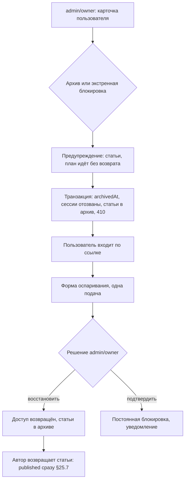

# Flow: Архивирование и восстановление аккаунта (= блокировка)

- **Реестр**: `00-registries/flows.md` #11
- **Статус**: утверждён (гейт Г7, 2026-09-09)
- **ADR**: ADR-0009, ADR-0014, ADR-0044; журнал §3, §5.3–6, #4, #30, #48, #50, §25.7;
  `40-admin/users.md` (#6), `articles.md` (#4); `20-public/blocked-appeal.md` (#41);
  `50-access/session-lifecycle.md` п. 7; матрица #52, #105, #113–115
- **Этап**: 1

## 1. Цель пользователя и роль на входе / выходе

`admin` или `owner` хочет закрыть доступ пользователю (блокировка — это архивирование аккаунта,
отдельной модели блокировки нет — журнал §5.5) или вернуть его. Вход: `admin` / `owner`
(`analyst`, `moderator` не могут — журнал §5.3). Выход: аккаунт в архиве — доступ закрыт, сессии
отозваны, статьи в архиве каскадно (журнал #4, #30), план идёт без возврата (журнал #48, #50);
пользователю при входе — форма оспаривания (журнал #48); либо аккаунт восстановлен — доступ
возвращён, статьи остаются в архиве и возвращаются автором по правилам плана (журнал §5.4,
§25.7). Экстренная блокировка — та же операция немедленно даже при действующем плане, после
подробного предупреждения (журнал §5.6; матрица #113).

## 2. Предусловия

Сессия `admin`/`owner`; цель — обычный аккаунт (служебные записи — `admins.md`); причина
обязательна; для восстановления — аккаунт в административном архиве (самостоятельный архив
пользователь восстанавливает сам — §5.2; сотрудник — по обращению `[ДОПУЩЕНИЕ]`); решение по
оспариванию — открытое оспаривание (#115).

## 3. Шаги

| Шаг | Экран (файл страницы) | Действие пользователя | Система делает | Данные / мутация | Событие (код) |
|---|---|---|---|---|---|
| 1 | `40-admin/users.md` (карточка) | «Архивировать аккаунт» или «Экстренная блокировка»: категория причины, сообщение пользователю по желанию, внутренняя причина (§26.9) | предупреждение: число статей, оплаченный план до {дата} продолжит идти без возврата (журнал #48, #50); экстренная — дополнительное подтверждение | — | `admin.read.personal` (#67) при открытии карточки |
| 2 | диалог | подтверждает | в одной транзакции: `archivedAt`, `archiveMode = admin \| emergency`, отзыв всех сессий, каскадный архив статей с актором и уровнем прав (журнал §3.3), закрытие медиа (§11); публичные адреса — 410 | `archiveAccount(id, reason, mode)` | `user.archive` (#14), `session.revoked` (#43), `article.archive` (#27) |
| 3 | `20-public/login.md` → `verify.md` | пользователь пытается войти | сессия не создаётся; переход к форме оспаривания по токену (`blocked-appeal.md`) | `verifyMagicLink` → `{ appealToken }` | `auth.login.failed` (#42) |
| 4 | `20-public/blocked-appeal.md` | пользователь подаёт оспаривание (один раз — журнал #48) | обращение в карточке пользователя | `submitAccountAppeal` | `user.appeal.submit` (#77) |
| 5 | `users.md` (карточка, вкладка «оспаривание») | `admin`/`owner` решает: восстановить или подтвердить блокировку, причина | восстановление (#105) — доступ возвращён, статьи в архиве; подтверждение — постоянная блокировка, уведомление | `decideAppeal(id, decision, reason)` | `user.appeal.decide` (#77), `user.restore` (#14) при восстановлении |
| 6 | `30-account/author/articles.md` (архив) | автор возвращает статьи по одной | ранее публичные — сразу `published` (§25.7), при активном плане | `restoreArticle` | `article.restore` (#27) |

## 4. Развилки

| Точка | Условие | Ветка А | Ветка Б |
|---|---|---|---|
| Шаг 1 | цель — служебная запись | здесь недоступно — `admins.md` | обычный аккаунт |
| Шаг 1 | цель — последний `owner` | недоступно (`admins.md`, журнал #10) | — |
| Шаг 1 | действующий план | предупреждение о плане; срок идёт без возврата (журнал #48, #50) | без плана |
| Шаг 2 | аккаунт уже в архиве (в том числе самостоятельном) | `CONFLICT`; для самостоятельного — режим меняется на административный `[ДОПУЩЕНИЕ]` | архив |
| Шаг 3 | самостоятельный архив | ограниченная сессия и `/me/archived` — не этот сценарий (`delete-account.md`) | форма оспаривания |
| Шаг 4 | оспаривание уже подано | `CONFLICT` (одно на аккаунт — журнал #48) | подача |
| Шаг 5 | восстановление | статьи остаются в архиве (журнал §5.4, §25.7); план — на остаток срока | подтверждение блокировки: уведомление, повторного оспаривания нет `[ДОПУЩЕНИЕ]` |
| Шаг 5 | план истёк за время архива | восстановление доступно; статьи вернуть — после продления (журнал #5) | — |
| Шаг 6 | статья архивирована сотрудником ещё до архива аккаунта | автор не восстанавливает (журнал §4.2–4); только `owner` | восстановление автором |
| Любой | `analyst` / `moderator` пытаются | `FORBIDDEN` (журнал §5.3) | — |

## 5. Ошибки и восстановление

| Ошибка (код ADR-0032) | На каком шаге | Что видит пользователь | Как продолжить |
|---|---|---|---|
| `FORBIDDEN` | 1–2, 5 | нет права `accounts` | `admin`/`owner` |
| `VALIDATION_ERROR` | 1–2 | причина обязательна | заполнить |
| `CONFLICT` | 2, 4, 5 | уже в архиве / оспаривание подано / решение принято | обновить карточку |
| `NOT_FOUND` | 3–4 | токен оспаривания истёк | новая ссылка входа |
| `INTERNAL_ERROR` | 2 | транзакция не выполнена — ничего не изменено | повтор |

## 6. Письма и уведомления

| Шаг | Письмо | Кому | Ссылка и срок действия |
|---|---|---|---|
| 2 | «аккаунт заблокирован»: одна из четырёх базовых категорий, короткое понятное объяснение и, если добавлено, сообщение сотрудника для этого случая (§26.9; §20.12) и ссылка на оспаривание | пользователь | `/login` → форма по токену |
| 5 | «аккаунт восстановлен» / «блокировка подтверждена» (журнал #48) | пользователь | `/login` / — |
| 2 (авторам) | о каскадном архиве статей писем нет — одно письмо о блокировке `[ДОПУЩЕНИЕ]` | — | — |

Тексты и правила — проход почты (§25.13); уведомление о решении по оспариванию закреплено
журналом #48.

## 7. Схема

## 8. Открытые вопросы и допущения

- `[ДОПУЩЕНИЕ]` Сотрудник восстанавливает самостоятельно архивированный аккаунт по обращению;
  административный архив поверх самостоятельного меняет режим; повторного оспаривания после
  подтверждения нет; одно письмо о блокировке.
- Отложено: жалобы как источник блокировки (журнал — отдельный разбор); письма (§25.13).
- Закрыто Г1–Г6 (журнал §5.3–6, #4, #30, #48, #50, §25.7): блокировка = архив; каскад статей;
  план идёт; оспаривание один раз; статьи возвращает автор, публичные — сразу в `published`.
- Закрыто Г7 (§26.9): пользователь видит категорию (одну из четырёх базовых), короткое
  объяснение и сообщение сотрудника по желанию; внутренняя причина — только в аудите.
- Отложено (§26.9): названия четырёх категорий — будущий вопрос владельца.
