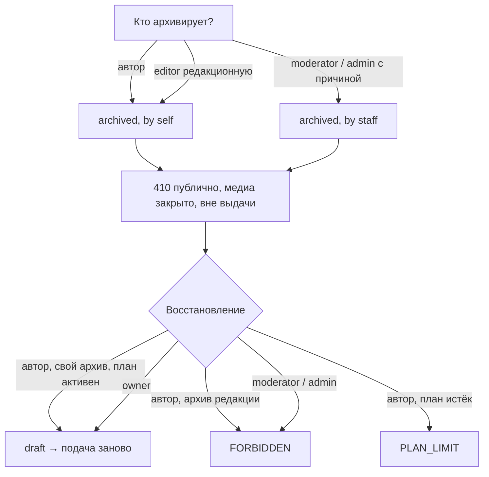

# Flow: Архивирование и восстановление статьи

- **Реестр**: `00-registries/flows.md` #15
- **Статус**: на утверждении
- **ADR**: ADR-0014, ADR-0044; журнал §3, §4, §11, #2–3, #28, #53, §5.4, §20.8, §21.16;
  `30-account/author/articles.md`; `40-admin/articles.md` (заход 7); матрица #26–27, #103
- **Этап**: 1

## 1. Цель пользователя и роль на входе / выходе

Автор хочет «удалить» статью — в системе это обратимый архив (журнал §3.1): версии, аналитика,
связи и аудит сохраняются, статья уходит из публичной выдачи и обычного списка, находится
через фильтр «архив» (журнал §4.1). Ревьюер и `admin` архивируют проблемный контент, но не
восстанавливают (журнал §4.3–4, #53); `owner` восстанавливает любую (§4.3). Вход: `author`,
`editor` (редакционные), `moderator`, `admin`, `owner`. Выход: статья `archived` или снова
`draft` после восстановления (публикация — заново по правилам плана). Роль не меняется.

## 2. Предусловия

Сессия; для автора — своя статья (для восстановления — архивировал сам и план активен, журнал
§4.2); для сотрудника — карточка в `/admin/articles`; при архиве сохраняются актор и уровень
прав — низшая роль не отменяет архив высшей (журнал §3.3). Медиа статьи закрывается вместе с
ней (журнал §11, #28). Удаление навсегда — отдельный сценарий `permanent-delete.md` (#16).

## 3. Шаги

| Шаг | Экран (файл страницы) | Действие пользователя | Система делает | Данные / мутация | Событие (код) |
|---|---|---|---|---|---|
| 1 | `30-account/author/articles.md` | «Удалить» у своей статьи, подтверждает | `archived`, `archivedBy = self`, актор и уровень прав; публичные адреса — 410 (`gone.md`); медиа закрыто; из выдачи — при следующем пересчёте (`recompute.md`) | `archiveArticle(articleId)` | `article.archive` (#27) |
| 1с | `40-admin/articles.md` (сотрудник) | «Архивировать» с причиной | то же, `archivedBy = staff`, роль актора; автор видит причину в фильтре «архив» | `archiveArticle(articleId, reason)` | `article.archive` (#27), `admin.change` (#75) |
| 2 | `articles.md`, вкладка «архив» | видит статью с пометкой «архивировал: вы / редакция» | фильтр `status=archived` | `me.articles(status: archived)` | — |
| 3 | `articles.md` | «Восстановить» (только свой архив, план активен) | `draft`; медиа открыто; публикация — через подачу заново (`write-and-publish.md`) | `restoreArticle(articleId)` | `article.restore` (#27) |
| 3о | `40-admin/articles.md` (`owner`) | «Восстановить» любую | `draft` `[ДОПУЩЕНИЕ: в `draft`, не сразу `published`]`; аудит | `restoreArticle` | `article.restore`, `admin.change` |

## 4. Развилки

| Точка | Условие | Ветка А | Ветка Б |
|---|---|---|---|
| Шаг 1 | статья на проверке (`ai_check` / `review`) | архив снимает с проверки `[ДОПУЩЕНИЕ]` | архив |
| Шаг 1 | у статьи две языковые версии | архивируется материал целиком (обе) `[ДОПУЩЕНИЕ]` | — |
| Шаг 3 | архивировал сотрудник | автору «восстановить» нет (журнал §4.2–4); `FORBIDDEN` | восстановление |
| Шаг 3 | план истёк | `PLAN_LIMIT` — «продлите план» (журнал #5, §5.4) | восстановление |
| Шаг 3 | архив каскадом при архиве аккаунта | после восстановления аккаунта — как «архивировал сам» (журнал §3.3, §5.4) | — |
| Шаг 3 | `moderator` / `admin` пытаются восстановить | `FORBIDDEN` (журнал §4.3–4) | `owner` |
| Шаг 3 | статья «отклонена редакцией» | восстановление из архива не снимает признак (журнал §4.5) | — |
| Рейтинг | архив / восстановление | из выдачи; при повторной публикации — новые снимки (§21.15–16), рейтинг автора не штрафуется (§20.8) | — |

## 5. Ошибки и восстановление

| Ошибка (код ADR-0032) | На каком шаге | Что видит пользователь | Как продолжить |
|---|---|---|---|
| `FORBIDDEN` | 3 | «архивировано редакцией — восстановить может только владелец» / роль без права | обращение; `owner` |
| `PLAN_LIMIT` | 3 | «нужен активный план» | продлить |
| `CONFLICT` | 1, 3 | уже в архиве / уже восстановлена | обновить список |
| `NOT_FOUND` | любой | удалена навсегда (журнал #1) | — |

## 6. Письма и уведомления

| Шаг | Письмо | Кому | Ссылка и срок действия |
|---|---|---|---|
| 1с | «материал архивирован редакцией» с причиной (журнал #53 `[ДОПУЩЕНИЕ: письмо]`) | автор | `/me/articles?status=archived` |
| 3о | «материал восстановлен владельцем» `[ДОПУЩЕНИЕ]` | автор | `/me/articles` |
| 1, 3 | писем нет — действие самого автора | — | — |

## 7. Схема

## 8. Открытые вопросы и допущения

- `[ДОПУЩЕНИЕ]` Архив снимает с проверки; архивируется материал целиком; восстановление
  владельцем — в `draft`; письма о действиях сотрудников.
- Отложено (§8.23): письма; (заход 7) экран `/admin/articles`; (жалобы) архив по претензии.
- Закрыто Г1–Г2 (журнал §3–4, #53): архив обратим; иерархия акторов; `admin` архивирует без
  восстановления.
- `[ВОПРОС ВЛАДЕЛЬЦУ]` Восстанавливать ли владельцем сразу в `published` (как было) или в
  `draft` с повторной подачей? Если в `published` — публикация без проверки, снимки рейтинга
  сохраняются; если в `draft` — как описано, новая проверка и новые снимки.
