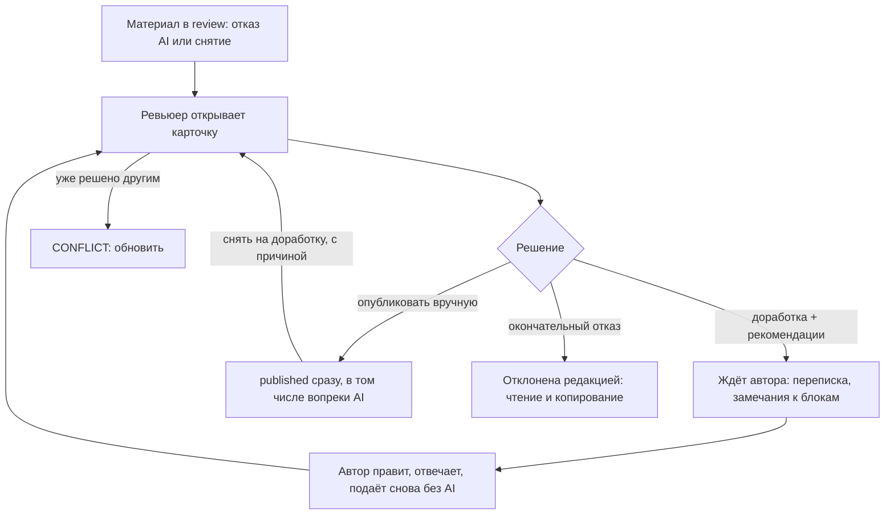

# Flow: Ручная проверка ревьюером

- **Реестр**: `00-registries/flows.md` #5
- **Статус**: на утверждении
- **ADR**: ADR-0045 (две ступени: AI, затем человек), ADR-0039 (в части, не противоречащей
  журналу: балла нет); журнал §6.5–8, §16, #12–14, #16, #18, #40–44, #51, §24.3, §25.6;
  `40-admin/review-queue.md` (#5), `articles.md` (#4); `30-account/author/review-history.md`,
  `article-edit.md`; `10-flows/write-and-publish.md` (#3)
- **Этап**: 1

## 1. Цель пользователя и роль на входе / выходе

Ревьюер (`moderator`; `owner` — те же права) хочет принять решение по материалу, который попал в
ручную ветку: после отказа автоматической проверки или после снятия с публикации (журнал §6.5).
Вход: `moderator` / `owner`. Выход: материал опубликован вручную (сразу публично, в том числе
вопреки отказу AI — журнал #14, #44), возвращён автору на доработку (неограниченно) либо
окончательно отклонён (журнал #12). Ревьюер не правит текст (журнал #12–13), не запускает AI
повторно (журнал #14); каждое решение — с причиной или рекомендациями (журнал #18), с
непубличной перепиской внутри решения (§25.6) и замечаниями к блокам (§25.6). Автору ревьюер
виден только ролью (§25.9); ревьюер видит имя и хэндл автора (журнал #51).

## 2. Предусловия

Материал в `review` (после `ai_check` с вердиктом «не публиковать» или после `unpublish`);
вердикт и причины проверки доступны ревьюеру (#8); у материала есть рубрика и у автора — имя и
адрес профиля для публикации (§25.3–4; иначе ручная публикация — `VALIDATION_ERROR`); право
`review` (`permission-checks.md` п. 4).

## 3. Шаги

| Шаг | Экран (файл страницы) | Действие пользователя | Система делает | Данные / мутация | Событие (код) |
|---|---|---|---|---|---|
| 1 | `40-admin/review-queue.md` | открывает очередь, берёт старшую заявку | список по возрасту; пометка «в работе» `[ДОПУЩЕНИЕ]` | `reviewQueue`, `claimReview` | — |
| 2 | `review-queue.md` (карточка) | читает текст, вердикт и причины проверки, историю версий, переписку | показывает текущую ревизию, причины по категориям, имя и хэндл автора (журнал #51) | `reviewItem(id)` | — |
| 3а | карточка | «Запросить доработку» с рекомендациями; при желании — замечания к блокам | остаётся `review`, ждёт автора; замечания привязаны к ревизии (§25.6) | `requestRework`, `createReviewNote` | `translation.rework.request` (#24), `review.message` (#70) |
| 3б | карточка | «Опубликовать вручную» (в том числе вопреки отказу AI) | `published` немедленно во всех лентах (журнал §16.6, #44); снимки рейтинга (§21.15–16) | `publishManual` | `translation.publish.manual` (#24), `translation.published` (#61) |
| 3в | карточка | «Окончательный отказ» с комментарием по желанию (§24.3) | признак «отклонена редакцией»; автор читает и копирует (журнал §4.5); переписка закрыта | `rejectFinal` | `translation.reject.final` (#69), `review.message` |
| 4 | `30-account/author/review-history.md` | автор читает решение, отвечает внутри решения, отмечает замечания решёнными, правит | ответ автора виден ревьюеру в карточке (§25.6) | `replyToDecision`, `resolveReviewNote`, `saveTranslation` | `review.reply` (#86 `[черновик]`) |
| 5 | `article-edit.md` | автор отправляет снова | материал снова в `review` без нового AI (журнал #14) → шаг 2 | `submitTranslation` | `translation.submit` (#45) |
| С | `40-admin/articles.md` | ревьюер снимает опубликованную статью на доработку в любой момент, с причиной | `review`; дальнейшие решения ручные (журнал §6.5) → шаг 2 | `unpublishTranslation` | `translation.unpublish` (#25), `review.message` |

## 4. Развилки

| Точка | Условие | Ветка А | Ветка Б |
|---|---|---|---|
| Шаг 2 | решение уже принято другим ревьюером / `owner` | `CONFLICT` — карточка обновляется | решение |
| Шаг 2 | автор отозвал подачу (`withdraw`) | заявка исчезает из очереди, `CONFLICT` при действии | решение |
| Шаг 3б | нет рубрики / имени / адреса профиля автора | `VALIDATION_ERROR` — сначала доработка (3а) | публикация |
| Шаг 3б | AI отказал | предупреждение с причинами, публикация вопреки (журнал #14, #44) | обычная публикация |
| Шаг 3а | автор не отвечает | заявка остаётся в очереди «ждёт автора»; напоминания — проход почты (§25.13) | ответ |
| Шаг 3в | редакционная статья журнала | окончательный отказ возможен (журнал #12; `roles/editor.md` §7) | — |
| Шаг С | статья автоопубликована ≤ 1 часа и автор сам нажал «перередактировать» | ветка автора (`write-and-publish.md` #4), снова через AI | ревьюер снимает — ручная ветка |
| Любой | ревьюер хочет исправить текст сам | недоступно (журнал #12–13) — только рекомендации | — |
| Любой | несогласие с отказом AI | выражается ручной публикацией, «оценки» AI нет (журнал #41; матрица #74 отменено) | — |

## 5. Ошибки и восстановление

| Ошибка (код ADR-0032) | На каком шаге | Что видит пользователь | Как продолжить |
|---|---|---|---|
| `FORBIDDEN` | 1–3 | нет права `review` (`admin` — чтение) | — |
| `CONFLICT` | 3 | «решение уже принято» / «автор отозвал» | обновить карточку |
| `VALIDATION_ERROR` | 3а, 3б, 3в | рекомендации обязательны / у материала нет рубрики / нет имени автора | заполнить; запросить доработку |
| `NOT_FOUND` | 2 | версия удалена навсегда | — |
| `INTERNAL_ERROR` | любой | `ErrorState` с `requestId`; введённый текст сохранён локально | повтор |

## 6. Письма и уведомления

| Шаг | Письмо | Кому | Ссылка и срок действия |
|---|---|---|---|
| 3а | «нужна доработка» с рекомендациями (журнал #16, §16.5) | автор | `/me/articles/{id}/edit?token=` (#68, 7 дней `[ДОПУЩЕНИЕ]`) |
| 3б | «опубликовано редакцией» | автор | публичная страница |
| 3в | «отклонена редакцией» с комментарием | автор | `/me/articles/{id}/review` |
| 4 | «ответ автора» ревьюеру | ревьюер | карточка очереди |
| С | «снята с публикации» с причиной | автор | редактор по ссылке #68 |

Состав и тексты всех писем — отдельный проход почты (§25.13); здесь — только события, по
которым они уходят.

## 7. Схема

## 8. Открытые вопросы и допущения

- `[ДОПУЩЕНИЕ]` Пометка «в работе»; срок ссылки #68; напоминания автору — проход почты.
- Отложено: жалобы и претензии (журнал #12 — отдельный разбор); письма (§25.13); сравнение
  ревизий (журнал §6.7).
- Закрыто Г1–Г6 (журнал #12–14, #16, #18, #40–44, #51, §24.3, §25.6, §25.9): без правки текста,
  без повторного AI, с причиной; публикация вопреки AI; переписка внутри решения; замечания к
  блокам; автору — роль ревьюера, ревьюеру — имя и хэндл автора.
- `[ВОПРОС ВЛАДЕЛЬЦУ]` Нужен ли срок ожидания ответа автора, после которого заявка уходит из
  активной очереди в «ожидающие» (без автоматического отказа)? Если да — параметр и раздел
  «ожидающие»; если нет — заявка остаётся в очереди бессрочно.
