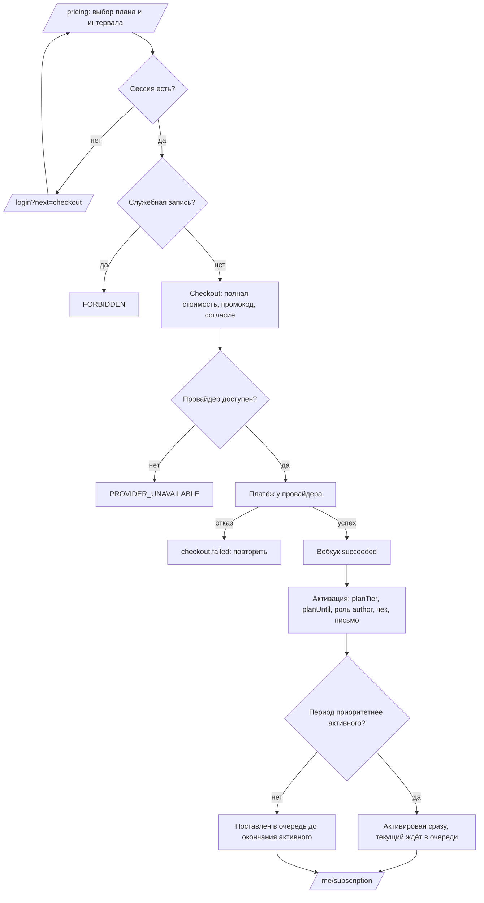

# Flow: Оплата и смена плана

- **Реестр**: `00-registries/flows.md` #6 (и #2 в части оплаты — `become-author.md`, заход 6)
- **Статус**: утверждён (гейт Г5, 2026-09-09)
- **ADR**: ADR-0010, ADR-0035, ADR-0028, ADR-0032 (в части, не противоречащей журналу #32, #35,
  §8.12–14, §8.17, §8.22, §21.15)
- **Этап**: 1 при платном запуске (§8.13 — отложено)

## 1. Цель пользователя и роль на входе / выходе

Пользователь хочет купить оплаченный период плана. Вход: `reader` (оформить `standard` или `pro`),
`author` (купить `pro` при `standard`, купить `standard` при `pro`, купить ещё период того же
плана, продлить после истечения). Выход: период в очереди подписки (§8.22); активен период с
наивысшим приоритетом — купленный `pro` при `standard` активируется сразу, купленный `standard`
при `pro` ждёт; неиспользованные периоды не сгорают. Полная стоимость периода без доплаты
(журнал #35); год — цена десяти месяцев (журнал #32); цены — централизованный источник, значения
— гипотезы (§8.12).

## 2. Предусловия

Сессия аккаунта (гость с `/pricing` идёт на `/login?next=…`); согласие с офертой и политикой ПД
действующих версий (ADR-0028), для платных услуг — оферта платных услуг `[ДОПУЩЕНИЕ: отдельное
согласие на checkout]`; провайдер (Т-Касса, §8.14) доступен; служебные записи планов не покупают (§8.17 —
`FORBIDDEN`); покупка ещё одного периода при активном — допустима (в очередь).

## 3. Шаги

| Шаг | Экран (файл страницы) | Действие пользователя | Система делает | Данные / мутация | Событие (код) |
|---|---|---|---|---|---|
| 1 | `20-public/pricing.md` | выбирает план и интервал, нажимает «Оформить» / «Купить период» | проверяет сессию, роль (служебной — `FORBIDDEN`) и очередь периодов; показывает, когда период активируется | `plans`, `me.subscription` | `http.request` |
| 2 | `30-account/reader/checkout.md` | подтверждает план, интервал, вводит промокод (минимальное поведение), соглашается с сохранением способа оплаты | считает полную стоимость, применяет скидку, создаёт `Payment.pending` | `startCheckout(plan, interval, promo)` → адрес провайдера | `checkout.started` (#59) |
| 3 | страница провайдера | оплачивает | провайдер проводит платёж и шлёт вебхук | `POST /api/webhooks/psp/{provider}` | `webhook.received` (#49) |
| 4 | `30-account/reader/checkout.md` §8 (результат) | ждёт результата | опрашивает `payment`; при `succeeded` активирует подписку: `planTier`, `planUntil`, роль, чек, письмо | `payment(id)` | `checkout.succeeded`, `subscription.activated` (#50) |
| 5 | `30-account/reader/subscription.md` | видит очередь периодов: активный, ожидающие, даты, чек | активирует купленный период сразу, если он приоритетнее текущего, иначе ставит в очередь (§8.22) | `me.subscription` | `subscription.activated` / `subscription.queued` (#50) |

## 4. Развилки

| Точка | Условие | Ветка А | Ветка Б |
|---|---|---|---|
| Шаг 1 | нет сессии | `/login?next=/me/subscription/checkout?plan=…` | продолжение |
| Шаг 1 | служебная запись | `FORBIDDEN` (§8.17) | продолжение |
| Шаг 1 | активен план с более высоким приоритетом | подсказка «период активируется после {дата}»; покупка в очередь | активация сразу |
| Шаг 2 | провайдер недоступен | `PROVIDER_UNAVAILABLE`, кнопка заменена пометкой | переход к провайдеру |
| Шаг 2 | промокод неверен или истёк | `NOT_FOUND` / `CONFLICT` в поле, оплата без скидки возможна | скидка применена |
| Шаг 3 | отказ платежа | `Payment.canceled`, план не включён, `checkout.failed`; предложение повторить | успех |
| Шаг 4 | вебхук не пришёл за N минут | запрос статуса у провайдера (`payment-provider.md` п. 9) | активация по вебхуку |
| Шаг 4 | купленный период приоритетнее активного (§8.22) | активируется сразу, текущий ждёт в очереди | период в очередь |
| Шаг 4 | продление после истечения | роль `author` возвращается; черновики как были (ADR-0044 п. 7) | — |

## 5. Ошибки и восстановление

| Ошибка (код ADR-0032) | На каком шаге | Что видит пользователь | Как продолжить |
|---|---|---|---|
| `UNAUTHENTICATED` | 1 | редирект на вход с возвратом | войти |
| `FORBIDDEN` | 1 | служебная запись: «планы доступны только личным авторским аккаунтам» | — |
| `PROVIDER_UNAVAILABLE` | 2 | «оплата временно недоступна» с `requestId` | попробовать позже |
| `NOT_FOUND` (промокод) | 2 | «код не найден или истёк» | оплатить без кода |
| `VALIDATION_ERROR` | 2 | нет согласия с офертой платных услуг | отметить согласие |
| отказ платежа (`checkout.failed`) | 3 | «платёж не прошёл», причина от провайдера без деталей карты | повторить оплату |
| ожидание вебхука | 4 | «ждём подтверждения» с обновлением | ждать; запрос статуса автоматически |

## 6. Письма и уведомления

| Шаг | Письмо | Кому | Ссылка и срок действия |
|---|---|---|---|
| 4 | подтверждение оплаты: план, интервал, сумма, дата окончания, ссылка на чек | пользователь | чек — ссылка провайдера, бессрочно |
| 4 | период в очереди: какой план активен сейчас и когда активируется купленный | пользователь | `/me/subscription` |
| 3 | отказ платежа с предложением повторить | пользователь | `/pricing`, без срока |

Шаблоны и правила рассылок — этап почты (§8.23); здесь — уведомления по событию.

## 7. Схема

Узлы совпадают с шагами §3 и развилками §4.

## 8. Открытые вопросы и допущения

- `[ДОПУЩЕНИЕ]` Отдельное согласие с офертой платных услуг на checkout; минимальное поведение
  промокода до разбора.
- Закрыто Г5 (§8.22): смены интервала как операции нет — покупка годового периода ставит его в
  очередь по приоритету (годовой того же плана приоритетнее месячного).
- Отложено (§8.12–13): цены и платный запуск — заход 5b.
