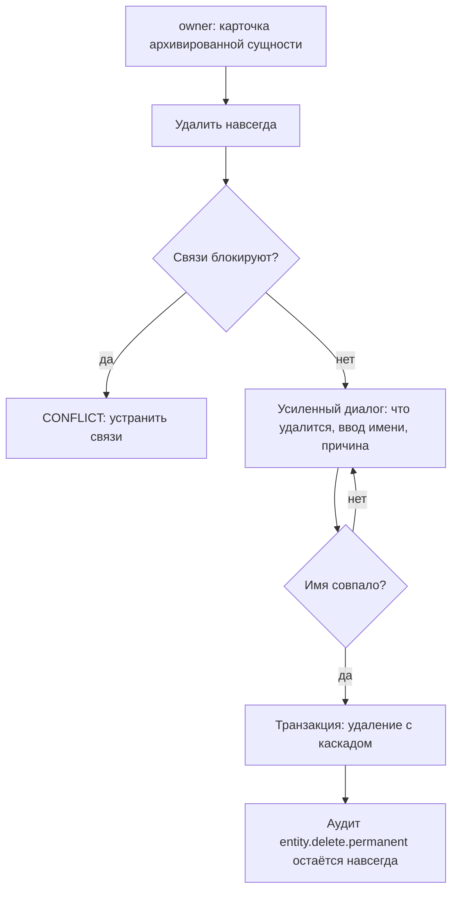

# Flow: Удалить навсегда

- **Реестр**: `00-registries/flows.md` #16
- **Статус**: на утверждении
- **ADR**: ADR-0011 (152-ФЗ: уничтожение ПДн), ADR-0014; журнал §3.2, #1, #44, #59;
  `40-admin/categories.md` (#2), `tags.md` (#3), `articles.md` (#4), `users.md` (#6),
  `admins.md` (#7); матрица #103; события #68; `roles/owner.md` §3, §6
- **Этап**: 1

## 1. Цель пользователя и роль на входе / выходе

`owner` хочет необратимо удалить сущность — статью, рубрику, формат, тег, пользователя,
служебную запись, — когда обратимого архива недостаточно (журнал §3.2). Вход: только `owner`
(журнал #1); никто другой не может даже с подтверждением. Выход: сущность удалена физически;
запись аудита с введённым именем остаётся навсегда (журнал #59); финансовые записи не
удаляются (`roles/owner.md` §6), а обезличиваются `[ДОПУЩЕНИЕ]`. Обычная кнопка «удалить»
везде означает архив (журнал §3.1) — этот сценарий начинается только из карточки
архивированной сущности отдельным действием.

## 2. Предусловия

Сессия `owner`; сущность в архиве (для статьи — в архиве или никогда не публиковалась; для
служебной записи — без роли `owner`); нет блокирующих связей: у рубрики нет материалов
(`categories.md` §5 `[ДОПУЩЕНИЕ]`), у владельца — не последний; усиленный диалог с вводом имени
сущности (журнал #1).

## 3. Шаги

| Шаг | Экран (файл страницы) | Действие пользователя | Система делает | Данные / мутация | Событие (код) |
|---|---|---|---|---|---|
| 1 | карточка сущности в `40-admin/{categories,tags,articles,users,admins}.md` | «Удалить навсегда» (отдельное действие, только в архиве) | показывает усиленный диалог: что именно удалится (связи, версии, медиа, сессии), что останется (аудит, агрегаты, финансовые записи обезличенно), поле ввода имени | `permanentDeletePreview(entity, id)` | — |
| 2 | диалог | вводит точное имя сущности (заголовок, название, хэндл), причину | сверяет имя; выполняет удаление в транзакции; каскад по связям | `deletePermanently(entity, id, confirmedName, reason)` | `entity.delete.permanent` (#68: `entityType`, `entityId`, `confirmedName`, `reason`) |
| 3 | список раздела | видит, что сущности нет; в аудите — запись | публичные адреса — 404 (не 410: сущности нет `[ДОПУЩЕНИЕ]`); слаги освобождаются `[ДОПУЩЕНИЕ]` | — | `admin.change` (#75) |

Что удаляется по типам `[ДОПУЩЕНИЕ: состав каскада]`: статья — версии, ревизии, медиа, замечания,
переписка, закладки на неё; пользователь — профиль, сессии, закладки, подписки, статьи (со всем
выше), оспаривания; служебная запись — профиль, сессии, исключения (история решений и аудит
остаются с ролью); рубрика / формат / тег — сама сущность и история слагов (материалов быть не
должно / связи тегов снимаются).

## 4. Развилки

| Точка | Условие | Ветка А | Ветка Б |
|---|---|---|---|
| Шаг 1 | не `owner` | действия нет в интерфейсе; API — `FORBIDDEN` | диалог |
| Шаг 1 | сущность не в архиве | действия нет — сначала архив (журнал §3.1) | диалог |
| Шаг 1 | рубрика с материалами; последний `owner`; служебная запись с ролью `owner` | `CONFLICT` с пояснением | диалог |
| Шаг 2 | имя не совпало | `VALIDATION_ERROR`, диалог остаётся | удаление |
| Шаг 2 | сущность изменена другим (восстановлена из архива) | `CONFLICT` | удаление |
| Шаг 2 | пользователь с платежами | платежи и чеки остаются обезличенными (54-ФЗ — §8.19) `[ДОПУЩЕНИЕ]` | — |
| Шаг 3 | агрегаты аналитики | остаются без идентификаторов (`articles.md` §5 `[ДОПУЩЕНИЕ]`) | — |

## 5. Ошибки и восстановление

| Ошибка (код ADR-0032) | На каком шаге | Что видит пользователь | Как продолжить |
|---|---|---|---|
| `FORBIDDEN` | 1–2 | нет права | — |
| `VALIDATION_ERROR` | 2 | «имя не совпадает» | ввести точно |
| `CONFLICT` | 1–2 | связи блокируют / сущность восстановлена | устранить связи |
| `NOT_FOUND` | 1–2 | уже удалена | — |
| `INTERNAL_ERROR` | 2 | транзакция не выполнена — ничего не удалено | повтор |

Восстановления после удаления навсегда нет — это его смысл; резервные копии
(`08-operations.md` §5) — инфраструктурная мера, не пользовательская функция.

## 6. Письма и уведомления

| Шаг | Письмо | Кому | Ссылка и срок действия |
|---|---|---|---|
| 2 (пользователь) | уведомление об уничтожении данных по 152-ФЗ `[ДОПУЩЕНИЕ: требуется ли — юридический контур]` | e-mail до удаления | — |
| 2 (статья) | автору писем нет — материал уже был в архиве `[ДОПУЩЕНИЕ]` | — | — |

Состав — проход почты (§25.13) и юридическая проверка (`legal-152-54.md`).

## 7. Схема

## 8. Открытые вопросы и допущения

- `[ДОПУЩЕНИЕ]` Состав каскада по типам; 404 вместо 410; освобождение слагов; обезличивание
  платежей; агрегаты остаются; уведомление по 152-ФЗ.
- Отложено (§8.19, `legal-152-54.md`): требования к уничтожению ПДн и хранению финансовых
  документов — юридический контур.
- Закрыто Г1 (журнал #1, §3.2, #44, #59): только `owner`; ввод имени; аудит навсегда.
- `[ВОПРОС ВЛАДЕЛЬЦУ]` Освобождать ли слаг удалённой навсегда статьи или рубрики для повторного
  использования? Если да — новый материал может занять старый адрес; если нет — слаг остаётся
  зарезервированным и старый адрес отвечает 404 постоянно.
