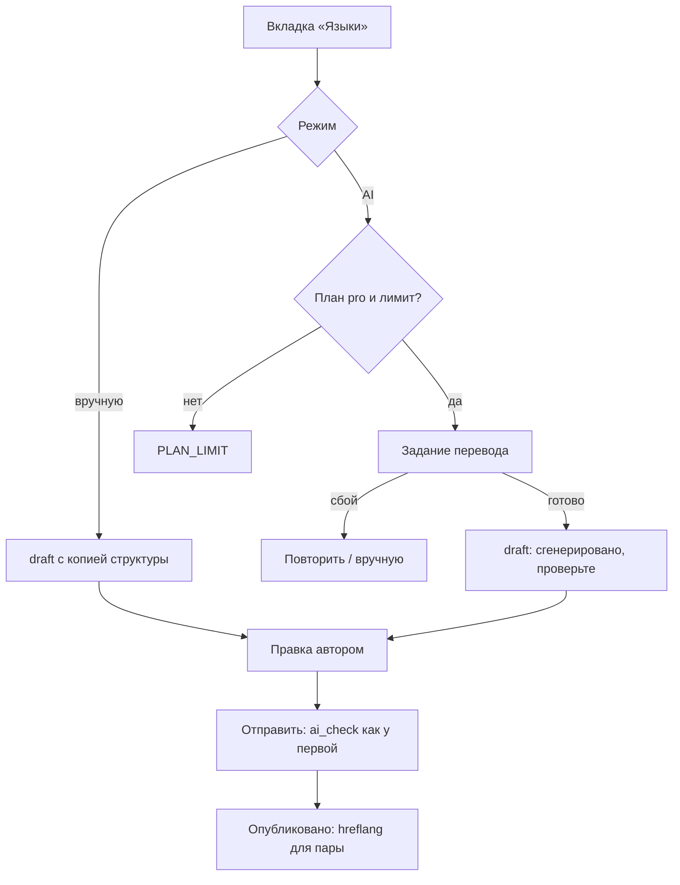

# Flow: Вторая языковая версия

- **Реестр**: `00-registries/flows.md` #8
- **Статус**: на утверждении
- **ADR**: ADR-0002 (полные переводы, общие метаданные, hreflang), ADR-0046 (AI-перевод для pro);
  журнал #33, §8.11, §20.10, §6.2; `30-account/author/article-edit.md` §7 (#40),
  `10-flows/write-and-publish.md` (#3)
- **Этап**: 2 (ручная версия), 3 (AI-перевод — `roadmap`) `[ДОПУЩЕНИЕ: этапы]`

## 1. Цель пользователя и роль на входе / выходе

Автор хочет опубликовать материал на втором языке. Вход: `author` с опубликованной или
черновой версией на одном языке; `standard` — создаёт версию вручную, `pro` — вручную или через
AI (журнал #33, §8.11). Выход: вторая версия `published`, обе связаны `hreflang` (ADR-0002).
Вторая версия проходит ту же проверку и те же ветки, что первая (`write-and-publish.md`).

## 2. Предусловия

Активный план или выдача; версии на целевом языке ещё нет; для AI — план `pro`, доступный
провайдер, дневной лимит переводов (параметр Г4 — отложено); текст уходит провайдеру без
имени и e-mail.

## 3. Шаги

| Шаг | Экран (файл страницы) | Действие пользователя | Система делает | Данные / мутация | Событие (код) |
|---|---|---|---|---|---|
| 1 | `30-account/author/article-edit.md` §7 (вкладка «Языки») | «Создать версию на другом языке», выбирает «вручную» или «через AI» | проверяет план: `standard` + AI → `PLAN_LIMIT`; создаёт `draft` второй версии с копией структуры и общими метаданными (рубрика, формат, теги, обложка) | `createTranslation(translationId, mode)` | `ai.translate.*` (#47) при AI |
| 2а | `article-edit.md` (новая версия) | переводит вручную | снимки версий | `saveTranslation` | — |
| 2б | `article-edit.md`, панель `JobStatus` | ждёт перевод, затем правит | задание перевода; результат — черновик с пометкой «сгенерировано, проверьте» | `translationJob(id)` | `ai.translate.*`, `ai.job.done` (#46) |
| 3 | `article-edit.md` | «Отправить к публикации» | `ai_check` второй версии — проверка допустимости как у первой | `submitTranslation` | `translation.submit` (#45), `ai.decision` (#71) |
| 4 | `20-public/article.md` | видит обе версии, переключатель языка | при публикации обеих — `hreflang`, сестринские адреса (ADR-0002) | — | `translation.published` (#61) |

## 4. Развилки

| Точка | Условие | Ветка А | Ветка Б |
|---|---|---|---|
| Шаг 1 | `standard` выбрал AI | `PLAN_LIMIT` «доступно в pro» — предложение `/pricing` (этап платности) | вручную |
| Шаг 1 | версия на языке уже есть | `CONFLICT` — открыть её | создание |
| Шаг 2б | лимит AI в сутки исчерпан | `PLAN_LIMIT` с временем сброса (значение — Г4) | задание |
| Шаг 2б | провайдер недоступен / сбой задания | `PROVIDER_UNAVAILABLE`; черновик остаётся пустым, «повторить» или «перевести вручную» | результат |
| Шаг 3 | AI-проверка | как `write-and-publish.md` §4: публикация / причины / ревьюер | — |
| Шаг 4 | первая версия снята или архивирована | вторая публикуется независимо; `hreflang` только для опубликованных пар | обе |

## 5. Ошибки и восстановление

| Ошибка (код ADR-0032) | На каком шаге | Что видит пользователь | Как продолжить |
|---|---|---|---|
| `PLAN_LIMIT` | 1, 2б | «доступно в pro» / «лимит на сегодня» | план / завтра / вручную |
| `CONFLICT` | 1 | «версия уже есть» | открыть |
| `PROVIDER_UNAVAILABLE` | 2б | «перевод не выполнен» | повтор / вручную |
| `CONTENT_INVALID` | 2б | «результат не по схеме» (ADR-0029) `[ДОПУЩЕНИЕ]` | повтор / вручную |
| как #3 | 3 | — | — |

## 6. Письма и уведомления

| Шаг | Письмо | Кому | Ссылка и срок действия |
|---|---|---|---|
| 2б | «перевод готов, проверьте» `[ДОПУЩЕНИЕ]` | автор | редактор второй версии |
| 3–4 | как в `write-and-publish.md` §6 | автор | — |

## 7. Схема

## 8. Открытые вопросы и допущения

- `[ДОПУЩЕНИЕ]` Этапы 2/3; письмо «перевод готов»; копия структуры и общих метаданных;
  `CONTENT_INVALID` для результата перевода.
- Отложено (Г4): лимиты AI-переводов в сутки; бюджет провайдера (`rate-limits.md` п. 11).
- Закрыто Г1 (журнал #33, §8.11): `standard` — вручную, `pro` — через AI.
- `[ВОПРОС ВЛАДЕЛЬЦУ]` Разрешать ли `pro` повторную AI-генерацию поверх уже правленной второй
  версии (с потерей правок, но с ревизией)? Если да — кнопка «перевести заново» с
  подтверждением и лимитом; если нет — генерация только в пустую версию.
