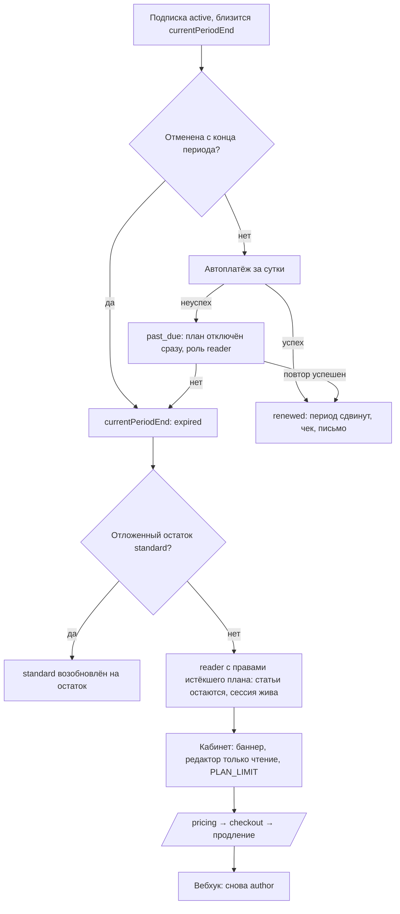

# Flow: Истечение, неуспешный платёж и продление

- **Реестр**: `00-registries/flows.md` #7
- **Статус**: на утверждении
- **ADR**: ADR-0035, ADR-0044 (п. 6 о льготном периоде заменён журналом #20; п. 2 — §20.8, §21.16),
  ADR-0032
- **Этап**: 1

## 1. Цель пользователя и роль на входе / выходе

Система: корректно отключить план, когда он закончился, не потеряв материалы и не отозвав сессию.
Пользователь: понять, что произошло, и продлить. Вход: `author` с подпиской, у которой наступил
`currentPeriodEnd` без продления, отменённой с конца периода, или с неуспешным автоплатежом.
Выход: `reader` с правами истёкшего плана (журнал #5, #20) — статьи остаются опубликованными,
рейтинг не меняется (§20.8), Pro-балл сохраняется (§21.16); после продления — снова `author`.

## 2. Предусловия

Подписка `active` с `currentPeriodEnd` или `cancelAtPeriodEnd`; сохранённый способ оплаты для
автоплатежа; сессии пользователя могут быть активны — они не отзываются (журнал #55); при
отложенном остатке `standard` после `pro` — возобновление вместо истечения (журнал #24).

## 3. Шаги

| Шаг | Экран (файл страницы) | Действие пользователя | Система делает | Данные / мутация | Событие (код) |
|---|---|---|---|---|---|
| 1 | — (письмо) | — | за N дней до конца периода `[ДОПУЩЕНИЕ: 3]` шлёт напоминание, если нет автоплатежа или подписка отменена | планировщик | лог |
| 2 | — | — | автоплатёж за сутки до конца периода (`subscription-lifecycle.md` п. 3) | адаптер провайдера | `webhook.*` (#49) |
| 3а | — | — | успех: период сдвинут, чек, письмо | вебхук | `subscription.renewed` (#50) |
| 3б | — | — | неуспех или отмена: план отключён сразу — `planTier = free`, роль `reader`, статьи остаются; письмо | вебхук / планировщик | `subscription.deactivated` / `.expired` (#50) |
| 4 | `30-account/reader/dashboard.md`, `author/article-edit.md` | открывает кабинет или редактор | баннер `SubscriptionStatus` «подписка истекла {дата}» с кнопкой «продлить»; редактор — только чтение; любой вызов, требующий плана, — `PLAN_LIMIT` с уведомлением (журнал #55) | `me.subscription` | `plan.action.rejected` (#78) |
| 5 | `20-public/pricing.md` → `checkout.md` | нажимает «продлить» | обычная оплата (`pay-and-upgrade.md`) | `startCheckout` | `checkout.started` |
| 6 | `30-account/reader/subscription.md` | видит активный план | роль `author` возвращена вебхуком; черновики и настройки как были | вебхук | `subscription.activated` |

## 4. Развилки

| Точка | Условие | Ветка А | Ветка Б |
|---|---|---|---|
| Шаг 2 | подписка отменена с конца периода | автоплатёж не выполняется; шаг 3б в `currentPeriodEnd` | автоплатёж |
| Шаг 2 | отложенный остаток `standard` после `pro` | вместо истечения — `standard` возобновляется на остаток (`subscription.remainder_resumed`) | истечение |
| Шаг 3б | неуспешный платёж | `past_due` без прав; один повтор списания `[ДОПУЩЕНИЕ]`; успех — `active` | отмена платежа — `canceled` |
| Шаг 4 | у пользователя есть черновики и статьи в очереди | остаются; отправка к публикации закрыта до продления | нет материалов |
| Шаг 4 | аккаунт в архиве | план продолжает идти без доступа (журнал #50); истечение — как обычно | обычный доступ |
| Шаг 5 | пользователь не продлевает | остаётся `reader` с правами истёкшего плана бессрочно | продление |

## 5. Ошибки и восстановление

| Ошибка (код ADR-0032) | На каком шаге | Что видит пользователь | Как продолжить |
|---|---|---|---|
| `PLAN_LIMIT` | 4 | уведомление «подписка неактивна» вместо успешного сохранения; ссылка на `/pricing` | продлить |
| `PROVIDER_UNAVAILABLE` | 2, 5 | письмо о неудачном автоплатеже; на checkout — «оплата временно недоступна» | повторить позже |
| отказ автоплатежа | 2 | письмо: план отключён, кнопка «продлить» | оплатить вручную |
| `CONFLICT` | 5 | «у вас уже активный план» (если повтор списания успел пройти) | ничего не делать |

## 6. Письма и уведомления

| Шаг | Письмо | Кому | Ссылка и срок действия |
|---|---|---|---|
| 1 | напоминание об окончании периода | пользователь | `/me/subscription`, без срока |
| 3а | подтверждение продления с чеком | пользователь | чек провайдера |
| 3б | план отключён: что осталось доступно (статьи, история, архив, экспорт), как продлить | пользователь | `/pricing` |
| 4 | — | — | — |

Правила и частота рассылок отложены; письма — по событию.

## 7. Схема

Узлы совпадают с шагами §3 и развилками §4.

## 8. Открытые вопросы и допущения

- `[ДОПУЩЕНИЕ]` Напоминание за 3 дня; один повтор списания при неуспехе; автоплатёж за сутки.
- `[ВОПРОС ВЛАДЕЛЬЦУ]` Слать ли бывшему автору повторные напоминания о продлении после
  истечения (например, через неделю и месяц) или только одно письмо об отключении? Если
  повторные — правило в отложенных правилах рассылок; если нет — одно письмо.
