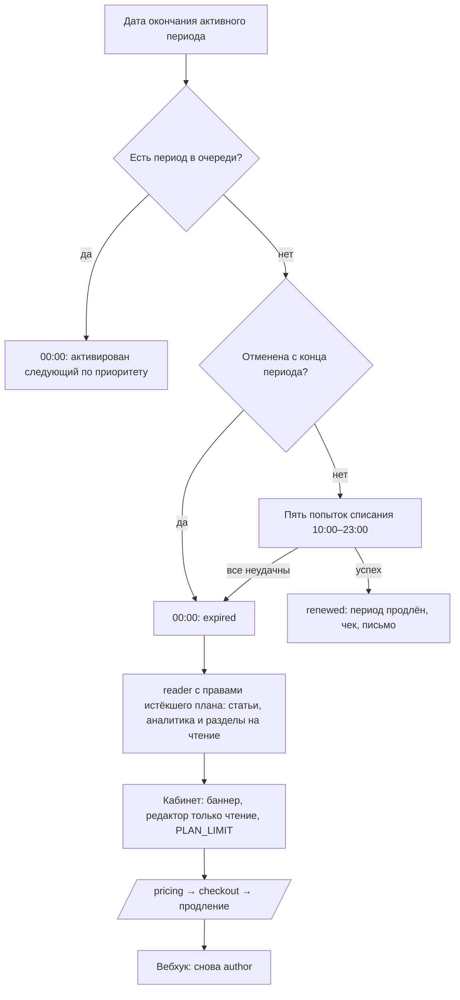

# Flow: Продление, неуспешные списания и истечение

- **Реестр**: `00-registries/flows.md` #7
- **Статус**: утверждён (гейт Г5, 2026-09-09)
- **ADR**: ADR-0035, ADR-0044 (п. 6 заменён журналом §8.15; п. 2 — §20.8, §21.16), ADR-0032
- **Этап**: отдельный этап платности (журнал §24.1)

## 1. Цель пользователя и роль на входе / выходе

Система: продлить план автосписанием, а при неудаче корректно перевести автора в права истёкшего
плана, не потеряв материалы, аналитику и сессию. Пользователь: понять, что произошло, и продлить.
Вход: `author` с активным периодом, у которого наступила дата окончания. Выход: `author` (успешное
списание или следующий период очереди) либо `reader` с правами истёкшего плана с 00:00 следующего
дня (журнал §8.15): статьи опубликованы, авторские разделы и аналитика — на чтение (§8.20–21),
рейтинг и Pro-компоненты не меняются (§20.8, §21.16); после продления — снова `author`.

## 2. Предусловия

Активный период с датой окончания; отсутствие оплаченного периода в очереди (иначе списания нет —
активируется следующий, §8.22); сохранённый способ оплаты; подписка не отменена
(`cancelAtPeriodEnd`); сессии не отзываются (журнал #55).

## 3. Шаги

| Шаг | Экран (файл страницы) | Действие пользователя | Система делает | Данные / мутация | Событие (код) |
|---|---|---|---|---|---|
| 1 | — (письмо) | — | напоминание об окончании за N дней `[ДОПУЩЕНИЕ: 3; повторные напоминания — этап почты, §8.23]` | планировщик | лог |
| 2 | — | — | в дату окончания: до пяти попыток списания с 10:00 до 23:00 (§8.15); права полные весь день | адаптер (`chargeSaved`) | `subscription.retry` (#50) |
| 3а | — | — | успех любой попытки: период продлён, чек, письмо | вебхук | `subscription.renewed` (#50) |
| 3б | — | — | все пять неудачны: с 00:00 следующего дня период `expired`; если в очереди есть период — активируется он; иначе `planTier = free`, роль `reader`; письмо | планировщик | `subscription.expired` (#50) |
| 4 | `30-account/reader/dashboard.md`, `author/articles.md`, `article-stats.md` | открывает кабинет | авторские разделы остаются на чтение: статьи, рейтинг, актуальная аналитика (§8.20–21); баннер «план истёк {дата}» с кнопкой «продлить»; редактор — только чтение; вызовы, требующие плана, — `PLAN_LIMIT` (журнал #55) | `me.subscription`, `articleStats` | `plan.action.rejected` (#78) |
| 5 | `20-public/pricing.md` → `checkout.md` | нажимает «продлить» | обычная оплата (`pay-and-upgrade.md`) | `startCheckout` | `checkout.started` |
| 6 | `30-account/reader/subscription.md` | видит активный план | роль `author` возвращена вебхуком; черновики как были | вебхук | `subscription.activated` |

## 4. Развилки

| Точка | Условие | Ветка А | Ветка Б |
|---|---|---|---|
| Шаг 2 | подписка отменена с конца периода | попыток списания нет; шаг 3б в 00:00 | серия попыток |
| Шаг 2 | в очереди есть оплаченный период (§8.22) | списания нет; в 00:00 активируется следующий по приоритету | серия попыток |
| Шаг 2 | провайдер недоступен во время попытки | попытка считается неудачной `[ДОПУЩЕНИЕ]`, серия продолжается | успех |
| Шаг 3б | у пользователя нет ни одной статьи и данных по ним | авторские разделы можно не показывать (§8.21); состав интерфейса — заход 6 | разделы на чтение |
| Шаг 4 | аккаунт в архиве | очередь идёт без доступа (журнал #50) | обычный доступ |
| Шаг 5 | пользователь не продлевает | остаётся `reader` с правами истёкшего плана бессрочно; повторные письма — этап почты | продление |

## 5. Ошибки и восстановление

| Ошибка (код ADR-0032) | На каком шаге | Что видит пользователь | Как продолжить |
|---|---|---|---|
| `PLAN_LIMIT` | 4 | «подписка неактивна» вместо сохранения; ссылка на `/pricing` | продлить |
| `PROVIDER_UNAVAILABLE` | 2, 5 | письмо о неудачной серии; на checkout — «оплата временно недоступна» | повторить позже |
| неудачная серия списаний | 2 | письмо: план истёк с 00:00, что осталось доступно, как продлить | оплатить вручную |
| `CONFLICT` | 5 | «у вас уже активный план» (успешное списание пришло позже) | ничего не делать |

## 6. Письма и уведомления

| Шаг | Письмо | Кому | Ссылка и срок действия |
|---|---|---|---|
| 1 | напоминание об окончании периода | пользователь | `/me/subscription`, без срока |
| 3а | подтверждение продления с чеком | пользователь | чек провайдера |
| 3б | план истёк: что доступно (статьи, аналитика, архив, экспорт), как продлить | пользователь | `/pricing` |

Шаблоны, частота, повторные напоминания и согласие на уведомления — отдельный этап почты вместе
со сценариями входа через email и Google (§8.23).

## 7. Схема

Узлы совпадают с шагами §3 и развилками §4.

## 8. Открытые вопросы и допущения

- `[ДОПУЩЕНИЕ]` Напоминание за 3 дня; недоступность провайдера как неудачная попытка.
- Отложено (§8.23): повторные напоминания после истечения — этап почты.
- Закрыто Г5 (§8.15, §8.20–22): пять попыток и истечение с 00:00; разделы и аналитика на
  чтение; очередь периодов.
