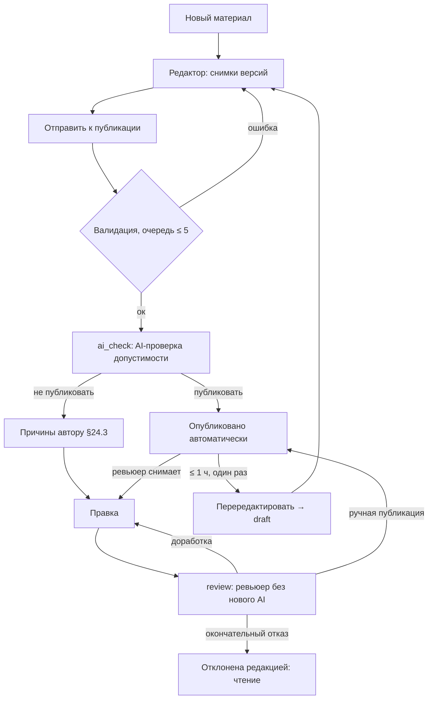

# Flow: Написать и опубликовать

- **Реестр**: `00-registries/flows.md` #3; §4 — «Перередактировать после автопубликации» (#4)
- **Статус**: утверждён (гейт Г6, 2026-09-09)
- **ADR**: ADR-0001, ADR-0007, ADR-0008, ADR-0033, ADR-0045, ADR-0046; журнал §6, §16, #9, #12–16,
  #40–42, §17, §20.6, §21.15–16, §24.1, §24.3; `30-account/author/article-new.md`,
  `article-edit.md`, `review-history.md`; `10-flows/moderation.md` (#5 — ручная ветка ревьюера)
- **Этап**: 1

## 1. Цель пользователя и роль на входе / выходе

Автор (и `editor` для редакционных — журнал §17) хочет написать материал и увидеть его
опубликованным. Вход: `author` с активным планом или выдачей (на первом запуске — любой
зарегистрированный, §24.1). Выход: версия `published` (автоматически после проверки или вручную
ревьюером) либо `review` с причинами, либо «отклонена редакцией». Правила: каждая первая
подача — AI-проверка допустимости (журнал §6.2); «публиковать» → автопубликация; «не
публиковать» → причины автору (текст формирует проверка — §24.3) → правка → ручная ветка без
нового AI (журнал #14); оспаривания AI нет (журнал #40).

## 2. Предусловия

Сессия; план или выдача (`PLAN_LIMIT` иначе); рубрика перед подачей, формат и теги — по желанию, тег может быть новым (§26.3) (журнал
§12); обязательные поля и лицензии изображений (ADR-0008); очередь проверки ≤ 5 материалов
(`rate-limits.md` п. 10); согласие с правилами публикации — в составе оферты
(`legal-content-rules.md`).

## 3. Шаги

| Шаг | Экран (файл страницы) | Действие пользователя | Система делает | Данные / мутация | Событие (код) |
|---|---|---|---|---|---|
| 1 | `30-account/author/article-new.md` | нажимает «плюс» («Создать статью») | сразу создаёт материал и версию `draft` с первой ревизией и открывает редактор; формат, рубрика и теги не требуются (журнал §25.3); первое нажатие читателя открывает базовые авторские возможности (§25.1) | `createArticle` | `author.enabled` (#87 `[черновик]`) при первом нажатии |
| 2 | `30-account/author/article-edit.md` | пишет, добавляет медиа с лицензией, SEO | снимок каждой версии (журнал §6.7); конфликт версий — `CONFLICT` (ADR-0033) | `saveTranslation`, `uploadMedia` | — |
| 3 | `article-edit.md` | «Отправить к публикации» | валидация; статус `ai_check`; задание AI (текст без имени и e-mail) | `submitTranslation` | `translation.submit` (#45), `ai.job.created` (#46) |
| 4 | — (фон) | ждёт | AI выносит бинарное решение по теме, правилам, возрасту, недопустимому контенту (журнал §6.2, §16.3) | — | `ai.decision` (#71) |
| 5а | `20-public/article.md` | видит опубликованный материал | «публиковать» → `published`, снимки Pro-балла и авторского рейтинга (§21.15–16), письмо, окно «перередактировать» 1 час | — | `translation.published` (#61) |
| 5б | `30-account/author/review-history.md` | читает причины | «не публиковать» → `review`; причины по категориям с текстом (§24.3); письмо | `translation.aiCheck` | `mail.queued` (#51) |
| 6 | `article-edit.md` | правит и отправляет снова | без нового AI → ревьюер (журнал #14); `moderation.md` #5 | `submitTranslation` | `translation.submit` |
| 7 | `review-history.md` | читает решение ревьюера | доработка (с рекомендациями), ручная публикация (сразу публично — журнал §16.6) или окончательный отказ с комментарием (§24.3) | `translation.reviewHistory` | `review.message` (#70), `translation.publish.manual` (#24), `translation.reject.final` (#69) |

## 4. Развилки

| Точка | Условие | Ветка А | Ветка Б |
|---|---|---|---|
| Шаг 1 | нет плана (этап платности; бывший автор) | `PLAN_LIMIT` → `/pricing` (журнал #5) | создание |
| Шаг 3 | рубрика не выбрана; перед первой публикацией нет публичного имени или адреса профиля | `VALIDATION_ERROR` с указанием (§25.3–4) | подача |
| Шаг 2 | конфликт ревизий (другая вкладка) | `CONFLICT`: открыть свежую / сохранить копию | сохранено |
| Шаг 2 | офлайн | локальный черновик, синхронизация позже (`offline.md`) | — |
| Шаг 3 | обязательные поля / лицензии не заполнены | `VALIDATION_ERROR` с указанием | подача |
| Шаг 3 | очередь ≥ 5 | `PLAN_LIMIT` «дождитесь решений» | подача |
| Шаг 4 | AI недоступен | материал остаётся в `ai_check`, повтор задания (`ai.job.failed`), автору «проверка задерживается» `[ДОПУЩЕНИЕ]` | решение |
| Шаг 4 | решение | «публиковать» → 5а | «не публиковать» → 5б |
| **Перередактировать (#4)** | ≤ 1 часа после автопубликации, один раз (журнал #9) | снятие с публикации → `draft` → правка → подача снова через AI (журнал §6.4): «публиковать» → автопубликация; отказ → ревьюер | вне срока или повторно — кнопки нет; правка опубликованной без снятия (#19) или снятие ревьюером |
| Шаг 6 | автор отзывает | `draft` | ревьюер |
| Шаг 7 | окончательный отказ | «отклонена редакцией»: чтение и копирование (журнал §4.5, #110) | доработка / публикация |
| Шаг 7 | ревьюер снимает уже опубликованную | доработка без ограничения числа раз (журнал §6.5) → шаг 6 | — |

## 5. Ошибки и восстановление

| Ошибка (код ADR-0032) | На каком шаге | Что видит пользователь | Как продолжить |
|---|---|---|---|
| `PLAN_LIMIT` | 1, 2, 3 | план / очередь | план или ожидание |
| `CONTENT_INVALID` | 2, 3 | «содержимое не соответствует схеме» (ADR-0029) | исправить блок |
| `CONFLICT` | 2, 3 | конфликт версий / уже подана | открыть свежую / подождать |
| `VALIDATION_ERROR` | 1, 3 | список полей | заполнить |
| `FORBIDDEN` | 2, #4 | `rejected` / окно закрыто | чтение; ждать ревьюера |
| `PROVIDER_UNAVAILABLE` | 4 | «проверка задерживается» | ожидание, повтор системой |

## 6. Письма и уведомления

| Шаг | Письмо | Кому | Ссылка и срок действия |
|---|---|---|---|
| 5а | «опубликовано» с окном «перередактировать до …» (журнал #9, §16.5) | автор | публичная страница; `/me/articles` |
| 5б | «не прошла проверку» с причинами (§24.3) | автор | `/me/articles/{id}/review` |
| 7 | решение ревьюера: доработка / публикация / отказ (журнал #16) | автор | `/me/articles/{id}/edit?token=` (#68, 7 дней `[ДОПУЩЕНИЕ]`) / `review` |

## 7. Схема

Узел «Перередактировать» — сценарий #4: после доработки подача снова идёт через `ai_check`
(журнал §6.4), а не в ручную ветку.

## 8. Открытые вопросы и допущения

- `[ДОПУЩЕНИЕ]` Поведение при недоступности AI (ожидание в `ai_check`, повтор); срок ссылки #68
  7 дней.
- Отложено: каталог блоков (ADR-0017, `95-blocks/`); правила AI-проверки (журнал #41 —
  отдельно); письма (§8.23).
- Закрыто Г1–Г6 (журнал §6, #9, #14, #40–42, §24.3, §25.3–4, §25.6): AI — первый фильтр;
  повторная подача — ручная ветка; «перередактировать» — через AI; причины — текст проверки,
  комментарий рецензента, переписка внутри решения; рубрика — перед подачей.
- Отложено Г6 (§25.13): уведомления о публикации, отказах и действиях длительнее десяти минут
  (в том числе задержка проверки) — отдельный проход почты.
