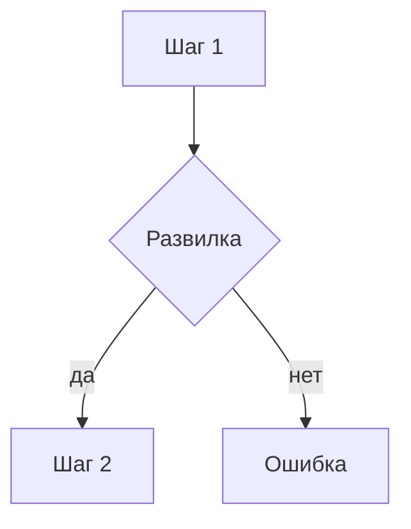

# Flow: <название>

- **Реестр**: `00-registries/flows.md` #NN
- **Статус**: черновик | на утверждении | утверждён | заменён
- **ADR**: ADR-XXXX (только ссылки)
- **Этап**: N

## 1. Цель пользователя и роль на входе / выходе

Что человек хочет получить; с какой ролью и состоянием подписки входит; с какой выходит.

## 2. Предусловия

Сессия, план, состояние объекта (статья, подписка), письма, лимиты, юридические согласия
(ADR-0028).

## 3. Шаги

| Шаг | Экран (файл страницы) | Действие пользователя | Система делает | Данные / мутация | Событие (код) |
|---|---|---|---|---|---|

## 4. Развилки

| Точка | Условие | Ветка А | Ветка Б |
|---|---|---|---|

Обязательные развилки, если применимы: истёкшая ссылка или сессия; недостаточный план;
AI-проверка не пройдена; отказ платежа; блокировка; конфликт версий.

## 5. Ошибки и восстановление

| Ошибка (код ADR-0032) | На каком шаге | Что видит пользователь | Как продолжить |
|---|---|---|---|

## 6. Письма и уведомления

| Шаг | Письмо | Кому | Ссылка и срок действия |
|---|---|---|---|

## 7. Схема

Узлы и развилки схемы совпадают с таблицами 3 и 4.

## 8. Открытые вопросы и допущения

- `[ДОПУЩЕНИЕ]` …
- `[ВОПРОС ВЛАДЕЛЬЦУ]` … — если да: …; если нет: ….
