# Целевая архитектура Altera

- **Ревизия**: 2 (2026-09-06), заменяет ревизию 1 (коммит `636538c`).
- **Статус**: принято владельцем 2026-09-06 (ADR-0043 и ADR-0034…0046 поверх ревизии 1).
- **Основание**: срез реальности `00-reality-check.md` (коммит `8cb987c`, код не менялся),
  продуктовые рамки ADR-0043 и `01-product.md` ревизии 2.
- **Ограничение ресурса**: один разработчик плюс AI-агенты. Оценок в этом документе нет:
  порядок — в `docs/issues/00-roadmap.md`, оценки — при разбивке этапов на задачи.
- Пометки: `[ФАКТ: файл:строка]`, `[ДОПУЩЕНИЕ]`, `[РЕШЕНИЕ: ADR-NNNN]`.

## 0. Что изменилось относительно ревизии 1

| Было | Стало | Решение |
|---|---|---|
| Принципы «два контура», «деньги за редакционную работу», «без алгоритмов» | Одна лента, подписка покупает возможности автора, рейтинговая выдача | ADR-0034, ADR-0035, ADR-0036 |
| D6 «два контура в данных», D10 «поддержка автора первой» | D6 «подписка — источник роли», D10 «биллинг с этапа 1»; новые D13 «рейтинг материализован», D14 «двухступенчатая проверка» | ADR-0035, ADR-0034, ADR-0045 |
| Контуры 4.2 (витрина), 4.6 (без закладок), 4.7 (донаты, выплаты) | 4.2 выдача и рейтинг, 4.6 закладки и подписка на автора, 4.7 планы | ADR-0034, ADR-0041, ADR-0035 |
| Новый контур | 4.9 AI: проверка, оценка, перевод | ADR-0039, ADR-0046 |
| Семь этапов с оценками и сценарием деградации | Шесть этапов без оценок | роадмап ревизии 2 |

---

## 1. Принципы

1. **Истина — код.** Каждое решение опирается на факт из среза реальности или помечено как
   допущение.
2. **Одна лента — один движок.** Одна модель материала, один редактор, один рендер; порядок
   задаёт материализованный рейтинг с названными компонентами [РЕШЕНИЕ: ADR-0034].
3. **Подписка покупает возможности автора; чтение бесплатно.** Роль автора выводится из
   плана; платежи с первого этапа [РЕШЕНИЕ: ADR-0035, ADR-0036].
4. **Каждая публикуемая ревизия проходит AI, затем человека** [РЕШЕНИЕ: ADR-0045].
5. **Локализация — свойство модели данных** [РЕШЕНИЕ: ADR-0002]; вторая версия для pro — AI-перевод
   [РЕШЕНИЕ: ADR-0046].
6. **Мигрировать данные один раз.** Дорогие решения приняты до кода (раздел 3).
7. **Маленькие этапы, каждый — состояние продукта**, которое можно показать автору.
8. **Персонализации и профилирования нет**: рейтинг одинаков для всех, прочтения без ПДн
   [РЕШЕНИЕ: ADR-0027, ADR-0038].

## 2. Система целиком

```mermaid
flowchart LR
  subgraph Client["Браузер"]
    Pub["Публичный сайт: чтение"]
    Cab["Кабинет читателя и автора, редактор"]
    Adm["Админка и редакция"]
  end
  subgraph Nuxt["web: Nuxt 4 (SSR)"]
    BFF["BFF-прокси /api/graphql, cookie-сессия"]
    Render["Рендер материалов из JSON"]
  end
  subgraph Content["packages/content"]
    Schema["Схема ProseMirror, валидация, рендерер, экспорт"]
  end
  subgraph API["server: GraphQL Yoga"]
    Res["Резолверы, единый модуль видимости, права по плану"]
    Auth["Magic link, сессии с ротацией, лимиты"]
    Media["Загрузка медиа, варианты изображений"]
    Search["Поиск: PostgreSQL FTS (3)"]
    Bill["Биллинг за адаптером провайдера (1)"]
    Rank["Рейтинг: пересчёт ArticleScore по расписанию и событиям (2)"]
    AI["AI-проверка, оценка, перевод за адаптером провайдера (1–3)"]
    Mail["Почта: транспортная абстракция"]
  end
  PG[("PostgreSQL в РФ (прод); Neon — dev")]
  S3[("S3-совместимое хранилище в РФ")]
  RedisC[("Redis — необязательный кеш")]
  MailP["Почтовый провайдер РФ"]
  PSP["ЮKassa / Т-Касса"]
  LLM["AI-провайдер (гейт этапа 1)"]

  Pub --> Render --> BFF --> Res
  Cab --> BFF
  Adm --> BFF
  Render --> Schema
  Res --> Schema
  Res --> PG
  Res -.-> RedisC
  Media --> S3
  Mail --> MailP
  Bill --> PSP
  AI --> LLM
  Rank --> PG
  Search --> PG
```

Стек не меняется: Nuxt 4 / Vue 3, Prisma, PostgreSQL, pnpm-workspace, Tailwind 4. Из
оспариваемого: GraphQL Yoga остаётся [РЕШЕНИЕ: ADR-0020]; FishtVue — только для поверхностей
приложения [РЕШЕНИЕ: ADR-0021]; magic link — единственный вход до конца этапа 3
[РЕШЕНИЕ: ADR-0022]; MDC не берётся [РЕШЕНИЕ: ADR-0001]. Прод-база не на Neon, а у
российского провайдера [РЕШЕНИЕ: ADR-0011]. Один процесс API и один Nuxt до этапа 5;
пересчёт рейтинга и AI-вызовы — фоновые задачи внутри процесса API с очередью в базе
`[ДОПУЩЕНИЕ: без внешнего брокера]`; второй процесс — только для совместной работы
[РЕШЕНИЕ: ADR-0033].

## 3. Решения, которые дорого менять потом

| № | Решение | Суть | Цена отката | ADR |
|---|---|---|---|---|
| D1 | Модель контента | JSON-документ ProseMirror; рендер JSON → Vue на сервере; экспорт в Markdown/HTML | Конвертер всего архива плюс редактор | ADR-0001, ADR-0029 |
| D2 | Локализация | `Article` + `ArticleTranslation`; RU без префикса, EN под `/en`; AI-перевод для pro | Адреса и hreflang | ADR-0002, ADR-0046 |
| D3 | Роли | enum из семи значений; `reader`/`author` из плана; единый источник через codegen | Низкая | ADR-0003, ADR-0042 |
| D4 | Идентификаторы и адреса | uuid внутри; `/{рубрика}/{слаг}`, `/en/...`, `/authors/{handle}`; история слагов | Внешние ссылки | ADR-0004 |
| D5 | Таксономия | Рубрика (в адресе) + формат (атрибут) + теги | Адреса | ADR-0005 |
| D6 | Подписка — источник роли | `PlanTier`, `User.planTier/planUntil`, инвариант «author ⇔ подписка ∨ грант»; истечение оставляет статьи | Продуктовое обещание авторам | ADR-0035, ADR-0044 |
| D7 | Ревизии | Снимки JSON с видами и ретенцией; каждая публикуемая ревизия проверяется | Низкая | ADR-0007, ADR-0045 |
| D8 | Медиа | `MediaAsset` в S3 РФ; лицензия и атрибуция обязательны; варианты при загрузке | Синхронизация бакета | ADR-0008, ADR-0030 |
| D9 | Сессии | Таблица сессий, ротация, отзыв; BFF-прокси и httpOnly-cookie | Низкая | ADR-0009, ADR-0023 |
| D10 | Биллинг с этапа 1 | Модель за адаптером провайдера; фискализация у провайдера; планы free/standard/pro | Новая реализация адаптера | ADR-0010, ADR-0035 |
| D11 | Хостинг данных | Прод в РФ; Neon — только dev | Переезд — часы; правовой риск при откате | ADR-0011 |
| D12 | Контракт API | SDL сервера — источник; типы фронта генерируются | Низкая | ADR-0012 |
| D13 | Рейтинг материализован | `ArticleScore`/`AuthorScore` с версией `RankingConfig`; детерминированный пересчёт | Низкая технически; продуктово — привычка к позициям | ADR-0034, ADR-0038, ADR-0040 |
| D14 | AI как ворота и сигнал | `ArticleAiReview` на ревизию; текст без ПДн провайдеру; переопределение человеком | Отказ от AI возвращает к ручной проверке | ADR-0039, ADR-0045 |

Остальные решения (грейд автора, закладки, роль `analyst`, права редактора на проверке,
каталог блоков, персональные данные, Redis, почта и лимиты, поиск, сообщество без
комментариев, юридические тексты, тесты и CI, ошибки, конфликты редактирования) —
ADR-0013…0033 и ADR-0037, 0041, 0042; указатель в `docs/decisions/README.md`.

## 4. Подсистемы

Каждая подсистема описана по одному шаблону: устройство; модель данных; границы ответственности;
влияние на роли; что должно быть до и что становится возможным после. Поштучные
спецификации — `docs/spec/`.

### 4.1. Модель контента и редактор

- **Устройство.** Документ ProseMirror в `ArticleTranslation.body`; редактор TipTap; общий
  пакет `content` (схема, валидация, рендерер, экспорт); статусный цикл на языковой версии с
  состоянием `ai_review`; ревизии-снимки; замечания к блокам (4); медиа по `assetId`;
  панель проверки в редакторе. Подробно — `05-editor.md`.
- **Модель данных.** `ArticleTranslation`, `ArticleRevision`, `ArticleAiReview`, `ReviewNote`
  (4), `MediaAsset`, `Template` (4), `TranslationJob` (3).
- **Границы ответственности.** Пакет `content` — документ существует и валиден; сервер —
  статусы, права по плану, ревизии, вызовы AI; веб — редактор и рендер; дизайн-система — вид
  блоков.
- **Влияние на роли.** Автор с активной подпиской владеет смыслом; редактор правит чужое
  только в `review` с ревизией [РЕШЕНИЕ: ADR-0036, ADR-0042]; ревьюер решает.
- **До и после.** До: D1, D2, D7, D14, каталог блоков (ADR-0017), дизайн-система для блоков
  этапа 1. После: рейтинг (2), AI-перевод и экспорт (3), библиотека блоков и замечания (4),
  совместная работа (5).

### 4.2. Публичный сайт, выдача и дизайн-система

- **Устройство.** SSR-страницы чтения на собственных компонентах; главная из секций по
  рейтингу; ленты рубрик, тегов, авторов по рейтингу; поиск (3); токены в `main.css`; SEO и
  JSON-LD; доступность и бюджеты как гейты CI. Подробно — `06-design-system.md`; рейтинг —
  `docs/spec/60-ranking/`.
- **Модель данных.** `ArticleScore`, `AuthorScore`, `RankingConfig`, `ArticleBoost`,
  `ArticleReadDaily`, `Section`, `Tag`.
- **Границы ответственности.** Дизайн-система владеет видом всего, что читается; рейтинг —
  порядком; редактор выдаёт только семантику; FishtVue — поверхности приложения
  [РЕШЕНИЕ: ADR-0021].
- **Влияние на роли.** Посетитель и читатель видят только опубликованное в своей локали;
  веса рейтинга меняет администратор с аудитом; ревьюер исключает накрутку.
- **До и после.** До: токены, карточка, атомы, `Prose*`, карта маршрутов, реестры
  `docs/spec/00-registries/`. После: страницы из данных по дате (1), рейтинг и секции (2),
  поиск и SEO целиком (3).

### 4.3. Административная среда

- **Устройство.** Админка на FishtVue: сводка, категории (рубрики), теги, статьи по версиям,
  очередь проверки с AI-вердиктом, пользователи с планом и блокировкой, администраторы,
  подписки, платежи и возвраты, статистика, жалобы (1); AI-оценки, конфигурация рейтинга (2);
  аудит-интерфейс, медиа-библиотека, расширенные отчёты, рассылка, юридические тексты,
  настройки системы (4). Текущие таблицы на фикстурах [ФАКТ: `00-reality-check.md` §5.3]
  подключаются к API. Поштучно — `docs/spec/40-admin/`.
- **Модель данных.** `Report`, `AuditLog` (с этапа 1), `PlanGrant`, `Subscription`, `Payment`,
  `ArticleAiReview`, `RankingConfig`, `NewsletterIssue` (4).
- **Границы ответственности.** Обязательно для запуска (конец этапа 1): сводка, категории,
  теги, статьи, очередь, пользователи, администраторы, подписки, базовая статистика, жалобы.
  Этап 2: AI-оценки, рейтинг. Этап 4: аудит-интерфейс, медиа, отчёты, рассылка.
- **Влияние на роли.** Матрица в `04-roles-and-access.md`; `analyst` — только чтение;
  назначение ролей из интерфейса — этап 1 [РЕШЕНИЕ: ADR-0042].
- **До и после.** До: D3, единый контракт, FishtVue на общих токенах. После: редакция из
  нескольких человек (4).

### 4.4. Роли, права и доступы

- **Устройство.** Семь ролей в enum; `reader`/`author` из плана; единый модуль видимости и
  хелперы прав на сервере (`ensureActiveAuthor`); аудит критичных действий с этапа 1.
  Подробно — `04-roles-and-access.md`.
- **Модель данных.** `User.role`, `planTier`, `planUntil`, `blocked*`, `deletedAt`, `Session`,
  `AuditLog`, `PlanGrant`.
- **Границы ответственности.** Права — только сервер; интерфейс скрывает, но не решает.
- **Влияние на роли.** Читатель становится автором оплатой; редакцию назначает
  администратор; владелец один; `analyst` без мутаций.
- **До и после.** До: D3, D6, D12. После: кабинеты и админка (1), самоудаление (3).

### 4.5. Доверие, безопасность и правовой контур

- **Устройство.** Сессии с ротацией и отзывом, BFF и httpOnly-cookie, лимиты на вход и API,
  почта как зависимость, публичные типы без ПДн, закрытые утечки черновиков и e-mail,
  двухступенчатая проверка, жалобы, юридические тексты с версиями согласий (включая платные
  услуги и передачу текстов AI), хостинг в РФ, бэкапы с проверкой восстановления. Подробно —
  `07-commerce.md` §7–10, `08-operations.md`.
- **Модель данных.** `Session`, `MagicLinkToken`, `Report`, `users.consent*`.
- **Границы ответственности.** Сервер — сессии, лимиты, видимость; Nuxt — cookie и CSRF;
  владелец — тексты, провайдеры, консультации.
- **Влияние на роли.** Ревьюер — жалобы и блокировки; владелец — секреты и провайдеры.
- **До и после.** До: D9, D11, ADR-0018, ADR-0024, ADR-0028. После: открытая регистрация
  (конец этапа 1).

### 4.6. Сообщество и обратная связь

- **Устройство.** Закладки (1), жалобы и письмо в редакцию (1), подписка на автора с
  письмами (3), рассылка с double opt-in (4). Комментариев и реакций нет [РЕШЕНИЕ: ADR-0026].
- **Модель данных.** `Bookmark`, `Report`, `AuthorFollow`, `NewsletterSubscriber`,
  `NewsletterIssue`.
- **Границы ответственности.** Модерация сводится к очереди проверки и жалобам; закладки не
  входят в рейтинг [РЕШЕНИЕ: ADR-0041].
- **Влияние на роли.** Читатель сохраняет, жалуется и подписывается; ревьюер рассматривает.
- **До и после.** До: почта (0). После: возврат читателей (3).

### 4.7. Планы и стоимость

- **Устройство.** Планы free / standard / pro; ЮKassa за адаптером; чеки у провайдера;
  жизненный цикл с истечением по ADR-0044; гранты и промокоды; гипотезы цен с критериями
  отказа; AI как статья расходов. Подробно — `07-commerce.md`.
- **Модель данных.** `Plan`, `Customer`, `Subscription`, `Payment`, `PlanGrant`, `PromoCode`,
  `PspWebhookEvent`; `Article.access` зарезервирован.
- **Границы ответственности.** Инвариант «author ⇔ подписка ∨ грант» — тест; провайдер —
  фискализация; владелец — договоры и консультации.
- **Влияние на роли.** Подписка определяет роль; администратор — возвраты, гранты, планы.
- **До и после.** До: D6, D10, юридические тексты, права (4.4). После: рейтинг с грейдом и
  бустом (2), AI-перевод (3), профессиональные инструменты (5).

### 4.8. Качество, эксплуатация и данные

- **Устройство.** Окружения dev/ci/preview/prod; сиды; миграции с репетицией и откатом;
  бэкапы с проверкой; тесты по рискам; честный CI; логи, health, сборщик ошибок; фоновые
  задачи в процессе API (пересчёт рейтинга, AI-вызовы, продления); housekeeping; бюджет в ₽
  с учётом AI. Подробно — `08-operations.md`.
- **Модель данных.** `_prisma_migrations`, `audit_log`, агрегаты прочтений, `ArticleScore`,
  `PspWebhookEvent`.
- **Границы ответственности.** CI — единственный судья; деплой — после зелёного CI; истина по
  каждому типу данных названа.
- **Влияние на роли.** Только владелец — секреты, провайдеры, процедуры последней инстанции.
- **До и после.** До: D12, ADR-0031, ADR-0032. После: любой этап проверяем по DoD.

### 4.9. AI: проверка, оценка, перевод

- **Устройство.** Один адаптер провайдера с реализациями `real` и `fake`; три операции:
  вердикт и оценка ревизии (ADR-0039), перевод версии (ADR-0046); очередь заданий в базе с
  повторами; стоимость на запись; лимиты в сутки на автора; недоступность провайдера
  переводит ревизию к человеку без вердикта.
- **Модель данных.** `ArticleAiReview`, `TranslationJob`, параметры порогов и лимитов в
  конфигурации.
- **Границы ответственности.** Адаптер — вызов и разбор ответа; сервер — очередь, статусы,
  хранение; правила публикации — часть промта с версией; ревьюер — последнее слово.
- **Влияние на роли.** Автор видит вердикт, балл, критерии, пояснения; ревьюер переопределяет;
  владелец выбирает провайдера и бюджет.
- **До и после.** До: ADR-0028 (правила публикации), провайдер и договор (гейт этапа 1),
  D14. После: очередь проверки этапа 1; AI-оценка в рейтинге (2); AI-перевод (3).

## 5. Этапы

Состояния продукта и порядок — `docs/issues/00-roadmap.md` ревизии 2 и файлы этапов.

| № | Состояние | Файл |
|---|---|---|
| 0 | Кровотечение остановлено | `docs/issues/01-stop-the-bleeding.md` |
| 1 | Первый автор оплачивает и публикует | `docs/issues/02-first-author-pays-and-publishes.md` |
| 2 | Выдача рейтинговая | `docs/issues/03-ranked-delivery.md` |
| 3 | Читатель находит и возвращается | `docs/issues/04-reader-finds-and-returns.md` |
| 4 | Редакция работает как команда | `docs/issues/05-editorial-team.md` |
| 5 | Совместная работа и профессиональные инструменты | `docs/issues/06-collaboration-and-pro-tools.md` |

**Почему этап 0 первый.** 25 из 35 операций фронта невалидны, сервер отдаёт черновики и
адреса, сессия не обновляется, письма не уходят, CI зелёный при сломанной сборке
[ФАКТ: `00-reality-check.md`]. Пока контракт не един, соединение не живое, а сессия не полна,
редактор, биллинг и рейтинг строятся на песке.

**Почему биллинг в этапе 1.** Без подписки нет роли автора (ADR-0035); первый автор
физически не может опубликовать, пока нет оплаты или гранта.

## 6. Зависимости

Граф и таблица «раньше — позже — почему» — `docs/issues/00-roadmap.md` §3. Ключевые
порядки: дорогие решения → этап 0 → этап 1; модель ролей и планов → кабинеты и админка;
дизайн-система и реестры → массовая вёрстка; модель контента и AI-адаптер → редактор и
очередь; материалы и просмотры → рейтинг; проверенный процесс публикации → AI-перевод;
модель локализации → SEO.

## 7. Точки решений владельца

`docs/issues/00-roadmap.md` §4: провайдер почты и ADR-0023 (0); список рубрик; юрлицо,
договор с ЮKassa, консультация по чекам, цены планов; AI-провайдер, юрисдикция и бюджет;
провайдер РФ для базы, S3, хостинга; юридические тексты; README; уведомление РКН (все — до
открытой регистрации в 1); веса рейтинга и состав секций главной (2, гейт Г4); лимиты
AI-переводов (3); учётки редакции (4); второй процесс (5).

## 8. Что подтверждено владельцем

2026-09-05: ревизия 1 (см. коммит `636538c`). 2026-09-06: продуктовые рамки ревизии 2
(ADR-0043), ответы на семь вопросов захода перебазирования (`99-open-questions.md` §D),
ADR-0034…0046 и порядок этапов 0–5 (гейт Г0).
