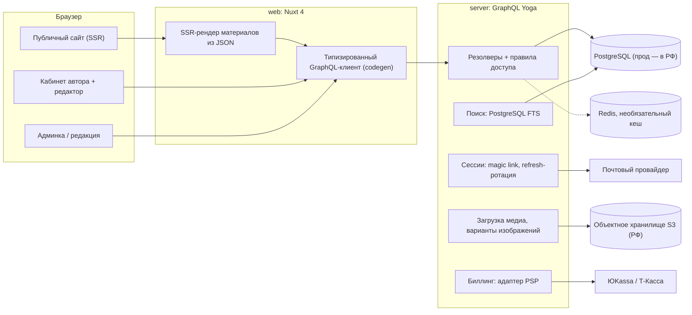
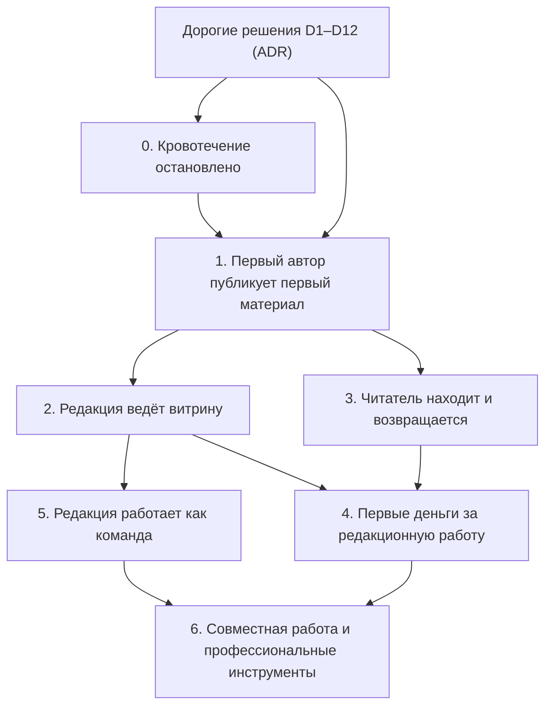

# Целевая архитектура Altera

- **Статус**: черновик на подтверждение владельца (шаг 3 промта). После подтверждения
  состава этапов и приоритетов документ дорабатывается до окончательного, а решения из
  раздела 3 оформляются как ADR в `docs/decisions/`.
- **Основание**: `00-reality-check.md` (коммит `8cb987c`) и продуктовые рамки из `CLAUDE.md`.
- **Открытые вопросы**: `99-open-questions.md`. Там, где ответ не получен, здесь принято
  допущение и помечено `[ДОПУЩЕНИЕ]`.
- **Ограничения ресурса**: один разработчик плюс AI-агенты. Оценки в человеко-днях, без
  календаря; допущение — около четырёх продуктивных дней в неделю.

---

## 1. Принципы

1. **Истина — код.** Каждое решение ниже опирается на факт из среза реальности или помечено
   как допущение.
2. **Два контура — один движок.** Открытая публикация и редакционная витрина используют одну
   модель материала, один редактор и один рендер; отличаются права, отбор и экономика.
3. **Деньги — за редакционную работу и инструменты**, никогда за право публиковаться и за доступ
   к открытому контуру. Каждый платный сценарий в этом документе прогнан через это правило.
4. **«Без алгоритмов» буквально.** Ранжирование редакционное и хронологическое; любая метрика
   «популярности» названа читателю.
5. **Локализация — свойство модели данных**, а не поле на записи.
6. **Мигрировать данные один раз.** Дорогие решения (раздел 3) принимаются до кода, а не по ходу.
7. **Маленькие этапы, каждый — состояние продукта**, которое можно показать автору.
8. **YAGNI везде, где не пункт 6.**

---

## 2. Система целиком

Стек не меняется: Nuxt 4 / Vue 3, Prisma, PostgreSQL, pnpm-workspace, Tailwind 4. Из
оспариваемого: GraphQL Yoga остаётся, FishtVue остаётся только в админке, magic link остаётся
единственным входом до этапа 3, **MDC не берётся** (раздел 4.1).

---

## 3. Решения, которые дорого менять потом

Принимаются до начала соответствующих этапов и оформляются ADR после подтверждения.

| № | Решение | Предложение | Цена отката |
|---|---|---|---|
| D1 | Модель контента | JSON-дерево ProseMirror как каноническое хранилище; рендер JSON → Vue на сервере; экспорт в Markdown/HTML | Высокая: конвертер всего архива |
| D2 | Модель локализации | `Article` (общие метаданные) → `ArticleTranslation` (locale, slug, title, body, статус, SEO); `sourceLocale`; перевод необязателен; RU без префикса, EN под `/en` [ДОПУЩЕНИЕ до ответа A4] | Высокая: адреса и hreflang |
| D3 | Модель ролей | enum `reader/author/editor/moderator/admin/owner` в Prisma → GraphQL → codegen; «подписчик» — состояние подписки | Средняя |
| D4 | Идентификаторы и URL | uuid внутри; `/{рубрика}/{слаг}` и `/en/{section}/{slug}`; `/authors/{handle}`; таблица истории слагов для 301 [ДОПУЩЕНИЕ до ответа A6] | Высокая: внешние ссылки |
| D5 | Таксономия | Рубрика (в URL, редакционная) + формат (атрибут) + теги (свободные) | Высокая: адреса |
| D6 | Два контура в данных | `Article.contour: open \| editorial`; `EditorialPick` (отбор на витрину/главную с позицией и сроком); `Commission` для заказных материалов | Средняя |
| D7 | Версии | `ArticleRevision` — снимок JSON языковой версии при каждом сохранении с интервалом; редакционные правки всегда создают ревизию | Низкая, если заложить сразу |
| D8 | Медиа | `MediaAsset` (владелец, лицензия, атрибуция, alt, варианты) в S3-совместимом хранилище РФ | Средняя |
| D9 | Сессии | `Session` (hash refresh-токена, устройство, срок, отзыв), ротация при обновлении | Низкая |
| D10 | Биллинг | `Customer`, `Plan`, `Subscription`, `Payment`, `Payout`, `PromoCode` за адаптером провайдера; фискализация — на стороне провайдера (54-ФЗ) | Средняя |
| D11 | Хостинг данных | Прод — база и хранилище в РФ; Neon — только разработка [ДОПУЩЕНИЕ до ответа A1] | Средняя до запуска, высокая после |
| D12 | Контракт API | Единственный источник — `schema.graphql` сервера; типы фронта генерируются; ручные строки запросов запрещены | Низкая |

---

## 4. Контуры

### 4.1. Модель контента и редактор

**Сравнение** (критерии из промта; оценка для одного разработчика):

| Критерий | MDC (Markdown + компоненты) | JSON-дерево (ProseMirror / TipTap) | Гибрид (Markdown + блочная надстройка) |
|---|---|---|---|
| Диффы и версии | Отлично: текстовый diff | Хорошо: структурный diff; человеку показываем diff экспорта | Плохо: два представления расходятся |
| Совместное редактирование | Нет пути: синтаксис компонентов ломается под CRDT | Есть: Y.js + hocuspocus, стандартный путь | Нет |
| Валидация и ограничения дизайн-системы | Слабая: пропсы — строки, проверка на парсинге | Сильная: схема документа = список разрешённого | Слабая |
| Рендер на сервере и SEO | Хорошо (`@nuxtjs/mdc`) | Хорошо: JSON → Vue на сервере, полный контроль | Хорошо |
| Портируемость | Отлично | Хорошо: JSON + экспорт в Markdown/HTML; формат общий для TipTap/BlockNote | Средне |
| Цена миграции при смене | Средняя: парсер MDC → AST → JSON | Низкая внутри экосистемы ProseMirror; средняя наружу (экспортёр) | Высокая |
| Объём работы | Низкий для textarea, высокий для WYSIWYG поверх | Средний: StarterKit за день, свои блоки — по одному | Высокий |
| Опыт автора-гуманитария | Нужно учить синтаксис | Привычный визуальный редактор | Смешанный |

**Рекомендация: JSON-дерево ProseMirror с TipTap для Vue 3.** Lexical и Editor.js не берём
(первый — React-first, у второго плоская модель без строгой вложенности и слабый путь к
совместной работе); BlockNote — ProseMirror внутри, но React-first.

**Правило границы свободы** (B6): автор управляет *смыслом* (тип блока, семантический вариант:
цитата/врезка, размер изображения обычный/широкий/полный, положение подписи), дизайн-система —
*видом*. Ответ на любой запрос «а можно настройку цвета?» — нет, если это не именованный
вариант, определённый дизайн-системой.

**Что берём с рынка и что нет.** Берём: карточки Ghost/Koenig как модель «мало блоков, каждый
с двумя-тремя вариантами»; Portable Text (Sanity) как принцип «медиа — отдельный документ, в
тексте ссылка»; членство Ghost как модель подписок; Substack — «автор в центре, читатель
подписывается на человека». Не берём: вложенность Notion, пер-блочную стилизацию Gutenberg,
«хлопки» Medium как непрозрачную метрику, Prismic-слайсы (лишний слой для журнала).

**Этапы редактора**: минимально ценный (блоки B5, автосохранение, черновик/публикация,
предпросмотр) → редакционная работа (замечания редактора к абзацу, ревизии, сравнение) →
библиотека блоков (галерея, видео/аудио, врезка, embed, таблица) → расширенная компоновка
(колонки, композиции, шаблоны материалов) → совместная работа (Y.js) → профессиональные
инструменты (платные: статистика, планировщик, экспорт).

**Перевод**: вторая языковая версия создаётся из первой копией структуры (блоки те же, текст
пустой или машинный черновик как подсказка), метаданные общие, у версии свой статус и слаг;
изображения и их подписи не синхронизируются автоматически, только по кнопке «взять из
оригинала».

### 4.2. Публичный сайт и дизайн-система

- **Страницы-фундамент** (проектируются до массовой вёрстки): материал, главная (витрина +
  поток), рубрика, автор, тег, подборка, вход/подтверждение ссылки, состояния пустой выдачи и
  ошибок, страница языковой версии с hreflang.
- **«Избранное»** — `EditorialPick` с позицией и сроком; **«популярное»** — уникальные прочтения
  за 7 дней с подписью метрики (B3).
- **Поиск** — PostgreSQL FTS; переход на внешний движок только при p95 поиска > 300 мс или
  требовании опечаток в русском.
- **Дизайн-система** строится поверх существующих гарнитур и `@theme`: одна семантическая
  палитра вместо двух одинаковых, включённая базовая типографика, тёмная тема через
  `@nuxtjs/color-mode` (без `useTheme`), токены отступов и сеток. FishtVue — только в админке.
- **Бюджеты**: WCAG 2.2 AA (контраст, фокус, клавиатура), LCP < 2,5 с на странице материала,
  JS публичной страницы < 150 КБ.
- **SEO-инфраструктура**: `useSeoMeta` на каждой странице, canonical, hreflang, sitemap, RSS,
  OG-изображения.

### 4.3. Административная среда

- **Обязательно для запуска**: очередь проверки (A2), список материалов с фильтрами (уже есть
  на сервере), отбор на витрину/главную, управление рубриками и тегами (есть), пользователи с
  ролями и блокировкой, жалобы.
- **Для устойчивой редакции**: замечания к материалу, ревизии, медиа-библиотека, аудит
  действий, отчёты по контенту.
- **Отложено**: подписки/тарифы/промокоды/возвраты (этап 4), отчёты по оплатам, рассылка.

### 4.4. Роли и права

Роли `reader`, `author`, `editor`, `moderator`, `admin`, `owner` (D3). Три обязательных закрытия:
единый источник enum через codegen; правила доступа только в резолверах и на уровне данных
(например, `where: { status: published }` для гостя — в одном месте); политика блокировки и
удаления автора (A5). Аудит критичных действий: смена роли, снятие с публикации, удаление,
выплаты.

### 4.5. Доверие, безопасность и правовой контур

Полный цикл сессии (D9), лимиты на magic link и на API, почта как отдельная зависимость,
разделение публичного профиля и персональных данных, закрытие утечек черновиков и e-mail,
модерация пользовательского контента, лицензия на контент в оферте (MIT — только код),
152-ФЗ (A1), удаление аккаунта с анонимизацией, резервные копии и проверенное восстановление.

### 4.6. Сообщество и обратная связь

На запуске — только жалобы и письмо в редакцию. Подписка на автора (уведомления о новых
материалах) — с этапа 3. Рассылка — с витрины. Комментарии и реакции — не планируются, пока
редакция не сможет их модерировать; это осознанный отказ (B14).

### 4.7. Подписки и стоимость

Разрешённые источники: поддержка автора (донат, подписка на автора с комиссией), подписка на
витрину и архив, заказные материалы, профессиональные инструменты, партнёрские форматы.
Каждый тариф проходит правило-арбитр явно (в `07-commerce.md` после подтверждения). Цены — только
гипотезы с диапазонами, способом проверки и **критерием отказа** (например: если за 8 недель
после запуска поддержки авторов менее 3 % читателей-подписчиков автора платят, модель
«поддержка автора» признаётся нежизнеспособной как основной источник).

### 4.8. Качество, эксплуатация и данные

Истина по типам данных: пользователи, роли, сессии, подписки, платежи — PostgreSQL; материалы,
ревизии, переводы, теги, отборы — PostgreSQL; медиа — S3 + запись в PostgreSQL; события
прочтений — PostgreSQL (агрегаты), позже отдельная таблица/ClickHouse при росте; решения — ADR;
контракт — `schema.graphql`; дизайн-система — `main.css` + документ; правила разработки —
`CLAUDE.md`. Инженерная база: окружения dev/preview/prod, сиды, миграции с данными и откат,
тесты (сначала контрактные и резолверные, затем e2e ключевых сценариев), честный CI, логи и
метрики, бюджет инфраструктуры.

---

## 5. Состав этапов (на подтверждение)

Названия — состояния продукта. Оценки — диапазоны человеко-дней для одного разработчика с
AI-агентами, уточняются в `docs/issues/` после подтверждения.

| № | Состояние | Что становится возможно | Оценка |
|---|---|---|---|
| 0 | **Кровотечение остановлено** | Веб получает данные из API по единому контракту; черновики и e-mail закрыты; сессия живёт и отзывается; письма доходят; CI ловит поломку сборки; Redis необязателен | 8–12 |
| 1 | **Первый автор публикует первый материал** | Модель данных v2 (переводы, ревизии, медиа, контуры); вход по ссылке; кабинет; минимальный редактор; загрузка обложки; публикация в открытом контуре (A2); страница материала, автора, рубрики из реальных данных; юридические тексты | 20–30 |
| 2 | **Редакция ведёт витрину** | Отбор на главную и в витрину; очередь проверки с замечаниями; ревизии; снятие с публикации и жалобы; вторая языковая версия; базовое SEO (meta, canonical, hreflang, sitemap, RSS) | 12–18 |
| 3 | **Читатель находит и возвращается** | Поиск; навигация из данных; подборки; счётчик прочтений и честное «популярное»; подписка на автора (уведомления); дизайн-система доведена до всех публичных страниц; доступность и бюджеты производительности | 12–18 |
| 4 | **Первые деньги за редакционную работу** | Аккаунт плательщика, поддержка автора, подписка на витрину, платёжный адаптер (A7), чеки 54-ФЗ, отмена/возврат/просрочка, выплаты авторам (подэтап), метрики и критерий отказа | 18–28 |
| 5 | **Редакция работает как команда** | Библиотека блоков (галерея, видео/аудио, врезки, embed), медиа-библиотека, роли `moderator`/`owner`, аудит, отчёты, рассылка, шаблоны материалов | 20–30 |
| 6 | **Совместная работа и профессиональные инструменты** | Y.js-редактирование, сравнение версий, платные инструменты автора, партнёрские форматы | 25+ |

**Почему этап 0 обязателен и первый.** Сейчас любая новая функция веба пишется на фикстурах
против несуществующего контракта: 25 из 35 операций фронта невалидны, а сервер отдаёт черновики
и адреса. Пока контракт не един, соединение не живое, а сессия не полна, редактор, витрина и
деньги строятся на песке — их пришлось бы переписывать после первого же подключения к API.

**Разбивка этапов на задачи** — только после подтверждения владельцем.

---

## 6. Граф зависимостей

| Раньше | Позже | Почему |
|---|---|---|
| Модель ролей и данных (D2–D7, этап 1) | Кабинеты и админка | Кабинет без модели переводов и контуров переписывается |
| Дизайн-система (ядро в этапе 1, полностью в 3) | Массовая вёрстка | Иначе страницы верстаются на `zinc-*`, как сейчас |
| Модель контента (D1) | Редактор (этап 1) | Редактор — производная от схемы документа |
| Права (этап 1–2) и биллинг (D10) | Платные сценарии (этап 4) | Paywall без прав — дыра, без модели платежей — переписывание |
| Модель локализации (D2, этап 1) | Контент и SEO (этапы 2–3) | Адреса и hreflang нельзя добавить задним числом |
| Единый контракт (этап 0) | Всё остальное | Иначе каждая страница — новое расхождение |

---

## 7. Точки решений владельца

| Когда | Решение | Вопрос |
|---|---|---|
| До этапа 0 | Модель контента, языки и URL, таксономия | A3, A4, A6 |
| До этапа 1 | Режим публикации в открытом контуре; права редактора и судьба материалов при удалении | A2, A5 |
| До открытой регистрации (конец этапа 1) | Хостинг данных в РФ; юридические тексты | A1, B16 |
| До этапа 4 | Первый платный продукт и провайдер | A7 |
| После этапа 3 | Открывать ли OAuth, комментарии, внешний поиск — только по измеренной потребности | B12–B14 |

---

## 8. Сценарий деградации

Если времени вдвое меньше, режем в таком порядке:

1. Этап 6 целиком и этап 5 до «медиа-библиотека + аудит».
2. Этап 4 откладывается до появления первых 20 активных авторов: деньги без аудитории не
   проверяют ничего.
3. Этап 3 — только поиск и навигация из данных; подборки и подписка на автора уходят.
4. Этап 2 — только отбор на главную и очередь проверки; вторая языковая версия уходит в
   следующий цикл, **но модель данных для неё остаётся в этапе 1** (D2).

Минимум, который всё ещё даёт живой продукт с первыми авторами: этап 0 + этап 1 + урезанный
этап 2. Это около 40–55 человеко-дней.

---

## 9. Что сознательно не делаем

- Международный биллинг, мультивалютность.
- Персонализированные ленты и рекомендательные алгоритмы.
- Комментарии и реакции (до появления ресурса на модерацию).
- Собственный CDN/обработку изображений на лету вместо вариантов при загрузке.
- Микросервисы, очереди, Kubernetes: один процесс API и один Nuxt достаточно на годы.
- Мобильные приложения.
- Плагинную систему редактора «для сообщества».
- Мультитенантность (несколько журналов на одном движке).

---

## 10. Что нужно подтвердить

1. Ответы на A1–A7 из `99-open-questions.md` (или согласие с рекомендациями).
2. Решения по умолчанию B1–B17 — только возражения.
3. Состав и порядок этапов 0–6 из раздела 5 и приоритет «этап 0 первым».
4. Список дорогих решений D1–D12 как основу ADR.

После подтверждения: новый план в `docs/plans/`, документы `01`, `03`–`08` в `docs/vision/`,
`docs/issues/00-roadmap.md` и по файлу на этап, ADR в `docs/decisions/`.
