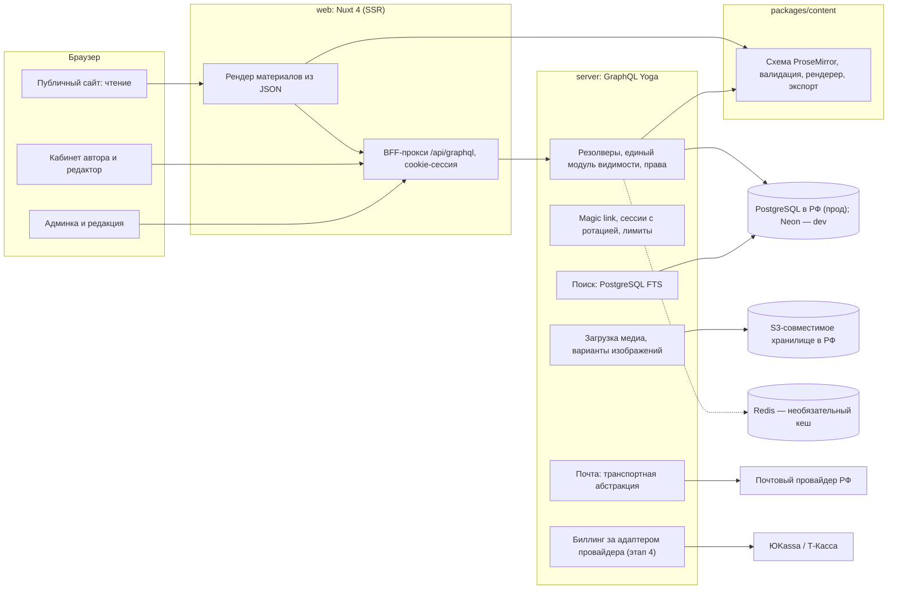

# Целевая архитектура Altera

- **Статус**: принято владельцем 2026-09-05. Черновик этого документа был подтверждён вместе
  с ответами на вопросы `99-open-questions.md` и составом этапов; ниже — окончательная
  редакция с решениями, оформленными как ADR в `docs/decisions/`.
- **Основание**: срез реальности `00-reality-check.md` (коммит `8cb987c`), продуктовые рамки
  из `CLAUDE.md` и `01-product.md`.
- **Ограничение ресурса**: один разработчик плюс AI-агенты; оценки — в человеко-днях при
  допущении около четырёх продуктивных дней в неделю, без календарных дат.
- Пометки: `[ФАКТ: файл:строка]`, `[ДОПУЩЕНИЕ]`, `[РЕШЕНИЕ: ADR-NNNN]`.

---

## 1. Принципы

1. **Истина — код.** Каждое решение опирается на факт из среза реальности или помечено как
   допущение.
2. **Два контура — один движок.** Открытая публикация и редакционная витрина используют одну
   модель материала, один редактор и один рендер; отличаются права, отбор и экономика
   [РЕШЕНИЕ: ADR-0006].
3. **Деньги — за редакционную работу и инструменты**, никогда за право публиковаться и за
   доступ к открытому контуру. Каждый платный сценарий проверен правилом-арбитром
   (`01-product.md` §6, `07-commerce.md` §2).
4. **«Без алгоритмов» буквально.** Ленты редакционные и хронологические; «популярное» — на
   названной метрике [РЕШЕНИЕ: ADR-0016].
5. **Локализация — свойство модели данных** [РЕШЕНИЕ: ADR-0002].
6. **Мигрировать данные один раз.** Дорогие решения приняты до кода (раздел 3).
7. **Маленькие этапы, каждый — состояние продукта**, которое можно показать автору.
8. **YAGNI везде, где не пункт 6.** У каждого контура — список того, чего не делаем.

## 2. Система целиком

Стек не меняется: Nuxt 4 / Vue 3, Prisma, PostgreSQL, pnpm-workspace, Tailwind 4. Из
оспариваемого: GraphQL Yoga остаётся [РЕШЕНИЕ: ADR-0020]; FishtVue — только для поверхностей
приложения [РЕШЕНИЕ: ADR-0021]; magic link — единственный вход до конца этапа 3
[РЕШЕНИЕ: ADR-0022]; MDC не берётся [РЕШЕНИЕ: ADR-0001]. Единственное отклонение от вводных —
прод-база не на Neon, а у российского провайдера, с согласия владельца
[РЕШЕНИЕ: ADR-0011]. Принцип «один процесс API и один Nuxt» держится до этапа 6, где для
совместной работы допускается второй процесс [РЕШЕНИЕ: ADR-0033].

## 3. Решения, которые дорого менять потом

| № | Решение | Суть | Цена отката | ADR |
|---|---|---|---|---|
| D1 | Модель контента | JSON-документ ProseMirror; рендер JSON → Vue на сервере; экспорт в Markdown/HTML | Конвертер всего архива, 3–5 чд плюс редактор | ADR-0001, ADR-0029 |
| D2 | Локализация | `Article` + `ArticleTranslation`; перевод необязателен; RU без префикса, EN под `/en` | Адреса и hreflang | ADR-0002 |
| D3 | Роли | enum `reader/author/editor/moderator/admin/owner`; подписчик — состояние; единый источник через codegen | Низкая | ADR-0003 |
| D4 | Идентификаторы и адреса | uuid внутри; `/{рубрика}/{слаг}`, `/en/...`, `/authors/{handle}`; история слагов | Внешние ссылки | ADR-0004 |
| D5 | Таксономия | Рубрика (в адресе) + формат (атрибут) + теги | Адреса | ADR-0005 |
| D6 | Два контура в данных | `contour` как происхождение; `EditorialPick` как размещение; `Commission`; paywall только `editorial` | Продуктовое обещание | ADR-0006 |
| D7 | Ревизии | Снимки JSON с видами и ретенцией | Низкая | ADR-0007 |
| D8 | Медиа | `MediaAsset` в S3 РФ; лицензия и атрибуция обязательны; варианты при загрузке | Синхронизация бакета | ADR-0008, ADR-0030 |
| D9 | Сессии | Таблица сессий, ротация, отзыв; BFF-прокси и httpOnly-cookie | Низкая | ADR-0009, ADR-0023 |
| D10 | Биллинг | Модель за адаптером провайдера; фискализация у провайдера | Новая реализация адаптера | ADR-0010, ADR-0015 |
| D11 | Хостинг данных | Прод в РФ; Neon — только dev | Переезд — часы; правовой риск при откате | ADR-0011 |
| D12 | Контракт API | SDL сервера — источник; типы фронта генерируются | Низкая | ADR-0012 |

Остальные решения (уровни доверия, права редактора, определения лент, каталог блоков,
персональные данные, Redis, почта и лимиты, поиск, сообщество, аналитика, юридические
тексты, тесты и CI, ошибки, конфликты редактирования) — ADR-0013…ADR-0033, указатель в
`docs/decisions/README.md`.

## 4. Контуры

Каждый контур описан по одному шаблону: устройство; модель данных; границы ответственности;
влияние на роли; что должно быть до и что становится возможным после; что не делаем.

### 4.1. Модель контента и редактор

- **Устройство.** Документ ProseMirror в `ArticleTranslation.body`; редактор TipTap; общий
  пакет `content` (схема, валидация, рендерер, экспорт); статусный цикл на языковой версии;
  ревизии-снимки; замечания к блокам; медиа по `assetId`. Подробно — `05-editor.md`.
- **Модель данных.** `ArticleTranslation`, `ArticleRevision`, `ReviewNote`, `MediaAsset`,
  `Template` — `03-data-model.md`.
- **Границы ответственности.** Пакет `content` отвечает за то, что документ существует и
  валиден; сервер — за статусы, права и ревизии; веб — за редактор и рендер; дизайн-система —
  за вид блоков.
- **Влияние на роли.** Автор владеет смыслом (тип блока, варианты); редактор правит чужое
  только в редакционном контуре и на проверке с ревизией [РЕШЕНИЕ: ADR-0014].
- **До и после.** До: D1, D2, D7, каталог блоков (ADR-0017), дизайн-система для блоков этапа 1.
  После: витрина и замечания (этап 2), экспорт (3), библиотека блоков (5), совместная работа (6).
- **Не делаем.** MDC, свободную стилизацию, плагины редактора, Markdown-режим ввода, Y.js до
  этапа 6.

### 4.2. Публичный сайт и дизайн-система

- **Устройство.** SSR-страницы чтения на собственных компонентах; две ленты главной;
  страницы рубрики, автора, тега, подборки, поиска, витрины; токены в `main.css`; SEO и
  JSON-LD; доступность и бюджеты как гейты CI. Подробно — `06-design-system.md`.
- **Модель данных.** `EditorialPick`, `ArticleReadDaily`, `Collection`, `Section`, `Tag`.
- **Границы ответственности.** Дизайн-система владеет видом всего, что читается; редактор
  выдаёт только семантику; FishtVue — только поверхности приложения [РЕШЕНИЕ: ADR-0021].
- **Влияние на роли.** Читатель и гость видят только опубликованное в своей локали; отборы
  делает редакция.
- **До и после.** До: токены, карточка, атомы метаданных, `Prose*` для блоков этапа 1, карта
  маршрутов. После: рубрики и авторы из данных (1), SEO (2), поиск и подборки (3), тизер
  paywall (4).
- **Не делаем.** Бесконечную прокрутку, персонализацию, темы авторов, внешние CDN шрифтов
  `[ДОПУЩЕНИЕ]`.

### 4.3. Административная среда

- **Устройство.** Админка на FishtVue: очередь проверки, материалы по версиям, отборы,
  рубрики и теги (есть на сервере [ФАКТ: `00-reality-check.md` §3.2]), пользователи с ролями
  и блокировкой, жалобы; с этапа 4 — платежи и подписки; с этапа 5 — медиа-библиотека, аудит,
  отчёты, рассылка. Текущие таблицы на фикстурах [ФАКТ: §5.3] подключаются к API.
- **Модель данных.** `Report`, `AuditLog`, `EditorialPick`, биллинг, `NewsletterIssue`.
- **Границы ответственности.** Обязательно для запуска (конец этапа 1): очередь проверки,
  список материалов, рубрики и теги, пользователи с блокировкой, жалобы. Для устойчивой
  редакции (этапы 2–3): замечания, ревизии, отборы, подборки. Отложено (4–5): деньги,
  аудит-интерфейс, отчёты, рассылка.
- **Влияние на роли.** Матрица в `04-roles-and-access.md`; назначение ролей из интерфейса —
  этап 5, до этого скриптом.
- **До и после.** До: D3, единый контракт, FishtVue на общих токенах. После: редакция из
  нескольких человек (5).
- **Не делаем.** Модерацию комментариев (их нет), отчёты по аудитории сверх SQL до этапа 5,
  роли по рубрикам.

### 4.4. Роли, права и доступы

- **Устройство.** Шесть ролей в enum, подписчик — состояние, гость — отсутствие сессии;
  единый модуль видимости и хелперы прав на сервере; аудит критичных действий. Подробно —
  `04-roles-and-access.md`.
- **Модель данных.** `User.role`, `trustLevel`, `blocked*`, `deletedAt`, `Session`, `AuditLog`.
- **Границы ответственности.** Права — только сервер; интерфейс скрывает, но не решает.
- **Влияние на роли.** Читатель становится автором сам; редакцию назначает администратор;
  владелец один.
- **До и после.** До: D3, D12. После: кабинеты и админка (1), редакционные правки (2),
  самоудаление (3), назначение ролей из интерфейса (5).
- **Не делаем.** RBAC-таблицу, роли по рубрикам, публичный e-mail.

### 4.5. Доверие, безопасность и правовой контур

- **Устройство.** Сессии с ротацией и отзывом, BFF и httpOnly-cookie, лимиты на вход и API,
  почта как зависимость, публичные типы без ПДн, закрытые утечки черновиков и e-mail, уровни
  доверия, жалобы, юридические тексты с версиями согласий, хостинг в РФ, бэкапы с проверкой
  восстановления. Подробно — `07-commerce.md` §8–11, `08-operations.md`.
- **Модель данных.** `Session`, `MagicLinkToken`, `Report`, `users.consent*`.
- **Границы ответственности.** Сервер — сессии, лимиты, видимость; Nuxt — cookie и CSRF;
  владелец — тексты, провайдеры, консультации.
- **Влияние на роли.** Модератор — жалобы, доверие, блокировки; владелец — секреты и провайдеры.
- **До и после.** До: D9, D11, ADR-0018, ADR-0024, ADR-0028. После: открытая регистрация
  (конец этапа 1), деньги (4).
- **Не делаем.** Пароли, OAuth до измеренной потребности, внешние трекеры.

### 4.6. Сообщество и обратная связь

- **Устройство.** Жалобы и письмо в редакцию (1), подписка на автора с письмами (3),
  рассылка с double opt-in (5). Комментариев и реакций нет [РЕШЕНИЕ: ADR-0026].
- **Модель данных.** `Report`, `AuthorFollow`, `NewsletterSubscriber`, `NewsletterIssue`.
- **Границы ответственности.** Модерация сводится к очереди проверки и жалобам.
- **Влияние на роли.** Читатель жалуется и подписывается; модератор рассматривает.
- **До и после.** До: почта (0). После: воронка поддержки автора (4).
- **Не делаем.** Комментарии, реакции, закладки до запроса, чаты.

### 4.7. Подписки и стоимость

- **Устройство.** Поддержка автора первой, подписка на витрину второй; модель биллинга за
  адаптером; чеки у провайдера; выплаты самозанятым и ИП, v1 вручную; гипотезы цен с
  критериями отказа. Подробно — `07-commerce.md`.
- **Модель данных.** `Customer`, `Plan`, `Subscription`, `Payment`, `PayoutProfile`, `Payout`,
  `PromoCode`, `PspWebhookEvent`, `Article.access`.
- **Границы ответственности.** Правило-арбитр — инвариант базы и тест; провайдер —
  фискализация; владелец — договоры и консультации.
- **Влияние на роли.** Подписчик — состояние; автор видит доходы; администратор — возвраты и
  выплаты.
- **До и после.** До: D6, D10, юридические тексты, права (4.4), подписка на автора (3),
  ≥ 20 активных авторов `[ДОПУЩЕНИЕ]`. После: профессиональные инструменты (6).
- **Не делаем.** Международный биллинг, триалы, выплаты физлицам без статуса до консультации,
  рекламу.

### 4.8. Качество, эксплуатация и данные

- **Устройство.** Окружения dev/ci/preview/prod; сиды; миграции с репетицией и откатом;
  бэкапы с проверкой; тесты по рискам; честный CI; логи, health, сборщик ошибок; housekeeping;
  бюджет в ₽; карта документации. Подробно — `08-operations.md`.
- **Модель данных.** `_prisma_migrations`, `audit_log`, агрегаты прочтений.
- **Границы ответственности.** CI — единственный судья; деплой — после зелёного CI; истина по
  каждому типу данных названа.
- **Влияние на роли.** Только владелец — секреты, провайдеры, процедуры последней инстанции.
- **До и после.** До: D12, ADR-0031, ADR-0032. После: любой этап проверяем по DoD.
- **Не делаем.** Kubernetes, микросервисы, очереди, staging-копию прода, зарубежные APM.

## 5. Этапы

Оценки черновика были занижены; принятые диапазоны учитывают каркас тестов и CI, миграцию с
данными, деплой в РФ и i18n интерфейса. Подробно — `docs/issues/00-roadmap.md` и файлы этапов.

| № | Состояние | Что становится возможно | Оценка, чд | Файл |
|---|---|---|---|---|
| 0 | Кровотечение остановлено | Веб получает данные из API по единому контракту; утечки закрыты; сессия живёт и отзывается; письма доходят; CI ловит поломки; Redis необязателен | 10–15 | `docs/issues/01-stop-the-bleeding.md` |
| 1 | Первый автор публикует первый материал | Модель данных v2, вход, кабинет, минимальный редактор, публикация с уровнями доверия, реальные страницы, прод в РФ, юридические тексты, README | 28–40 | `docs/issues/02-first-author-first-article.md` |
| 2 | Редакция ведёт витрину | Отборы, замечания к блокам, ревизии, снятие с причиной, вторая языковая версия, i18n интерфейса, базовое SEO, аудит | 14–22 | `docs/issues/03-editorial-showcase.md` |
| 3 | Читатель находит и возвращается | Поиск, подборки, прочтения и честное «популярное», подписка на автора, экспорт, доступность и бюджеты, самоудаление | 14–20 | `docs/issues/04-reader-finds-and-returns.md` |
| 4 | Первые деньги за редакционную работу | Поддержка автора, подписка на витрину, адаптер провайдера, чеки, отмена и возврат, выплаты v1, критерий отказа | 22–34 (+5–8 автоматические выплаты) | `docs/issues/05-first-money-for-editorial-work.md` |
| 5 | Редакция работает как команда | Библиотека блоков, медиа-библиотека, роли из интерфейса, аудит-интерфейс, отчёты, рассылка, шаблоны | 22–34 | `docs/issues/06-editorial-team.md` |
| 6 | Совместная работа и профессиональные инструменты | Y.js, сравнение версий, платные инструменты, партнёрские материалы | 25–40 | `docs/issues/07-collaboration-and-pro-tools.md` |

Сумма 135–205 чд ≈ 34–51 недели при четырёх днях в неделю `[ДОПУЩЕНИЕ о скорости]`.
Минимум для живого продукта с первыми авторами — этапы 0, 1 и половина этапа 2: 45–65 чд.

**Почему этап 0 первый.** 25 из 35 операций фронта невалидны, сервер отдаёт черновики и
адреса, сессия не обновляется, письма не уходят, CI зелёный при сломанной сборке
[ФАКТ: `00-reality-check.md`]. Пока контракт не един, соединение не живое, а сессия не полна,
редактор, витрина и деньги строятся на песке — их пришлось бы переписывать после первого же
подключения к API.

## 6. Зависимости

Граф и таблица «раньше — позже — почему» — `docs/issues/00-roadmap.md` §3. Ключевые
порядки: дорогие решения → этап 0 → этап 1; модель ролей и данных → кабинеты; дизайн-система →
массовая вёрстка; модель контента → редактор; права и биллинг → платные сценарии; модель
локализации → контент и SEO.

## 7. Точки решений владельца

Список гейтов с привязкой к этапам — `docs/issues/00-roadmap.md` §4: провайдер почты и
ADR-0023 (этап 0); список рубрик, провайдер РФ, юридические тексты, README, уведомление РКН
(этап 1); учётки редакции и SLA (2); юрлицо, договор с провайдером, консультация по чекам,
цены (до 4); второй процесс (до 6).

## 8. Сценарий деградации

`docs/issues/00-roadmap.md` §5: при вдвое меньшем времени режем 6, 5 (кроме медиа-библиотеки
и аудита), откладываем 4 до 20 активных авторов, из 3 оставляем поиск и навигацию, из 2 —
отбор и очередь; модель данных для переводов остаётся в этапе 1.

## 9. Что сознательно не делаем

- Международный биллинг, мультивалютность.
- Персонализированные ленты и рекомендации.
- Комментарии и реакции до появления штатного модератора.
- Обработку изображений на лету и собственный CDN.
- Микросервисы, очереди, Kubernetes; второй процесс — только для совместной работы на этапе 6.
- Мобильные приложения.
- Плагинную систему редактора.
- Мультитенантность.

## 10. Что подтверждено владельцем

2026-09-05: рекомендации A1–A7 и решения по умолчанию B1–B17 (`99-open-questions.md`),
состав и порядок этапов 0–6, приоритет «этап 0 первым», список дорогих решений D1–D12 как
основа ADR, ветка `docs/platform-design` для документации.
