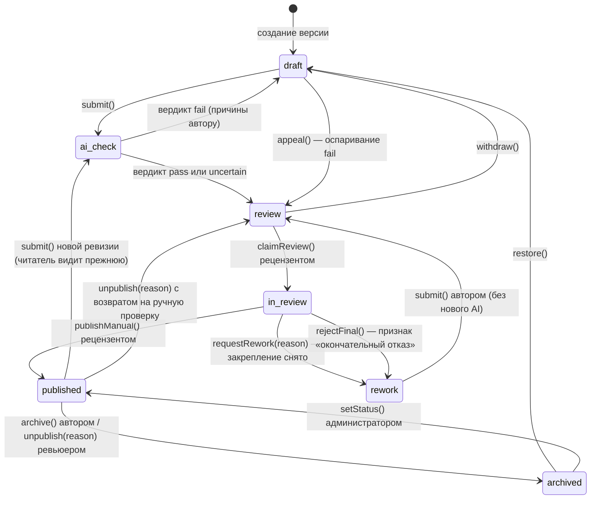

# Модель контента и редактор

- **Ревизия**: 3 (2026-09-14), заменяет ревизию 2 (2026-09-06).
- **Статус**: синхронизировано с журналом Г1–Г9 (T-109).
- **Основание**: `Article.body` — строка, редактора нет, MDC не установлен
  [ФАКТ: `00-reality-check.md` §2, §5]; ADR-0039, ADR-0044, ADR-0045, ADR-0046; ADR-0001,
  ADR-0007, ADR-0008, ADR-0017, ADR-0029, ADR-0030, ADR-0033; журнал §24.1, §25.1, §26.5,
  §29.13, #41.
- Этот документ владеет: статусами и процессом публикации, каталогом блоков и их
  настройками, границей свободы, поведением редактора при сбоях, медиа-UX, рабочим процессом
  перевода, стадиями редактора. Сущности — в `03-data-model.md`, права — в
  `04-roles-and-access.md`, вид блоков — в `06-design-system.md`.

## 0. История ревизий

### Ревизия 2 → 3 (2026-09-14, T-109, журнал Г5b–Г9)

| Было (ревизия 2) | Стало (ревизия 3) | Источник |
|---|---|---|
| `alt` в атрибутах узла `figure`; автору «настойчиво предлагается» заполнить `alt` | `alt` — единое у медиафайла; автор не редактирует `alt`; только `admin` исправляет с аудитом | журнал §29.13 |
| Статусы `draft → ai_review → review → published`; `ai_review` — статус | Статусы `draft → ai_check → review → published`; ручная ветка `in_review`/`rework` при взятии рецензентом | журнал §26.5 |
| Очередь с AI-вердиктом, баллом, критериями; `overrideAiScore` | AI даёт бинарный вердикт с причинами; балла нет; переопределения оценки нет | журнал #41 |
| При истёкшей подписке кнопка «Отправить» недоступна, редактор — только чтение | Базовое авторство бессрочно; истечение подписки ограничивает только расширенные возможности | журнал §24.1, §25.1 |

### Ревизия 1 → 2 (2026-09-06, ADR-0039, ADR-0045, ADR-0046)

| Было | Стало | Решение |
|---|---|---|
| Публикация сразу для `trusted`, проверка для `probation` | Каждая публикуемая ревизия: AI-ступень, затем человек | ADR-0045, ADR-0037 |
| Очередь проверки без вердикта | Очередь с AI-вердиктом; оспаривание | ADR-0039 |
| Отборы, редактирование заказных | Удалены | ADR-0036 |
| Перевод автором или переводчиком редакции | AI-перевод для pro с правкой автором; редакция вручную | ADR-0046 |
| Стадии по этапам 1–6 | Стадии по этапам 1–5 ревизии 2 | роадмап |
| Правка при любом плане | При истёкшей подписке редактор — только чтение | ADR-0044 |

---

## 1. Модель контента

### 1.1. Сравнение

| Критерий | MDC (Markdown + компоненты) | JSON-документ ProseMirror (TipTap) | Гибрид (Markdown + блочная надстройка) |
|---|---|---|---|
| Диффы и версии | Текстовый diff — лучший для человека | Снимки JSON; diff по блокам, для человека — diff экспорта | Два представления расходятся |
| Совместное редактирование | Пути нет: CRDT над текстом ломает синтаксис компонентов | Y.js — стандартный путь | Нет |
| Валидация и ограничения дизайн-системы | Слабая: пропсы — строки, проверка на парсинге | Сильная: схема документа — список разрешённого | Слабая |
| Рендер на сервере и SEO | `@nuxtjs/mdc` | JSON → Vue на сервере, полный контроль; HTML для RSS и писем | Хорошо |
| Портируемость | Отличная | JSON + экспорт в Markdown и HTML; формат общий для ProseMirror-редакторов | Средняя |
| Цена миграции при смене решения | Парсер MDC → AST → JSON, средняя | Внутри экосистемы ProseMirror — низкая; наружу — экспортёр | Высокая |
| Объём работы для одного разработчика | Низкий для textarea, высокий для визуального редактора поверх | Средний: базовый набор — дни, каждый блок — по одному | Высокий |
| Опыт автора-гуманитария | Учить синтаксис | Привычный визуальный редактор | Смешанный |

**Решение: JSON-документ ProseMirror, редактор TipTap** (ADR-0001). MDC отвергнут; гибрид
отвергнут; Lexical и BlockNote — React-first; Editor.js — плоская модель без схемы марок;
`TextEditor` FishtVue на Quill 2 — модель для форм, а не для материала (годится для коротких
rich-полей админки).

### 1.2. Рынок: что берём и что нет

| Продукт | Берём | Не берём |
|---|---|---|
| Ghost (Koenig) | Малый набор «карточек» с двумя-тремя вариантами каждая; членство и рассылка как единая модель | Тему и внешний вид |
| WordPress Gutenberg | Библиотека блоков и паттерны как идея «композиций» | Пер-блочную стилизацию: она разрушает единство журнала |
| Sanity (Portable Text) | Принцип «медиа — отдельный документ, в тексте ссылка»; структурированный JSON как переносимый формат | Собственный формат: ProseMirror достаточно |
| Prismic (слайсы) | Идею шаблонов страниц | Лишний слой для журнала |
| Substack | «Автор в центре, читатель подписывается на человека»; письмо и веб из одного текста | Почту как первичный канал |
| Medium | Минимальный редактор, чтение важнее оформления | «Хлопки» как непрозрачную метрику; paywall на всём |
| Notion | — | Вложенность и «базы данных» — журнал не рабочее пространство |
| TipTap / ProseMirror | Схема, расширения, статический рендер, Y.js | — |

### 1.3. Устройство документа

- Корень `doc` с `attrs.schemaVersion`; блочные узлы первого уровня; у каждого блока
  стабильный `attrs.id` (uuid), присваиваемый при создании узла.
- Изображения ссылаются на `assetId` медиа-библиотеки; подпись берётся из медиа и может быть
  переопределена в узле; `alt` берётся из медиафайла и не переопределяется в узле (журнал
  §29.13).
- Схема, валидация, экстракторы (`toPlainText`, `readingTime`, `firstParagraph`) и
  сериализаторы (`toMarkdown`, `toHTML`) живут в пакете `packages/content` (ADR-0029), общем
  для редактора, сервера и рендера.
- Сервер отклоняет документ с неизвестным узлом, маркой или атрибутом (`CONTENT_INVALID`).

## 2. Жизненный цикл языковой версии

Статус живёт на языковой версии (ADR-0002). Ожидание вердикта AI — состояние `ai_check`;
рецензент берёт статью из `review` в `in_review`, запрашивает доработку → `rework` (журнал
§26.5).

| Действие | Кто | Из → в | Сегодняшняя мутация → целевая |
|---|---|---|---|
| Сохранить | автор; редакция в `review` | статус не меняется | `updateArticle(id, input)` → `saveTranslation(id, input, baseRevisionId)` |
| Отправить к публикации | автор, редакция | `draft → ai_check`; для опубликованной версии — новая ревизия в `ai_check` | `requestReview(id)` → `submitTranslation(id)` |
| Вердикт AI | система | `ai_check → review` (pass, uncertain) или `→ draft` (fail) | — → внутреннее событие, `ArticleAiCheck` |
| Оспорить отказ AI | автор | `draft → review` с пометкой «оспорено» | — → `appealTranslation(id, message)` |
| Отозвать | автор | `ai_check \| review → draft` | `revertToDraft(id)` → `withdrawTranslation(id)` |
| Взять в работу | ревьюер, владелец | `review → in_review` | — → `claimReview(id)` |
| Опубликовать вручную | ревьюер, владелец | `in_review → published` | — → `publishManual(id)` |
| Запросить доработку | ревьюер, владелец | `in_review → rework` | — → `requestRework(id, reason)` |
| Окончательный отказ | ревьюер, владелец | `in_review → rework` + флаг `rejectedFinal` | — → `rejectFinal(id, comment?)` |
| Повторная подача после доработки | автор | `rework → review` (без нового AI) | — → `submitTranslation(id)` |
| Снять с публикации | ревьюер и выше | `published → review` | — → `unpublishTranslation(id, reason)` |
| Архивировать своё | автор (и после истечения подписки) | `published → archived` | `archiveArticle(id)` → `archiveTranslation(id)` |
| Вернуть из архива | автор, редакция | `archived → draft` | — → `restoreTranslation(id)` |
| Любой переход | администратор | любой | `setArticleStatus` → `setTranslationStatus(id, status, reason)` |
| Массовые операции | администратор | | `bulkUpdateArticleStatus` → на версиях; `bulkDeleteArticles` → только для никогда не публиковавшихся (`03` §4.7) |

Правила: `publishedAt` ставится при первой публикации версии и не сбрасывается;
`Article.firstPublishedAt` — при первой публикации любой версии; архив всех версий = архив
материала; удаление материала возможно только до первой публикации. Публикуемая ревизия
опубликованной версии до одобрения не видна читателю — он видит прежнюю (ADR-0007). Все
ревизии сохраняются.

## 3. Редактор: черновики, сохранение, восстановление

| Сценарий | Поведение |
|---|---|
| Создание материала | Выбор рубрики (обязательно), формата (нет), заголовок; версия `sourceLocale` создаётся в той же транзакции; слаг предлагается транслитерацией заголовка |
| Автосохранение | Каждые ≤ 10 секунд при изменениях; запрос несёт `baseRevisionId`; сервер создаёт или перезаписывает `autosave`-ревизию (ADR-0007); индикатор «сохранено / сохраняется / ошибка» |
| Сохранение вручную | Кнопка «Сохранить версию» → ревизия `manual` с заметкой |
| Отправка к публикации | Проверка обязательных полей (заголовок, рубрика, обложка обязательна §29.1, лицензии всех изображений), затем `submitTranslation`: ревизия `publish`, состояние `ai_check`; панель проверки показывает ход: «AI проверяет» → вердикт с причинами → «ждёт ревьюера» → решение |
| Предпросмотр | Страница `/{рубрика}/{слаг}?preview=<token>` рендерит текущую ревизию для автора и редакции; токен — короткоживущий, привязан к сессии; для гостя адрес отвечает 404 |
| Восстановление после сбоя | При открытии — если локальный буфер новее последней ревизии, предложить «восстановить локальную копию» |
| Восстановление ревизии | Список ревизий (этап 2) → просмотр → «восстановить» создаёт новую ревизию с `restoredFromId` |
| Конфликт двух вкладок или двух людей | `CONFLICT` от сервера → баннер с выбором «загрузить новую версию» или «сохранить мою как ревизию»; ни одна сторона не теряется (ADR-0033). Вторая вкладка того же пользователя получает мягкую пометку через BroadcastChannel |
| Потеря сети | Редактор работает; изменения копятся в IndexedDB; баннер «нет сети»; при восстановлении — отправка с тем же `baseRevisionId` |
| Мобильный | Чтение, правка текста и абзацев — да; раскладка, галереи, колонки — desktop; кнопки публикации доступны везде |

## 4. Редакционная работа

- **AI-ступень** (этап 1, ADR-0039): один вызов на ревизию — бинарный вердикт по правилам
  публикации с категориями причин; текст уходит провайдеру без имени и e-mail автора;
  повтор при недоступности, через порог — к человеку без вердикта (журнал #41–42).
- **Очередь ревьюера** (этап 1): версии в `review` по `reviewRequestedAt`; фильтры «оспорено»,
  «AI не уверен», «без вердикта»; рецензент берёт статью в `in_review` (§26.5); карточка
  показывает вердикт, категории причин, пояснения, историю ревизий, переписку (§25.6);
  действия «опубликовать вручную», «запросить доработку», «окончательный отказ»;
  письмо автору на каждом решении; бейдж «перевод» для не-source версий.
- **Обратная связь автору** (этап 1): страница `/me/articles/{id}/review` — вердикт,
  категории причин, пояснения, решение ревьюера с причиной, переписка, кнопка «оспорить»
  (лимит в сутки `[ДОПУЩЕНИЕ]`).
- **Правка текста редактором** (этап 1): только в `review`, всегда с ревизией `editorial` с
  именем (ADR-0036, ADR-0042); опубликованный чужой текст не правится.
- **Замечания к блоку** (этап 4): `ReviewNote(blockId)` — привязка к стабильному `attrs.id`;
  автор видит замечания рядом с блоком, отмечает «исправлено», редактор закрывает.
- **История решений** (этап 4 в интерфейсе; данные — с этапа 1): `audit_log` и поля `*ById`;
  автор видит хронологию по своему материалу.
- **Ревизии** (этап 4): список, просмотр, восстановление; `editorial`-ревизии помечены.
- **Сравнение версий** и **совместная работа** (этап 5): diff по блокам; Y.js, курсоры.

## 5. Медиа

| Вопрос | Решение |
|---|---|
| Загрузка | Из редактора (перетаскивание, вставка из буфера) и из медиа-библиотеки; файл уходит в API, API — в S3 (ADR-0008); прогресс и ошибка в блоке |
| Обязательные поля | Атрибуция и лицензия при загрузке; без них файл не сохраняется; `alt` — формируется AI автоматически (§29.11), хранится в медиафайле, только `admin` может исправить (§29.13) |
| Обрезка и фокус | Фокусная точка (`focalX/Y`) в медиа; варианты генерируются при загрузке (ADR-0030); кадрирование в редакторе — этап 5 |
| Форматы и лимиты | JPEG/PNG/WebP/AVIF/GIF, до 20 МБ `[ДОПУЩЕНИЕ]`; видео и аудио — этап 5 в поддерживаемых браузером форматах |
| Подписи | Подпись и атрибуция из медиа, переопределяются в блоке |
| Права и ответственность | На загрузившем; текст в правилах публикации; редакция может заменить изображение при претензии |
| Takedown | Жалоба `copyright` → модератор скрывает изображение или снимает версию → уведомление автора → решение; сроки в `07-commerce.md` |
| Библиотека (этап 5) | Сетка, поиск, фильтр по лицензии, переиспользование, замена файла с сохранением ссылок, физическая чистка неиспользуемых |

## 6. SEO-поля и предпросмотр

- На версии: `seoTitle`, `seoDescription` (по умолчанию — заголовок и дек); canonical —
  адрес версии, всегда автоматический; hreflang — из опубликованных сестёр; OG-изображение —
  обложка или дефолтное.
- Предпросмотр сниппета поиска и карточки в соцсетях — панель в редакторе (этап 2).
- Структурированные данные (`Article`, `Person`, `BreadcrumbList`) — рендер, без участия
  автора (`06-design-system.md`).

## 7. Каталог блоков

| Блок | Этап | Узел | Варианты автора | Компонент рендера |
|---|---|---|---|---|
| Абзац | 1 | `paragraph` | — | `ProseParagraph` |
| Заголовок | 1 | `heading` (level 2, 3) | уровень | `ProseHeading` |
| Цитата | 1 | `blockquote` (kind: plain, pull) | обычная / выносная | `ProseQuote` |
| Список | 1 | `bulletList`, `orderedList` | тип | `ProseList` |
| Изображение с подписью | 1 | `figure` (assetId, size: normal, wide, full, caption, attribution) | размер | `ProseFigure` |
| Разделитель | 1 | `horizontalRule` | — | `ProseDivider` |
| Марки | 1 | `bold`, `italic`, `link` | — | inline |
| Галерея | 5 | `gallery` (assetIds, layout: grid, strip, slider `[ДОПУЩЕНИЕ]`) | раскладка | `ProseGallery` |
| Видео | 5 | `video` (assetId) | — | `ProseVideo` |
| Аудио | 5 | `audio` (assetId) | — | `ProseAudio` |
| Врезка | 5 | `aside` (kind: lead, note, reference) | тип | `ProseAside` |
| Embed | 5 | `embed` (url из allow-list доменов) | — | `ProseEmbed` |
| Таблица | 5 | `table` (headerRow) | заголовочная строка | `ProseTable` |
| Колонки | 5 | `columns` (count: 2, 3) → `column` | число | `ProseColumns` |
| Композиция, шаблон | 5 | заготовка документа (`Template`) | выбор шаблона | — |

Вложенность: блоки первого уровня; контейнеры — только `columns` и `gallery`; глубина не
более двух; контейнер в контейнере запрещён схемой. Каждый новый блок — запись здесь, узел
схемы, компонент, снимок-тест, запись в `06`.

## 8. Настройки блока и граница свободы

| Атрибут | Автор | Дизайн-система | Никто |
|---|---|---|---|
| Содержание (текст, подпись, ссылка, медиа) | ✓ | | |
| Тип блока, семантический вариант (уровень, тип цитаты, размер изображения, тип врезки, число колонок) | ✓ | | |
| Стиль: цвета, шрифты, начертания сверх курсива и полужирного | | ✓ | |
| Отступы, размеры | | ✓ (через вариант размера) | |
| Выравнивание | | ✓ | |
| Фон, рамки | | ✓ | |
| Медиа: обрезка, фокус | ✓ в пределах вариантов | ✓ | |
| Адаптивное поведение | | ✓ | |
| Видимость на устройствах | | | ✓ контент одинаков везде |

**Правило** (ADR-0017): автор управляет смыслом, дизайн-система — видом. Настройка допустима,
если меняет смысл или чтение, а не внешний вид, и каждое её значение — именованный вариант.
Просьба «добавить настройку цвета» получает «нет»; просьба «нужен вариант широкой цитаты»
обсуждается как вариант дизайн-системы.

## 9. Перевод

1. Pro-автор нажимает «Создать перевод» на опубликованной версии (ADR-0046): `TranslationJob`
   отправляет текст, заголовок, дек, подписи к изображениям AI-провайдеру; создаётся
   `ArticleTranslation(locale = en)` в `draft` с переводом, `sourceRevisionId`, своим слагом
   (транслитерация переведённого заголовка). Standard видит кнопку с пометкой «доступно в
   pro». Редакция (`editor` и выше) создаёт и переводит версии любых материалов вручную.
2. Автор правит перевод в редакторе и отправляет к публикации; версия проходит обе ступени
   проверки как любая другая; лимит переводов в сутки — параметр.
3. Синхронизируется автоматически: ничего после создания. По кнопке «взять из оригинала»:
   изображения и их атрибуция; рубрика и теги — общие по определению. Индикатор «оригинал
   обновился» — по `sourceRevisionId`; повторный перевод — по запросу автора с тем же лимитом.
4. Статус версии независим: EN может быть `draft`, пока RU опубликован. hreflang и
   переключатель языка появляются только когда обе версии опубликованы.
5. Переведённая версия проходит проверку как обычная; Pro-грейд автора учитывается в рейтинге.
6. Интерфейс редактора переведён на этапе 3 вместе с i18n интерфейса.

## 10. Стадии редактора

| Стадия | Этап | Автору | Редакции |
|---|---|---|---|
| Минимально ценный | 1 | Блоки первого этапа, автосохранение, предпросмотр, отправка к публикации, панель проверки с AI-вердиктом и категориями причин, оспаривание | Очередь: взять в работу (`in_review`), опубликовать вручную, запросить доработку, окончательный отказ, правка в `review` |
| Рейтинг и статистика | 2 | Разложение рейтинга статьи, прочтения по дням (pro) | Исключение прочтений, конфигурация рейтинга |
| Перевод и экспорт | 3 | AI-перевод (pro), экспорт в Markdown/HTML, подписчики | Ручные переводы |
| Библиотека блоков и редакционная работа | 4 | Галереи, видео, аудио, врезки, embed, таблицы, колонки, шаблоны; замечания к блокам; ревизии | Медиа-библиотека, замечания, ревизии, аудит-интерфейс, рассылка из того же редактора |
| Совместная работа и профессиональные инструменты | 5 | Соавторство, сравнение версий, отложенная публикация, PDF/EPUB | Курсоры присутствия, история, партнёрские материалы |

## 11. Принятые границы (ADR-0017, ADR-0033)

- Свободную стилизацию и кастомные CSS-классы в блоках.
- Плагины редактора от сообщества.
- Markdown-режим редактора (экспорт есть, ввод — визуальный; вставка Markdown-текста
  конвертируется при вставке `[ДОПУЩЕНИЕ: этап 3]`).
- Хранение Y.js-состояния до этапа 6.
- Комментарии читателей к абзацам.
